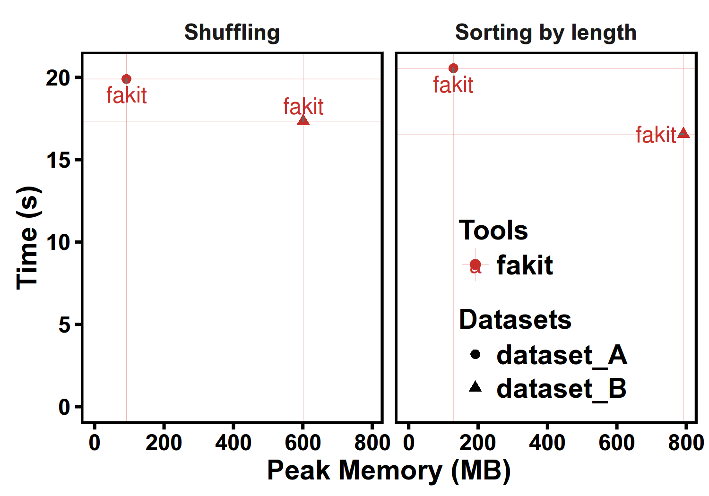

# fakit - a cross-platform and efficient suit for FASTA/Q file manipulation

Documents  : [http://shenwei356.github.io/fakit](http://shenwei356.github.io/fakit)

Source code: [https://github.com/shenwei356/fakit](https://github.com/shenwei356/fakit)

## About the name

Originally, `fakit` (abbreviation of `FASTA kit`) was designed to handle FASTA
format. And the name was remained after adding ***seamless support for FASTA/Q fromat***.

## Introduction

FASTA and FASTQ are basic formats for storing nucleotide and protein sequences.
The manipulations of FASTA/Q file includes converting, clipping, searching,
filtering, deduplication, splitting, shuffling, sampling and so on.
Existed tools only implemented parts of the functions,
and some of them are only available for specific operating systems.
Furthermore, the complicated installation process of dependencies packages and
running environment also make them less friendly to common users.

fakit is a cross-platform, efficient, and practical FASTA/Q manipulations tool
that is friendly for researchers to complete wide ranges of FASTA file processing.
The suite supports plain or gzip-compressed input and output
from either standard stream or files, therefore, it could be easily used in pipelines.

## Features

- **Cross-platform** (Linux/Windows/Mac OS X/OpenBSD/FreeBSD,
  see [download](http://shenwei356.github.io/fakit/download/))
- **Light weight and out-of-the-box, no dependencies, no compilation, no configuration**
  (see [download](http://shenwei356.github.io/fakit/download/))
- **Fast** (see [benchmark](/#benchmark)),
  **multiple-CPUs supported**.
- **Practical functions supported by 18 subcommands** (see subcommands and
  [usage](http://shenwei356.github.io/fakit/usage/) )
- **Well documented** (detailed [usage](http://shenwei356.github.io/fakit/usage/)
  and [benchmark](http://shenwei356.github.io/fakit/benchmark/) )
- **Seamlessly parses both FASTA and FASTQ formats**
- **Support STDIN and gziped input/output file, easy being used in pipe**
- **Support custom sequence ID regular expression** (especially useful for quering with ID list)
- Reproducible results (configurable rand seed in `sample` and `shuffle`)
- Well organized source code, friendly to use and easy to extend.

**Features comparison**

Features         | fakit    | fasta_utilities | fastx_toolkit | pyfaidx | seqmagick | seqtk
:--------------- | :------: | :-------------: | :-----------: | :-----: | :-------: | :----
Cross-platform   | Yes      | Partly          | Partly        | Yes     | Yes       | Yes
Mutli-line FASTA | Yes      | Yes             | --            | Yes     | Yes       | Yes
Read FASTQ       | Yes      | Yes             | Yes           | --      | Yes       | Yes
Mutli-line FASTQ | Yes      | Yes             | --            | --      | Yes       | Yes
Validate bases   | Yes      | --              | Yes           | Yes     | --        | --
Recognize RNA    | Yes      | Yes             | --            | --      | Yes       | Yes
Read STDIN       | Yes      | Yes             | Yes           | --      | Yes       | Yes
Read gzip        | Yes      | Yes             | --            | --      | Yes       | Yes
Write gzip       | Yes      | --              | --            | --      | Yes       | --
Search by motifs | Yes      | Yes             | --            | --      | Yes       | Yes
Sample seqs      | Yes      | Yes             | --            | --      | Yes       | Yes
Subseq           | Yes      | Yes             | --            | Yes     | Yes       | Yes
Deduplicate seqs | Yes      | --              | --            | --      | Partly    | --
Split seqs       | Yes      | Yes             | --            | Partly  | --        | --
Split by seq     | Yes      | --              | Yes           | Yes     | --        | --
Shuffle seqs     | Yes      | --              | --            | --      | --        | --
Sort seqs        | Yes      | Yes             | --            | --      | Yes       | --
Locate motifs    | Yes      | --              | --            | --      | --        | --
Common seqs      | Yes      | --              | --            | --      | --        | --
Clean bases      | Yes      | Yes             | Yes           | Yes     | --        | --
Transcribe       | Yes      | Yes             | Yes           | Yes     | Yes       | Yes
Translate        | --       | Yes             | Yes           | Yes     | Yes       | --
Size select      | Indirect | Yes             | --            | Yes     | Yes       | --
Rename head      | Yes      | Yes             | --            | --      | Yes       | Yes

# Installation

`fakit` is implemented in [Golang](https://golang.org/) programming language,
 executable binary files **for most popular operating system** are freely available
  in [release](https://github.com/shenwei356/fakit/releases) page.

Just [download](https://github.com/shenwei356/fakit/releases) gzip-compressed
executable file of your operating system, and uncompress it with `tar -zxvf *.tar.gz` command,
rename it to `fakit.exe` (Windows) or `fakit` (other operating systems) for convenience.

You may need to add executable permision by `chmod a+x fakit`.

You can also add the directory of the executable file to environment variable
`PATH`, so you can run `fakit` anywhere.

1. For windows, the simplest way is copy it to `C:\WINDOWS\system32`.

2. For Linux, type:

        chmod a+x /PATH/OF/FASTCOV/fakit
        echo export PATH=\$PATH:/PATH/OF/FASTCOV >> ~/.bashrc

    or simply copy it to `/usr/local/bin`

## Subcommands

18 in total.

**Sequence and subsequence**

- `seq`        transform sequences (revserse, complement, extract ID...)
- `subseq`     get subsequences by region/gtf/bed, including flanking sequences
- `sliding`    sliding sequences, circle genome supported
- `stat`       simple statistics of FASTA files
- `faidx`      create FASTA index file

**Format conversion**

- `fx2tab`     covert FASTA/Q to tabular format (and length/GC content/GC skew)
- `tab2fx`     covert tabular format to FASTA/Q format
- `fq2fa`      covert FASTQ to FASTA

**Searching**

- `grep`       search sequences by pattern(s) of name or sequence motifs
- `locate`     locate subsequences/motifs

**Set operations**

- `rmdup`      remove duplicated sequences by id/name/sequence
- `common`     find common sequences of multiple files by id/name/sequence
- `split`      split sequences into files by id/seq region/size/parts
- `sample`     sample sequences by number or proportion

**Edit**

- `replace`    replace name/sequence/by regular expression
- `rename`     rename duplicated IDs

**Ordering**

- `shuffle`    shuffle sequences
- `sort`       sort sequences by id/name/sequence

## Technical details and guides for use

### FASTA/Q format parsing

fakit uses author's bioinformatics packages [bio](https://github.com/shenwei356/bio)
for FASTA/Q parsing, which ***asynchronously parse FASTA/Q records and buffer them
in chunks***. The parser returns one chunk of records for each call.

Asynchronous parsing saves much time because these's no waiting interval for
parsed records being handled.
The strategy of records chunks reduces data exchange in parallelly handling
of sequences, which could also improve performance.

Since using of buffers and chunks, the memory occupation will be higher than
cases of reading sequence one by one.
The default value of chunk size (configurable by global flag `-c` or `--chunk-size`)
is 1, which is suitable for most of cases.
But for manipulating short sequences, e.g. FASTQ or FASTA of short sequences,
you could set higher value, e.g. 100.
For big genomes like human genome, smaller chunk size is prefered, e.g. 1.
And the buffer size is configurable by global flag `-b` or `--buffer-size`
(default value is 1). You may set with higher
value for short sequences to imporve performance.

### Sequence formats and types

fakit seamlessly support FASTA and FASTQ format.
All subcommands except for `faidx` can handle both formats.
And only when some commands (`subseq`, `split`, `sort` and `shuffle`)
which utilise FASTA index to improve perfrmance for large files in two pass mode
(by flag `--two-pass`), only FASTA format is supported.

Sequence format is automatically detected by the first character of the file
or STDIN.

Sequence type (DNA/RNA/Protein) is automatically detected by leading subsequences
of the first sequences in file or STDIN. The length of the leading subsequences
is configurable by global flag `--alphabet-guess-seq-length` with default value
of 10000. If length of the sequences is less than that, whole sequences will
be checked.

### Sequence ID

By default, most softwares, including `fakit`, takes the first non-space
letters as sequence ID. For example,

|   FASTA head                                                  |     ID                                            |
|:--------------------------------------------------------------|:--------------------------------------------------|
| >123456 gene name                                             | 123456                                            |
| >longname                                                     | longname                                          |
| >gi&#124;110645304&#124;ref&#124;NC_002516.2&#124; Pseudomona | gi&#124;110645304&#124;ref&#124;NC_002516.2&#124; |

But for some sequences from NCBI,
e.g. `>gi|110645304|ref|NC_002516.2| Pseudomona`, the ID is `NC_002516.2`.
In this case, we could set sequence ID parsing regular expression by global flag
`--id-regexp "\|([^\|]+)\| "` or just use flag `--id-ncbi`. If you want
the `gi` number, then use `--id-regexp "^gi\|([^\|]+)\|"`.

### FASTA index

For some commands, including `subseq`, `split`, `sort` and `shuffle`,
when input files are (plain or gzipped) FASTA files,
FASTA index would be optional used for
rapid acccess of sequences and reducing memory occupation.

ATTENTION: the `.fakit.fai` file created by fakit is a little different from .fai file
created by samtools. fakit uses full sequence head instead of just ID as key.

### Parallelization of CPU intensive jobs

Most of the manipulations of FASTA/Q files are I/O intensive, to improve the
performance, asynchronous parsing strategy is used.

The validation of sequences bases and complement process of sequences
are parallelized for large sequences.

For CPU intensive jobs like `grep` with regular expressions and `locate` with
sequence motifs. The processes are parallelized
with "Map-Reduce" model by multiple goroutines in golang which are similar to but much
lighter weight than threads. The concurrency number is configurable with global
flag `-j` or `--threads` (default value: 1 for single-CPU PC, 2 for others).

### Memory occupation

Most of the subcommands do not read whole FASTA/Q records in to memory,
including `stat`, `fq2fa`, `fx2tab`, `tab2fx`, `grep`, `locate`, `replace`,
 `seq`, `sliding`, `subseq`. They just temporarily buffer chunks of records.

However when handling big sequences, e.g. human genome, the memory is high
(2-3 GB) even the buffer size is 1.
This is due to the limitation of Go programming language, it may be solved
in the future.

Note that when using `subseq --gtf | --bed`, if the GTF/BED files are too
big, the memory usage will increase.
You could use `--chr` to specify chromesomes and `--feature` to limit features.

Some subcommands need to store sequences or heads in memory, but there are
strategy to reduce memory occupation, including `rmdup` and `common`.
When comparing with sequences, MD5 digest could be used to replace sequence by
flag `-m` (`--md5`).

Some subcommands could either read all records or read the files twice by flag
`-2` (`--two-pass`), including `sample`, `split`, `shuffle` and `sort`.
They use FASTA index for rapid acccess of sequences and reducing memory occupation.

### Reproducibility

Subcommands `sample` and `shuffle` use random function, random seed could be
given by flag `-s` (`--rand-seed`). This makes sure that sampling result could be
reproduced in different environments with same random seed.

## Usage && Examples

[Usage and examples](http://shenwei356.github.io/fakit/usage/)

[Tutorial](http://shenwei356.github.io/fakit/tutorial/)

## Benchmark

More details: [http://shenwei356.github.io/fakit/benchmark/](http://shenwei356.github.io/fakit/benchmark/)

Datasets:

    $ fakit stat *.fa
    file           seq_format   seq_type   num_seqs   min_len        avg_len       max_len
    dataset_A.fa   FASTA        DNA          67,748        56       41,442.5     5,976,145                  
    dataset_B.fa   FASTA        DNA             194       970   15,978,096.5   248,956,422

Performance of other functions in fakit:

## Contact

Email me for any problem when using fakit. shenwei356(at)gmail.com

[Create an issue](https://github.com/shenwei356/fakit/issues) to report bugs,
propose new functions or ask for help.

## License

[MIT License](https://github.com/shenwei356/fakit/blob/master/LICENSE)
