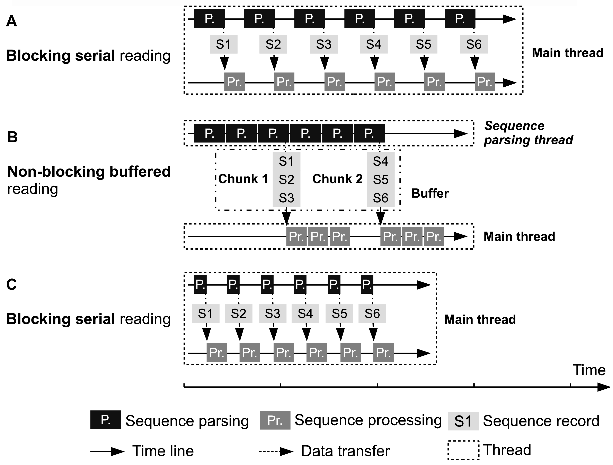
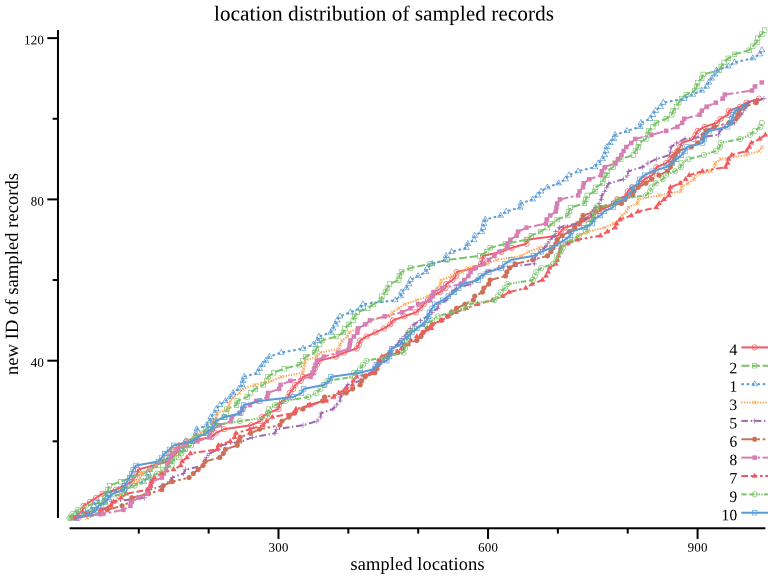

# Notes

## Sequence Parsing Strategies

In general, most FASTA/Q file processing softwares read one sequence record and process it immediately, and then read the next one (Fig 1A). The early version of SeqKit adopted this strategy too; however, our sequence parsing algorithm was not efficient. Therefore, we tried another strategy by using a separated thread to non-blocking read and parse sequences (Fig 1B): The sequence parsing thread parsed fixed number of sequences and packaged them into Chunks, then one or more chunks were buffered in memory so they could be paralleled processed by one or more processing threads. This strategy saved time by reducing the waiting time between parsing sequences and by paralleled processing of sequences in some cases. However, this strategy consumes more memories especially for long sequences like human genome and it is hard to find an optimum combination of buffer and chunk size for different scales of sequences. 

During the major revision, we kept on optimizing the sequence parsing algorithm and several optimizations had been made ([Seqkit v0.2.7](https://github.com/shenwei356/seqkit/releases/tag/v0.2.7)). The most important one is using custom buffered file reading algorithm instead of using standard library “bufio” which is not efficient in memory for large sequences. This increased the speed and lowered memory usage significantly. Note that the “buffer” here is different from the previously mentioned one in Fig 1B, this “buffer” evolved in the low level processing of file reading. At last, the FASTA/Q format parsing algorithm was significant improved by factor of about 3× in speed and the memory usage was only 1/2 compared to SeqKit version 0.2.4 in the first manuscript (this was not descripted in the manuscript). Therefore, we discarded the strategy of “buffer and chunk” and adopt the serially reading strategy again (Fig 1C). The only difference between Fig C and Fig A is that the time of parsing one sequence is much shorter.

**Figure 1 Illustration of FASTA/Q file parsing strategies**. (A) and (C) Main thread parses one sequence, waits (blocked) it to be processed and then parses next one. (B) Sequence parsing thread continuously (non-blocked) parses sequences and passes them to main thread. The width of rectangles representing sequence parsing and sequence processing is proportional with running time. Sequence parsing speeds in (A) and (B) are the same, which are both much slower than that in (C). The speeds of sequence processing are identical in (A), (B) and (C). In (B), chunks of sequences in buffer can be processed in parallel, but most of the time the main thread needs to serially manipulate the sequences.

## Effect of random seed on results of `seqkit sample`

`seqkit sample` supports FASTA/Q sampling by proportion or amount.

- For sampling by proportion (`P`), SeqKit returns a record if a random number (`[0, 1`])
  is less than `P`.
- For sampling by amount (`N`), Seqkit firstly gets the total amount of records,
  and compute the proportion (`P`), and sampling by proportion (`P`).
  Cause the generated random number is [pseudorandom](https://en.wikipedia.org/wiki/Pseudorandomness)
  and affected by the random seed (`-s/--rand-seed`), the number of sampled records
  may not be equal to `N`.

Here we evaluate the effect of random seed on `seqkit sample` results.
Used softwares

- csvtk: [https://github.com/shenwei356/csvtk](https://github.com/shenwei356/csvtk)
- rush: [https://github.com/shenwei356/rush](https://github.com/shenwei356/rush)

### Amount distribution of sampled records

1000 FASTA records with IDs of `1`, `2`, ..., `1000` were sampled by proportion of `0.1`
with random seeds from `1` to `1000`, and the distribution of number of sampled records
was plotted in boxplot.

    seq 1000 \
        | rush 'seq 1000 | csvtk -t -H mutate | seqkit tab2fx \
            | seqkit sample -p 0.1 -s {} \
            | seqkit fx2tab | wc -l' \
        > ns.txt

    cat ns.txt | csvtk -H -t plot box -f 1 --horiz --height 2 \
        --xlab "# of sampled records" \
        > ns.png

### Location distribution of sampled records

1000 FASTA records with IDs of `1`, `2`, ..., `1000` were sampled by proportion of `0.1`
with random seeds from `1` to `10`. The record IDs (`x axis`) was used to plot a scatter plot,
which show the location distribution of sampled records. The ideal distribution
would produces a straight line in the plot.

    seq 10 \
        | rush 'seq 1000 | csvtk -t -H mutate | seqkit tab2fx \
            | seqkit sample -p 0.1 -s {} \
            | seqkit fx2tab | csvtk -H -t mutate \
            | csvtk -H -t replace -f 2 -p '.+' -r '{nr}' \
            | csvtk -H -t replace -f 4 -p '.+' -r {}' \
        | csvtk -H -t plot line -x 1 -y 2 -g 4 \
            --xlab "sampled locations" --ylab "new ID of sampled records" \
            --title "location distribution of sampled records" \
            --width 8 --height 6 --point-size 2 \
        > pos.png

<noscript>Please enable JavaScript to view the <a href="https://disqus.com/?ref_noscript">comments powered by Disqus.</a></noscript>
