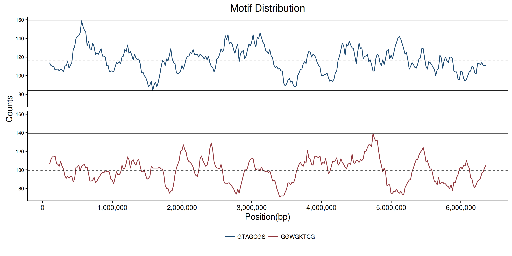

# Tutorial

## Some manipulations on big genomes

A script [memusg](https://github.com/shenwei356/memusg) is
used to check the peek memory usage of fakit. Usage: `memusg [-t] command`.

1. Human genome

        $  fakit stat hsa.fa
        file     seq_format   seq_type   num_seqs   min_len        avg_len       max_len
        hsa.fa   FASTA        DNA             194       970   15,978,096.5   248,956,422

1. Sorting by sequence length

        $ memusg -t fakit sort --by-length --reverse --two-pass hsa.fa > hsa.sorted.fa
        [INFO] create and read FASTA index ...
        [INFO] read sequence IDs and lengths from FASTA index ...
        [INFO] 194 sequences loaded
        [INFO] sorting ...
        [INFO] output ...

        elapsed time: 25.533s
        peak rss: 4.62 GB

    Detail:

        $ fakit fx2tab --length hsa.sorted.fa --name --only-id | cut -f 1,4 | more
        1       248956422
        2       242193529
        3       198295559
        4       190214555
        5       181538259
        6       170805979
        7       159345973
        X       156040895
        8       145138636
        9       138394717
        11      135086622
        10      133797422
        12      133275309
        13      114364328
        14      107043718
        15      101991189
        16      90338345
        17      83257441
        18      80373285
        20      64444167
        19      58617616
        Y       57227415
        22      50818468
        21      46709983
        KI270728.1      1872759
        KI270727.1      448248
        ...

        real    0m10.697s
        user    0m11.153s
        sys     0m0.917s

1. Shuffling sequences

        $ memusg -t fakit shuffle hsa.fa --two-pass > hsa.shuffled.fa
        [INFO] create and read FASTA index ...
        [INFO] create FASTA index for hsa.fa
        [INFO] read sequence IDs from FASTA index ...
        [INFO] 194 sequences loaded
        [INFO] shuffle ...
        [INFO] output ...

        elapsed time: 37.248s
        peak rss: 5.25 GB

1. Spliting into files with single sequence

        $ memusg -t fakit split --by-id hsa.fa --two-pass
        [INFO] split by ID. idRegexp: ^([^\s]+)\s?
        [INFO] create and read FASTA index ...
        [INFO] read sequence IDs from FASTA index ...
        [INFO] 194 sequences loaded
        [INFO] write 1 sequences to file: hsa.id_KI270743.1.fa
        [INFO] write 1 sequences to file: hsa.id_KI270706.1.fa
        [INFO] write 1 sequences to file: hsa.id_KI270717.1.fa
        [INFO] write 1 sequences to file: hsa.id_KI270718.1.fa
        [INFO] write 1 sequences to file: hsa.id_KI270468.1.fa
        ...

        elapsed time: 24.183s
        peak rss: 4.79 GB

1. Geting subsequence of some chromesomes

        $ memusg -t fakit subseq -r 1:10 --chr X --chr Y  hsa.fa
        >X_1-10 X dna_sm:chromosome chromosome:GRCh38:X:1:156040895:1 REF
        nnnnnnnnnn
        >Y_1-10 Y dna_sm:chromosome chromosome:GRCh38:Y:2781480:56887902:1 REF
        NNNNNNNNNN

        elapsed time: 1.627s
        peak rss: 770.88 MB

1. Geting CDS sequence of chr 1 by GTF files

        $ memusg -t fakit subseq --gtf Homo_sapiens.GRCh38.84.gtf.gz --chr X --feature cds  hsa.fa > chrX.gtf.cds.fa
        [INFO] read GTF file ...
        [INFO] 22420 GTF features loaded

        elapsed time: 8.967s
        peak rss: 1.29 GB

## Remove contaminated reads

1. Mapping with reads on some potential contaminate genomes, and get the reads IDs list.

        $ wc -l contaminate.list
        244 contaminate.list

        $ head -n 2 contaminate.list
        HWI-D00523:240:HF3WGBCXX:1:1101:2574:2226
        HWI-D00523:240:HF3WGBCXX:1:1101:12616:2205

1. Remove contaminated reads

        $ fakit grep -f contaminate.list -v reads_1.fq.gz -o reads_1.clean.fq.gz
        $ fakit grep -f contaminate.list -v reads_2.fq.gz -o reads_2.clean.fq.gz

        $ fakit stat *.fq.gz
        file                  seq_format   seq_type   num_seqs   min_len   avg_len   max_len
        reads_1.clean.fq.gz   FASTQ        DNA           2,256       226       227       229
        reads_1.fq.gz         FASTQ        DNA           2,500       226       227       229
        reads_2.clean.fq.gz   FASTQ        DNA           2,256       223       224       225
        reads_2.fq.gz         FASTQ        DNA           2,500       223       224       225

## Handling of aligned sequences

1. Some mock sequences (usually they will be much longer)

        $ cat seqs.fa
        >seq1
        ACAACGTCTACTTACGTTGCATCGTCATGCTGCATTACGTAGTCTGATGATG
        >seq2
        ACACCGTCTACTTTCATGCTGCATTACGTAGTCTGATGATG
        >seq3
        ACAACGTCTACTTACGTTGCATCGTCATGCTGCACTGATGATG
        >seq4
        ACAACGTCTACTTACGTTGCATCTTCGGTCATGCTGCATTACGTAGTCTGATGATG

1. Run multiple sequence alignment (clustalo)

        clustalo -i seqs.fa -o seqs.msa.fa --force --outfmt fasta --threads=4

1. Convert FASTA format to tabular format.

        $ fakit fx2tab seqs.msa.fa
        seq1    ACAACGTCTACTTACGTTGCAT----CGTCATGCTGCATTACGTAGTCTGATGATG
        seq2    ---------------ACACCGTCTACTTTCATGCTGCATTACGTAGTCTGATGATG
        seq3    ACAACGTCTACTTACGTTGCATCGTCATGCTGCACTGATGATG-------------
        seq4    ACAACGTCTACTTACGTTGCATCTTCGGTCATGCTGCATTACGTAGTCTGATGATG

    or

        $ fakit fx2tab seqs.msa.fa | cut -f 2
        ACAACGTCTACTTACGTTGCAT----CGTCATGCTGCATTACGTAGTCTGATGATG
        ---------------ACACCGTCTACTTTCATGCTGCATTACGTAGTCTGATGATG
        ACAACGTCTACTTACGTTGCATCGTCATGCTGCACTGATGATG-------------
        ACAACGTCTACTTACGTTGCATCTTCGGTCATGCTGCATTACGTAGTCTGATGATG

    For me, it's useful when 1) manually assembling Sanger sequencing result,
    2) designing site specific PCR primers.

1. Remove gaps

        $ fakit seq seqs.msa.fa -g
        >seq1
        ACAACGTCTACTTACGTTGCATCGTCATGCTGCATTACGTAGTCTGATGATG
        >seq2
        ACACCGTCTACTTTCATGCTGCATTACGTAGTCTGATGATG
        >seq3
        ACAACGTCTACTTACGTTGCATCGTCATGCTGCACTGATGATG
        >seq4
        ACAACGTCTACTTACGTTGCATCTTCGGTCATGCTGCATTACGTAGTCTGATGATG

## Play with miRNA hairpins

### Dataset

[`hairpin.fa.gz`](ftp://mirbase.org/pub/mirbase/21/hairpin.fa.gz)
from [The miRBase Sequence Database -- Release 21](ftp://mirbase.org/pub/mirbase/21/)

### Quick glance

1. Sequence number

        $ fakit stat hairpin.fa.gz
        file             seq_type    num_seqs    min_len    avg_len    max_len
        hairpin.fa.gz         RNA      28,645         39        103      2,354

1. First 10 bases

        $ zcat hairpin.fa.gz | fakit subseq -r 1:10 | fakit sort -s | fakit seq -t rna -s | head -n 10
        AAAAAAAAAA
        AAAAAAAAAA
        AAAAAAAAAG
        AAAAAAAAAG
        AAAAAAAAAG
        AAAAAAAAAU
        AAAAAAAAGG
        AAAAAAACAU
        AAAAAAACGA
        AAAAAAAUUA

    hmm, nothing special, non-coding RNA~

### Repeated hairpin sequences

We may want to check how may identical hairpins among different species there are.
`fakit rmdup` could remove duplicated sequences by sequence content,
and save the replicates to another file (here is `duplicated.fa.gz`),
as well as replicating details (`duplicated.detail.txt`,
1th column is the repeated number,
2nd column contains sequence IDs seperated by comma).

    $ fakit rmdup -s -i hairpin.fa.gz -o clean.fa.gz -d duplicated.fa.gz -D duplicated.detail.txt

    $ head -n 5 duplicated.detail.txt
    18      dre-mir-430c-1, dre-mir-430c-2, dre-mir-430c-3, dre-mir-430c-4, dre-mir-430c-5, dre-mir-430c-6, dre-mir-430c-7, dre-mir-430c-8, dre-mir-430c-9, dre-mir-430c-10, dre-mir-430c-11, dre-mir-430c-12, dre-mir-430c-13, dre-mir-430c-14, dre-mir-430c-15, dre-mir-430c-16, dre-mir-430c-17, dre-mir-430c-18
    16      hsa-mir-29b-2, mmu-mir-29b-2, rno-mir-29b-2, ptr-mir-29b-2, ggo-mir-29b-2, ppy-mir-29b-2, sla-mir-29b, mne-mir-29b, ppa-mir-29b-2, bta-mir-29b-2, mml-mir-29b-2, eca-mir-29b-2, aja-mir-29b, oar-mir-29b-1, oar-mir-29b-2, rno-mir-29b-3
    15      dme-mir-125, dps-mir-125, dan-mir-125, der-mir-125, dgr-mir-125-1, dgr-mir-125-2, dmo-mir-125, dpe-mir-125-2, dpe-mir-125-1, dpe-mir-125-3, dse-mir-125, dsi-mir-125, dvi-mir-125, dwi-mir-125, dya-mir-125
    13      hsa-mir-19b-1, ggo-mir-19b-1, age-mir-19b-1, ppa-mir-19b-1, ppy-mir-19b-1, ptr-mir-19b-1, mml-mir-19b-1, sla-mir-19b-1, lla-mir-19b-1, mne-mir-19b-1, bta-mir-19b, oar-mir-19b, chi-mir-19b
    13      hsa-mir-20a, ssc-mir-20a, ggo-mir-20a, age-mir-20, ppa-mir-20, ppy-mir-20a, ptr-mir-20a, mml-mir-20a, sla-mir-20, lla-mir-20, mne-mir-20, bta-mir-20a, eca-mir-20a

The result shows the most conserved miRNAs among different species,
`mir-29b`, `mir-125`, `mir-19b-1` and `mir-20a`.
And the `dre-miR-430c` has the most multicopies in *Danio rerio*.

### Hairpins in different species

1. Before spliting by species, let's take a look at the sequence names.

        $ fakit seq hairpin.fa.gz -n | head -n 3
        cel-let-7 MI0000001 Caenorhabditis elegans let-7 stem-loop
        cel-lin-4 MI0000002 Caenorhabditis elegans lin-4 stem-loop
        cel-mir-1 MI0000003 Caenorhabditis elegans miR-1 stem-loop

    The first three letters (e.g. `cel`) are the abbreviation of species names.
    So we could split hairpins by the first letters by defining custom
    sequence ID parsing regular expression `^([\w]+)\-`.

    By default, `fakit` takes the first non-space letters as sequence ID.
    For example,

    |   FASTA head                                                  |     ID                                            |
    |:--------------------------------------------------------------|:--------------------------------------------------|
    | >123456 gene name                                             | 123456                                            |
    | >longname                                                     | longname                                          |
    | >gi&#124;110645304&#124;ref&#124;NC_002516.2&#124; Pseudomona | gi&#124;110645304&#124;ref&#124;NC_002516.2&#124; |

    But for some sequences from NCBI,
    e.g. `>gi|110645304|ref|NC_002516.2| Pseudomona`, the ID is `NC_002516.2`.
    In this case, we could set sequence ID parsing regular expression by flag
    `--id-regexp "\|([^\|]+)\| "` or just use flag `--id-ncbi`. If you want
    the `gi` number, then use `--id-regexp "^gi\|([^\|]+)\|"`.

1. Split sequences by species.
A custom ID parsing regular expression is used, `^([\w]+)\-`.

        $ fakit split hairpin.fa.gz -i --id-regexp "^([\w]+)\-" --two-pass

    ***To reduce memory usage when spliting big file, we should alwasy use flag `--two-pass`***

2. Species with most miRNA hairpins. Third column is the sequences number.

        $ fakit stat hairpin.id_*.gz | csvtk space2tab | csvtk -t sort -k num_seqs:nr | csvtk -t pretty| more
        file                     seq_format   seq_type   num_seqs   min_len   avg_len   max_len
        hairpin.id_hsa.fa.gz     FASTA        RNA        1,881      41        81.9      180
        hairpin.id_mmu.fa.gz     FASTA        RNA        1,193      39        83.4      147
        hairpin.id_bta.fa.gz     FASTA        RNA        808        53        80.1      149
        hairpin.id_gga.fa.gz     FASTA        RNA        740        48        91.5      169
        hairpin.id_eca.fa.gz     FASTA        RNA        715        52        104.6     145
        hairpin.id_mtr.fa.gz     FASTA        RNA        672        54        165.3     910

    Here, a CSV/TSV tool [csvtk](https://github.com/shenwei356/csvtk)
    is used to sort and view the result.

For human miRNA hairpins

1. Length distribution.
 `fakit fx2tab` could show extra information like sequence length, GC content.
 A distribution ploting script is used, (
 [plot_distribution.py](https://github.com/shenwei356/bio_scripts/blob/master/plot/plot_distribution.py) )

        $ fakit fx2tab hairpin.id_hsa.fa.gz -l | cut -f 3  | plot_distribution.py -o hairpin.id_hsa.fa.gz.lendist.png

    

## Bacteria genome

### Dataset

[Pseudomonas aeruginosa PAO1](http://www.ncbi.nlm.nih.gov/nuccore/110645304),
files:

-  Genbank file [`PAO1.gb`](/files/PAO1/PAO1.gb)
-  Genome FASTA file [`PAO1.fasta`](/files/PAO1/PAO1.fasta)
-  GTF file [`PAO1.gtf`](/files/PAO1/PAO1.gtf) was created with [`extract_features_from_genbank_file.py`](https://github.com/shenwei356/bio_scripts/blob/master/file_formats/extract_features_from_genbank_file.py), by

        extract_features_from_genbank_file.py  PAO1.gb -t . -f gtf > PAO1.gtf

### Motif distribution

Motifs

    $ cat motifs.fa
    >GTAGCGS
    GTAGCGS
    >GGWGKTCG
    GGWGKTCG

1. Sliding. Remember flag `--id-ncbi`, do you?
  By the way, do not be scared by the long flag `--circle-genome`, `--step`
  and so on. They have short ones, `-c`, `-s`

        $ fakit sliding --id-ncbi --circle-genome --step 20000 --window 200000 PAO1.fasta -o PAO1.fasta.sliding.fa

        $ fakit stat PAO1.fasta.sliding.fa
        file                     seq_type    num_seqs    min_len    avg_len    max_len
        PAO1.fasta.sliding.fa         DNA         314    200,000    200,000    200,000

1. Locating motifs

        $ fakit locate --id-ncbi --ignore-case --degenerate --pattern-file motifs.fa  PAO1.fasta.sliding.fa -o  PAO1.fasta.sliding.fa.motifs.tsv

1. Ploting distribution ([plot_motif_distribution.R](/files/PAO1/plot_motif_distribution.R))

        # preproccess
        $ perl -ne 'if (/_sliding:(\d+)-(\d+)\t(.+)/) {$loc= $1 + 100000; print "$loc\t$3\n";} else {print}' PAO1.fasta.sliding.fa.motifs.tsv  > PAO1.fasta.sliding.fa.motifs.tsv2

        # plot
        $ ./plot_motif_distribution.R

    Result

    

### Find multicopy genes

1. Get all CDS sequences

        $ fakit subseq --id-ncbi --gtf PAO1.gtf --feature cds PAO1.fasta -o PAO1.cds.fasta

        $ fakit stat *.fasta
        file              seq_type    num_seqs      min_len      avg_len      max_len
        PAO1.cds.fasta         DNA       5,572           72      1,003.8       16,884
        PAO1.fasta             DNA           1    6,264,404    6,264,404    6,264,404

1. Get duplicated sequences

        $ fakit rmdup --by-seq --ignore-case PAO1.cds.fasta -o PAO1.cds.uniq.fasta --dup-seqs-file PAO1.cds.dup.fasta --dup-num-file PAO1.cds.dup.text

        $ cat PAO1.cds.dup.text
        6       NC_002516.2_500104:501120:-, NC_002516.2_2556948:2557964:+, NC_002516.2_3043750:3044766:-, NC_002516.2_3842274:3843290:-, NC_002516.2_4473623:4474639:+, NC_002516.2_5382796:5383812:-
        2       NC_002516.2_2073555:2075438:+, NC_002516.2_4716660:4718543:+
        2       NC_002516.2_2072935:2073558:+, NC_002516.2_4716040:4716663:+
        2       NC_002516.2_2075452:2076288:+, NC_002516.2_4718557:4719393:+

### Flanking sequences

1. Get CDS and 1000 bp upstream sequence

        $ fakit subseq --id-ncbi --gtf PAO1.gtf --feature cds PAO1.fasta --up-stream 1000

1. Get 1000 bp upstream sequence of CDS, *NOT* including CDS.

        $ fakit subseq --id-ncbi --gtf PAO1.gtf --feature cds PAO1.fasta --up-stream 1000 --only-flank

<noscript>Please enable JavaScript to view the <a href="https://disqus.com/?ref_noscript" rel="nofollow">comments powered by Disqus.</a></noscript>
