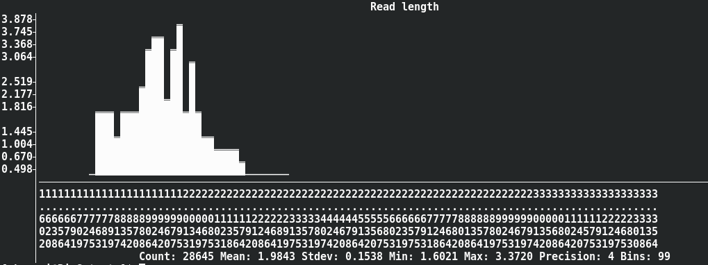

# Usage and Examples

## Quick Guide

- Basic: [seq](#seq), [stats](#stats), [subseq](#subseq), [sliding](#sliding),
  [faidx](#faidx), [translate](#translate), [watch](#watch), [sana](#sana), [scat](#scat)
- Format conversion: [fq2fa](#fq2fa), [fa2fq](#fa2fq), [fx2tab](#fx2tab-tab2fx), [tab2fx](#fx2tab-tab2fx),
  [convert](#convert)
- Searching: [grep](#grep), [locate](#locate), [amplicon](#amplicon), [fish](#fish)
- Set operation: [sample](#sample), [sample2](#sample2), [rmdup](#rmdup), [common](#common),
  [duplicate](#duplicate), [split](#split), [split2](#split2), [head](#head),
  [head-genome](#head-genome), [range](#range), [pair](#pair)
- Edit: [concat](#concat), [replace](#replace), [restart](#restart), [mutate](#mutate),
  [rename](#rename)
- Ordering: [sort](#sort), [shuffle](#shuffle)
- BAM processing: [bam](#bam)
- Others: [sum](#sum), [merge-slides](#merge-slides)

## Technical details and guides for use

### FASTA/Q format parsing and writing

> **Seqkit also supports reading and writing xz (.xz) and zstd (.zst) formats since v2.2.0**.
> **Bzip2 format is supported since v2.4.0**.

SeqKit uses the author's lightweight and high-performance bioinformatics package
[bio](https://github.com/shenwei356/bio) for FASTA/Q parsing,
which has [high performance](https://github.com/shenwei356/bio#fastaq-parsing)
close to the
famous C lib [klib](https://github.com/attractivechaos/klib/) ([kseq.h](https://github.com/attractivechaos/klib/blob/master/kseq.h)).


Notes:

- `seqkit` uses 4 threads by default.
- `seqkit_t1` uses 1 thread.
- `seqtk` is single-threaded.
- `seqtk+gzip`: `seqtk` pipes data to the single-threaded `gzip`.
- `seqtk+pigz`: `seqtk` pipes data to the multithreaded `pigz` which uses 4 threads here.

### Input and output files

Seqkit accepts input data from standard input (STDIN) and plain or gzip-compressed files.
Files can be given via positional arguments or the flag `--infile-list`. For example:

    seqkit seq   a.fasta b.fasta
    
    seqkit seq --infile-list file-list.txt
    
    seqkit seq --infile-list <(find -name "*.fq.gz" directory)

Result are printed to standard ouput (STDOUT) by default, you can also specify the output file
via the flag `-o/--out-file`. The file name extension `.gz` is automatically recognized.
For example:

    seqkit seq a.fasta -o a.fasta.gz
    
    seqkit grep -f IDs.txt read_1.fq.gz -o dir/read_1.fq.gz
    
Seqkit utilizes the [pgzip](https://github.com/klauspost/pgzip) package to read and write gzip file,
and the outputted gzip file would be slighty larger than files generated by GNU `gzip`.

**Seqkit writes gzip files very fast, much faster than the multi-threaded `pigz`,
so there's no need to pipe the result to `gzip`/`pigz`**.

    
### Sequence formats and types

SeqKit seamlessly support FASTA and FASTQ format.
Sequence format is automatically detected.
All subcommands except for `faidx` and `bam` can handle both formats.
And only when some commands (`subseq`, `split`, `sort` and `shuffle`)
which utilise FASTA index to improve perfrmance for large files in two pass mode
(by flag `--two-pass`), only FASTA format is supported.


Sequence type (DNA/RNA/Protein) is automatically detected by leading subsequences
of the first sequences in file or STDIN. The length of the leading subsequences
is configurable by global flag `--alphabet-guess-seq-length` with default value
of 10000. If length of the sequences is less than that, whole sequences will
be checked.

### Sequence ID

By default, most softwares, including `seqkit`, take the leading non-space
letters as sequence identifier (ID). For example,

| FASTA header                                                  | ID                                                |
| :------------------------------------------------------------ | :------------------------------------------------ |
| >123456 gene name                                             | 123456                                            |
| >longname                                                     | longname                                          |
| >gi&#124;110645304&#124;ref&#124;NC_002516.2&#124; Pseudomona | gi&#124;110645304&#124;ref&#124;NC_002516.2&#124; |

But for some sequences from NCBI,
e.g. `>gi|110645304|ref|NC_002516.2| Pseudomona`, the ID is `NC_002516.2`.
In this case, we could set sequence ID parsing regular expression by global flag
`--id-regexp "\|([^\|]+)\| "` or just use flag `--id-ncbi`. If you want
the `gi` number, then use `--id-regexp "^gi\|([^\|]+)\|"`.

### FASTA index

For some commands, including `subseq`, `split`, `sort` and `shuffle`,
when input files are (plain or gzipped) FASTA files,
FASTA index would be optional used for
rapid access of sequences and reducing memory occupation.

ATTENTION: the `.seqkit.fai` file created by SeqKit is a little different from `.fai` file
created by `samtools`. SeqKit uses full sequence head instead of just ID as key.

### Parallelization of CPU intensive jobs

The validation of sequences bases and complement process of sequences
are parallelized for large sequences.

Parsing of line-based files, including BED/GFF file and ID list file are also parallelized.

The `pgzip` package reads and write gzip files in parallel.

The Parallelization is implemented by multiple goroutines in golang
 which are similar to but much
lighter weight than threads. The concurrency number is configurable with global
flag `-j` or `--threads` (default value: 4).

**Using four threads is fast enough for most commands where FASTA/Q reading and writing is the
performance bottleneck, and using more threads will not increase the speed**. 

Few commands could benefit from multiple (>4) threads:

- `stats`
- `scat`
- `grep -s -m`
- `locate -s -m`
- `amplicon -s -m`

### Memory occupation

Most of the subcommands do not read whole FASTA/Q records in to memory,
including `stat`, `fq2fa`, `fx2tab`, `tab2fx`, `grep`, `locate`, `replace`,
 `seq`, `sliding`, `subseq`.

Note that when using `subseq --gtf | --bed`, if the GTF/BED files are too
big, the memory usage will increase.
You could use `--chr` to specify chromesomes and `--feature` to limit features.

Some subcommands could either read all records or read the files twice by flag
`-2` (`--two-pass`), including `sample`, `split`, `shuffle` and `sort`.
They use FASTA index for rapid acccess of sequences and reducing memory occupation.

### Reproducibility

Subcommands `sample` and `shuffle` use random function, random seed could be
given by flag `-s` (`--rand-seed`). This makes sure that sampling result could be
reproduced in different environments with same random seed.

## seqkit

``` text
SeqKit -- a cross-platform and ultrafast toolkit for FASTA/Q file manipulation

Version: 2.11.0

Author: Wei Shen <shenwei356@gmail.com>

Documents  : http://bioinf.shenwei.me/seqkit
Source code: https://github.com/shenwei356/seqkit
Please cite: https://doi.org/10.1002/imt2.191


Seqkit utilizes the pgzip (https://github.com/klauspost/pgzip) package to
read and write gzip file, and the outputted gzip file would be slighty
larger than files generated by GNU gzip.

Seqkit writes gzip files very fast, much faster than the multi-threaded pigz,
therefore there's no need to pipe the result to gzip/pigz.

Seqkit also supports reading and writing xz (.xz) and zstd (.zst) formats since v2.2.0.
Bzip2 format is supported since v2.4.0.

Compression level:
  format   range   default  comment
  gzip     1-9     5        https://github.com/klauspost/pgzip sets 5 as the default value.
  xz       NA      NA       https://github.com/ulikunitz/xz does not support.
  zstd     1-4     2        roughly equals to zstd 1, 3, 7, 11, respectively.
  bzip     1-9     6        https://github.com/dsnet/compress

Usage:
  seqkit [command]

Commands for Basic Operation:
  faidx           create the FASTA index file and extract subsequences
  scat            real time recursive concatenation and streaming of fastx files
  seq             transform sequences (extract ID, filter by length, remove gaps, reverse complement...)
  sliding         extract subsequences in sliding windows
  stats           simple statistics of FASTA/Q files
  subseq          get subsequences by region/gtf/bed, including flanking sequences
  translate       translate DNA/RNA to protein sequence (supporting ambiguous bases)
  watch           monitoring and online histograms of sequence features

Commands for Format Conversion:
  convert         convert FASTQ quality encoding between Sanger, Solexa and Illumina
  fa2fq           retrieve corresponding FASTQ records by a FASTA file
  fq2fa           convert FASTQ to FASTA
  fx2tab          convert FASTA/Q to tabular format (and length, GC content, average quality...)
  tab2fx          convert tabular format to FASTA/Q format

Commands for Searching:
  amplicon        extract amplicon (or specific region around it) via primer(s)
  fish            look for short sequences in larger sequences using local alignment
  grep            search sequences by ID/name/sequence/sequence motifs, mismatch allowed
  locate          locate subsequences/motifs, mismatch allowed

Commands for Set Operation:
  common          find common/shared sequences of multiple files by id/name/sequence
  duplicate       duplicate sequences N times
  head            print the first N FASTA/Q records, or leading records whose total length >= L
  head-genome     print sequences of the first genome with common prefixes in name
  pair            match up paired-end reads from two fastq files
  range           print FASTA/Q records in a range (start:end)
  rmdup           remove duplicated sequences by ID/name/sequence
  sample          sample sequences by number or proportion
  split           split sequences into files by id/seq region/size/parts (mainly for FASTA)
  split2          split sequences into files by size/parts (FASTA, PE/SE FASTQ)

Commands for Edit:
  concat          concatenate sequences with the same ID from multiple files
  mutate          edit sequence (point mutation, insertion, deletion)
  rename          rename duplicated IDs
  replace         replace name/sequence by regular expression
  restart         reset start position for circular genome
  sana            sanitize broken single line FASTQ files

Commands for Ordering:
  shuffle         shuffle sequences
  sort            sort sequences by id/name/sequence/length

Commands for BAM Processing:
  bam             monitoring and online histograms of BAM record features

Commands for Miscellaneous:
  merge-slides    merge sliding windows generated from seqkit sliding
  sum             compute message digest for all sequences in FASTA/Q files

Additional Commands:
  genautocomplete generate shell autocompletion script (bash|zsh|fish|powershell)
  version         print version information and check for update

Flags:
      --alphabet-guess-seq-length int   length of sequence prefix of the first FASTA record based on
                                        which seqkit guesses the sequence type (0 for whole seq)
                                        (default 10000)
      --compress-level int              compression level for gzip, zstd, xz and bzip2. type "seqkit -h"
                                        for the range and default value for each format (default -1)
  -h, --help                            help for seqkit
      --id-ncbi                         FASTA head is NCBI-style, e.g. >gi|110645304|ref|NC_002516.2|
                                        Pseud...
      --id-regexp string                regular expression for parsing ID (default "^(\\S+)\\s?")
  -X, --infile-list string              file of input files list (one file per line), if given, they are
                                        appended to files from cli arguments
  -w, --line-width int                  line width when outputting FASTA format (0 for no wrap) (default 60)
  -o, --out-file string                 out file ("-" for stdout, suffix .gz for gzipped out) (default "-")
      --quiet                           be quiet and do not show extra information
  -t, --seq-type string                 sequence type (dna|rna|protein|unlimit|auto) (for auto, it
                                        automatically detect by the first sequence) (default "auto")
      --skip-file-check                 skip input file checking when given a file list if you believe
                                        these files do exist
  -j, --threads int                     number of CPUs. can also set with environment variable
                                        SEQKIT_THREADS) (default 4)

Use "seqkit [command] --help" for more information about a command.
```

### Datasets

Datasets from [The miRBase Sequence Database -- Release 21](ftp://mirbase.org/pub/mirbase/21/)

- [`hairpin.fa.gz`](ftp://mirbase.org/pub/mirbase/21/hairpin.fa.gz)
- [`mature.fa.gz`](ftp://mirbase.org/pub/mirbase/21/mature.fa.gz)
- [`miRNA.diff.gz`](ftp://mirbase.org/pub/mirbase/21/miRNA.diff.gz)

Human genome from [ensembl](http://uswest.ensembl.org/info/data/ftp/index.html)
(For `seqkit subseq`)

- [`Homo_sapiens.GRCh38.dna_sm.primary_assembly.fa.gz`](ftp://ftp.ensembl.org/pub/release-84/fasta/homo_sapiens/dna/Homo_sapiens.GRCh38.dna_sm.primary_assembly.fa.gz)
- [`Homo_sapiens.GRCh38.84.gtf.gz`](ftp://ftp.ensembl.org/pub/release-84/gtf/homo_sapiens/Homo_sapiens.GRCh38.84.gtf.gz)
- `Homo_sapiens.GRCh38.84.bed.gz` is converted from `Homo_sapiens.GRCh38.84.gtf.gz`
by [`gtf2bed`](http://bedops.readthedocs.org/en/latest/content/reference/file-management/conversion/gtf2bed.html?highlight=gtf2bed)
with the command

        zcat Homo_sapiens.GRCh38.84.gtf.gz \
            | gtf2bed --do-not-sort \
            | gzip -c > Homo_sapiens.GRCh38.84.bed.gz

Only DNA and gtf/bed data of Chr1 were used:

- `chr1.fa.gz`

        seqkit grep -p 1 Homo_sapiens.GRCh38.dna_sm.primary_assembly.fa.gz -o chr1.fa.gz

- `chr1.gtf.gz`

        zcat Homo_sapiens.GRCh38.84.gtf.gz | grep -w '^1' | gzip -c > chr1.gtf.gz

- `chr1.bed.gz`

        zcat Homo_sapiens.GRCh38.84.bed.gz | grep -w '^1' | gzip -c > chr1.bed.gz


## seq

Usage

``` text
transform sequences (extract ID, filter by length, remove gaps, reverse complement...)

Filtering records to edit:
  You can use flags similar to those in "seqkit grep" to choose partly records to edit.

Usage:
  seqkit seq [flags] 

Flags:
  -k, --color                    colorize sequences - to be piped into "less -R"
  -p, --complement               complement sequence, flag '-v' is recommended to switch on
      --dna2rna                  DNA to RNA
      --f-by-name                [target filter] match by full name instead of just ID
      --f-by-seq                 [target filter] search subseq on seq, both positive and negative strand
                                 are searched
      --f-ignore-case            [target filter] ignore case
      --f-invert-match           [target filter] invert the sense of matching, to select non-matching records
      --f-only-positive-strand   [target filter] only search on positive strand
      --f-pattern strings        [target filter] search pattern (multiple values supported. Attention:
                                 use double quotation marks for patterns containing comma, e.g., -p
                                 '"A{2,}"')
      --f-pattern-file string    [target filter] pattern file (one record per line)
      --f-use-regexp             [target filter] patterns are regular expression
  -G, --gap-letters string       gap letters to be removed with -g/--remove-gaps (default "- \t.")
  -h, --help                     help for seq
  -l, --lower-case               print sequences in lower case
  -M, --max-len int              only print sequences shorter than or equal to the maximum length (-1
                                 for no limit) (default -1)
  -R, --max-qual float           only print sequences with average quality less than this limit (-1 for
                                 no limit) (default -1)
  -m, --min-len int              only print sequences longer than or equal to the minimum length (-1 for
                                 no limit) (default -1)
  -Q, --min-qual float           only print sequences with average quality greater or equal than this
                                 limit (-1 for no limit) (default -1)
  -n, --name                     only print names/sequence headers
  -i, --only-id                  print IDs instead of full headers
  -q, --qual                     only print qualities
  -b, --qual-ascii-base int      ASCII BASE, 33 for Phred+33 (default 33)
  -g, --remove-gaps              remove gaps letters seft by -G/--gap-letters, e.g., spaces, tabs, and
                                 dashes (gaps "-" in aligned sequences)
  -r, --reverse                  reverse sequence
      --rna2dna                  RNA to DNA
  -s, --seq                      only print sequences
  -u, --upper-case               print sequences in upper case
  -v, --validate-seq             validate bases according to the alphabet

```

Examples

1. Read and print

    - From file:

            $ seqkit seq hairpin.fa.gz
            >cel-let-7 MI0000001 Caenorhabditis elegans let-7 stem-loop
            UACACUGUGGAUCCGGUGAGGUAGUAGGUUGUAUAGUUUGGAAUAUUACCACCGGUGAAC
            UAUGCAAUUUUCUACCUUACCGGAGACAGAACUCUUCGA

            $ seqkit seq reads_1.fq.gz
            @HWI-D00523:240:HF3WGBCXX:1:1101:2574:2226 1:N:0:CTGTAG
            TGAGGAATATTGGTCAATGGGCGCGAGCCTGAACCAGCCAAGTAGCGTGAAGGATGACTGCCCTACGGG
            +
            HIHIIIIIHIIHGHHIHHIIIIIIIIIIIIIIIHHIIIIIHHIHIIIIIGIHIIIIHHHHHHGHIHIII

    - From stdin:

            zcat hairpin.fa.gz | seqkit seq


1. Sequence types

    - By default, `seqkit seq` automatically detect the sequence type

            $ echo -e ">seq\nacgtryswkmbdhvACGTRYSWKMBDHV" | seqkit stats
            file  format  type  num_seqs  sum_len  min_len  avg_len  max_len
            -     FASTA   DNA          1       28       28       28       28

            $ echo -e ">seq\nACGUN ACGUN" | seqkit stats
            file  format  type  num_seqs  sum_len  min_len  avg_len  max_len
            -     FASTA   RNA          1       11       11       11       11

            $ echo -e ">seq\nabcdefghijklmnpqrstvwyz" | seqkit stats
            file  format  type     num_seqs  sum_len  min_len  avg_len  max_len
            -     FASTA   Protein         1       23       23       23       23

            $ echo -e "@read\nACTGCN\n+\n@IICCG" | seqkit stats
            file  format  type  num_seqs  sum_len  min_len  avg_len  max_len
            -     FASTQ   DNA          1        6        6        6        6

    - You can also set sequence type by flag `-t` (`--seq-type`).
      But this only take effect on subcommands `seq` and `locate`.

            $ echo -e ">seq\nabcdefghijklmnpqrstvwyz" | seqkit seq -t dna
            [INFO] when flag -t (--seq-type) given, flag -v (--validate-seq) is automatically switched on
            [ERRO] error when parsing seq: seq (invalid DNAredundant letter: e)


1. Only print names

    - Full name:

            $ seqkit seq hairpin.fa.gz -n
            cel-let-7 MI0000001 Caenorhabditis elegans let-7 stem-loop
            cel-lin-4 MI0000002 Caenorhabditis elegans lin-4 stem-loop
            cel-mir-1 MI0000003 Caenorhabditis elegans miR-1 stem-loop

    - Only ID:

            $ seqkit seq hairpin.fa.gz -n -i
            cel-let-7
            cel-lin-4
            cel-mir-1

    - Custom ID region by regular expression (this could be applied to all subcommands):

            $ seqkit seq hairpin.fa.gz -n -i --id-regexp "^[^\s]+\s([^\s]+)\s"
            MI0000001
            MI0000002
            MI0000003

1. Only print seq (global flag `-w` defines the output line width, `0` for no wrap)

        $ seqkit seq hairpin.fa.gz -s -w 0
        UACACUGUGGAUCCGGUGAGGUAGUAGGUUGUAUAGUUUGGAAUAUUACCACCGGUGAACUAUGCAAUUUUCUACCUUACCGGAGACAGAACUCUUCGA
        AUGCUUCCGGCCUGUUCCCUGAGACCUCAAGUGUGAGUGUACUAUUGAUGCUUCACACCUGGGCUCUCCGGGUACCAGGACGGUUUGAGCAGAU
        AAAGUGACCGUACCGAGCUGCAUACUUCCUUACAUGCCCAUACUAUAUCAUAAAUGGAUAUGGAAUGUAAAGAAGUAUGUAGAACGGGGUGGUAGU

1. Convert multi-line FASTQ to 4-line FASTQ

        $ seqkit seq reads_1.fq.gz -w 0

1. Reverse comlement sequence

        $ seqkit seq hairpin.fa.gz -r -p
        >cel-let-7 MI0000001 Caenorhabditis elegans let-7 stem-loop
        UCGAAGAGUUCUGUCUCCGGUAAGGUAGAAAAUUGCAUAGUUCACCGGUGGUAAUAUUCC
        AAACUAUACAACCUACUACCUCACCGGAUCCACAGUGUA

1. Remove gaps and to lower/upper case

        $ echo -e ">seq\nACGT-ACTGC-ACC" | seqkit seq -g -u
        >seq
        ACGTACTGCACC

1. RNA to DNA

        $ echo -e ">seq\nUCAUAUGCUUGUCUCAAAGAUUA" | seqkit seq --rna2dna
        >seq
        TCATATGCTTGTCTCAAAGATTA

1. Filter by sequence length

        $ cat hairpin.fa | seqkit seq | seqkit stats
        file  format  type  num_seqs    sum_len  min_len  avg_len  max_len
        -     FASTA   RNA     28,645  2,949,871       39      103    2,354

        $ cat hairpin.fa | seqkit seq -m 100 | seqkit stats
        file  format  type  num_seqs    sum_len  min_len  avg_len  max_len
        -     FASTA   RNA     10,975  1,565,486      100    142.6    2,354

        $ cat hairpin.fa | seqkit seq -m 100 -M 1000 | seqkit stats
        file  format  type  num_seqs    sum_len  min_len  avg_len  max_len
        -     FASTA   RNA     10,972  1,560,270      100    142.2      938
        
1. Choose some sequences to edit.

        $ echo -ne ">s1\na-c-t-g\n>s2 plasmid\naa-cc-tt-gg\n" 
        >s1
        a-c-t-g
        >s2 plasmid
        aa-cc-tt-gg

        $ echo -ne ">s1\na-c-t-g\n>s2 plasmid\naa-cc-tt-gg\n" \
                | ./seqkit seq --f-use-regexp --f-by-name  --f-pattern plasmid -r -p -g -u
        >s1
        a-c-t-g
        >s2 plasmid
        CCAAGGTT


## subseq

Usage

``` text
get subsequences by region/gtf/bed, including flanking sequences.

Attention:
  1. When extracting with BED/GTF from plain text FASTA files, the order of output sequences
     are random. To keep the order, just compress the FASTA file (input.fasta) and use the
     compressed one (input.fasta.gz) as the input.
  2. Use "seqkit grep" for extracting subsets of sequences.
     "seqtk subseq seqs.fasta id.txt" equals to
     "seqkit grep -f id.txt seqs.fasta"

Recommendation:
  1. Use plain FASTA file, so seqkit could utilize FASTA index.
  2. The flag -U/--update-faidx is recommended to ensure the .fai file matches the FASTA file.

The definition of region is 1-based and with some custom design.

Examples:

 1-based index    1 2 3 4 5 6 7 8 9 10
negative index    0-9-8-7-6-5-4-3-2-1
           seq    A C G T N a c g t n
           1:1    A
           2:4      C G T
         -4:-2                c g t
         -4:-1                c g t n
         -1:-1                      n
          2:-2      C G T N a c g t
          1:-1    A C G T N a c g t n
          1:12    A C G T N a c g t n
        -12:-1    A C G T N a c g t n

Usage:
  seqkit subseq [flags] 

Flags:
      --bed string        by tab-delimited BED file
      --chr strings       select limited sequence with sequence IDs when using --gtf or --bed (multiple
                          value supported, case ignored)
  -d, --down-stream int   down stream length
      --feature strings   select limited feature types (multiple value supported, case ignored, only
                          works with GTF)
      --gtf string        by GTF (version 2.2) file
      --gtf-tag string    output this tag as sequence comment (default "gene_id")
  -h, --help              help for subseq
  -f, --only-flank        only return up/down stream sequence
  -r, --region string     by region. e.g 1:12 for first 12 bases, -12:-1 for last 12 bases, 13:-1 for
                          cutting first 12 bases. type "seqkit subseq -h" for more examples
  -R, --region-coord      append coordinates to sequence ID for -r/--region
  -u, --up-stream int     up stream length
  -U, --update-faidx      update the fasta index file if it exists. Use this if you are not sure whether
                          the fasta file changed

```

Examples

***Recommendation: use plain FASTA file, so seqkit could utilize FASTA index.***

1. First 12 bases

        $ zcat hairpin.fa.gz | seqkit subseq -r 1:12

1. Last 12 bases

        $ zcat hairpin.fa.gz | seqkit subseq -r -12:-1

1. Subsequences without first and last 12 bases

        $ zcat hairpin.fa.gz | seqkit subseq -r 13:-13

1. Get subsequence by GTF file

        $ cat t.fa
        >seq
        actgACTGactgn

        $ cat t.gtf
        seq     test    CDS     5       8       .       .       .       gene_id "A"; transcript_id "";
        seq     test    CDS     5       8       .       -       .       gene_id "B"; transcript_id "";

        $ seqkit subseq --gtf t.gtf t.fa
        >seq_5:8:. A
        ACTG
        >seq_5:8:- B
        CAGT

    Human genome example:

    ***AVOID loading all data from Homo_sapiens.GRCh38.84.gtf.gz,
    the uncompressed data are so big and may exhaust your RAM.***

    We could specify chromesomes and features.

        $ seqkit subseq --gtf Homo_sapiens.GRCh38.84.gtf.gz --chr 1 --feature cds  hsa.fa > chr1.gtf.cds.fa

        $ seqkit stats chr1.gtf.cds.fa
        file             format  type  num_seqs    sum_len  min_len  avg_len  max_len
        chr1.gtf.cds.fa  FASTA   DNA     65,012  9,842,274        1    151.4   12,045

1. Get CDS and 3bp up-stream sequences

        $ seqkit subseq --gtf t.gtf t.fa -u 3
        >seq_5:8:._us:3 A
        ctgACTG
        >seq_5:8:-_us:3 B
        agtCAGT

1. Get 3bp up-stream sequences of CDS, not including CDS

        $ seqkit subseq --gtf t.gtf t.fa -u 3 -f
        >seq_5:8:._usf:3 A
        ctg
        >seq_5:8:-_usf:3 B
        agt

1. Get subsequences by BED file.

    ***AVOID loading all data from Homo_sapiens.GRCh38.84.gtf.gz,
    the uncompressed data are so big and may exhaust your RAM.***

        $ seqkit subseq --bed Homo_sapiens.GRCh38.84.bed.gz --chr 1 hsa.fa \
            >  chr1.bed.gz.fa

    We may need to remove duplicated sequences

        $ seqkit subseq --bed Homo_sapiens.GRCh38.84.bed.gz --chr 1 hsa.fa \
            | seqkit rmdup > chr1.bed.rmdup.fa
        [INFO] 141060 duplicated records removed

    Summary:

        $ seqkit stats chr1.gz.*.gz
        file               seq_format   seq_type   num_seqs   min_len   avg_len     max_len
        chr1.gz.fa         FASTA        DNA         231,974         1   3,089.5   1,551,957
        chr1.gz.rmdup.fa   FASTA        DNA          90,914         1   6,455.8   1,551,957


## sliding

Usage

``` text
extract subsequences in sliding windows

Usage:
  seqkit sliding [flags]

Flags:
  -c, --circular          circular genome (same to -C/--circular-genome)
  -C, --circular-genome   circular genome (same to -c/--circular)
  -g, --greedy            greedy mode, i.e., exporting last subsequences even shorter than the windows size
  -h, --help              help for sliding
  -s, --step int          step size
  -S, --sufix string      suffix added to the sequence ID
  -W, --window int        window size

```

Examples

1. General use

        $ echo -e ">seq\nACGTacgtNN" | seqkit sliding -s 3 -W 6
        >seq_sliding:1-6
        ACGTac
        >seq_sliding:4-9
        TacgtN

1. Greedy mode

        $ echo -e ">seq\nACGTacgtNN" | seqkit sliding -s 3 -W 6 -g
        >seq_sliding:1-6
        ACGTac
        >seq_sliding:4-9
        TacgtN
        >seq_sliding:7-12
        gtNN
        >seq_sliding:10-15
        N

2. Circular genome

        $ echo -e ">seq\nACGTacgtNN" | seqkit sliding -s 3 -W 6 -C
        >seq_sliding:1-6
        ACGTac
        >seq_sliding:4-9
        TacgtN
        >seq_sliding:7-2
        gtNNAC
        >seq_sliding:10-5
        NACGTa

3. Generate GC content for ploting

        $ zcat hairpin.fa.gz \
            | seqkit sliding -s 5 -W 30 \
            | seqkit fx2tab -n -g
        cel-let-7_sliding:1-30          50.00
        cel-let-7_sliding:6-35          46.67
        cel-let-7_sliding:11-40         43.33
        cel-let-7_sliding:16-45         36.67
        cel-let-7_sliding:21-50         33.33
        cel-let-7_sliding:26-55         40.00
        ...

## stats

Usage

``` text
simple statistics of FASTA/Q files

Columns:

  1.  file      input file, "-" for STDIN
  2.  format    FASTA or FASTQ
  3.  type      DNA, RNA, Protein or Unlimit
  4.  num_seqs  number of sequences
  5.  sum_len   number of bases or residues       , with gaps or spaces counted
  6.  min_len   minimal sequence length           , with gaps or spaces counted
  7.  avg_len   average sequence length           , with gaps or spaces counted
  8.  max_len   miximal sequence length           , with gaps or spaces counted
  9.  Q1        first quartile of sequence length , with gaps or spaces counted
  10. Q2        median of sequence length         , with gaps or spaces counted
  11. Q3        third quartile of sequence length , with gaps or spaces counted
  12. sum_gap   number of gaps
  13. N50       N50. https://en.wikipedia.org/wiki/N50,_L50,_and_related_statistics#N50
  14. N50_num   N50_num or L50. https://en.wikipedia.org/wiki/N50,_L50,_and_related_statistics#L50
  15. Q20(%)    percentage of bases with the quality score greater than 20
  16. Q30(%)    percentage of bases with the quality score greater than 30
  17. AvgQual   average quality.
                Attention: It's not the arithmetic average of quartiles (some tools do that).
                How to computate: 1) take the qscore for each base, 2) convert it back to
                an error probability, 3) take the mean of those, 4) and then convert that
                mean error back into a qscore.
                Reference: https://github.com/shenwei356/seqkit/issues/448
  18. GC(%)     percentage of GC content
  19. sum_n     number of ambitious letters (N, n, X, x)
  
Attention:
  1. Sequence length metrics (sum_len, min_len, avg_len, max_len, Q1, Q2, Q3)
     count the number of gaps or spaces. You can remove them with "seqkit seq -g":
         seqkit seq -g input.fasta | seqkit stats

Tips:
  1. For lots of small files (especially on SDD), use big value of '-j' to
     parallelize counting.
  2. Extract one metric with csvtk (https://github.com/shenwei356/csvtk):
         seqkit stats -Ta input.fastq.gz | csvtk cut -t -f "Q30(%)" | csvtk del-header

Usage:
  seqkit stats [flags]

Aliases:
  stats, stat

Flags:
  -N, --N strings            other N50-like stats. value range [0, 100], multiple values supported,
                             e.g., -N 50,90 or -N 50 -N 90
  -a, --all                  all statistics, including quartiles of seq length, sum_gap, N50
  -b, --basename             only output basename of files
  -E, --fq-encoding string   fastq quality encoding. available values: 'sanger', 'solexa',
                             'illumina-1.3+', 'illumina-1.5+', 'illumina-1.8+'. (default "sanger")
  -G, --gap-letters string   gap letters (default "- .")
  -h, --help                 help for stats
  -e, --skip-err             skip error, only show warning message
  -S, --skip-file-check      skip input file checking when given files or a file list.
  -i, --stdin-label string   label for replacing default "-" for stdin (default "-")
  -T, --tabular              output in machine-friendly tabular format

```

Eexamples

1. General use

        $ seqkit stats *.f{a,q}.gz
        file           format  type  num_seqs    sum_len  min_len  avg_len  max_len
        hairpin.fa.gz  FASTA   RNA     28,645  2,949,871       39      103    2,354
        mature.fa.gz   FASTA   RNA     35,828    781,222       15     21.8       34
        reads_1.fq.gz  FASTQ   DNA      2,500    567,516      226      227      229
        reads_2.fq.gz  FASTQ   DNA      2,500    560,002      223      224      225

1. Machine-friendly tabular format

        $ seqkit stats *.f{a,q}.gz -T
        file    format  type    num_seqs        sum_len min_len avg_len max_len
        hairpin.fa.gz   FASTA   RNA     28645   2949871 39      103.0   2354
        mature.fa.gz    FASTA   RNA     35828   781222  15      21.8    34
        Illimina1.8.fq.gz       FASTQ   DNA     10000   1500000 150     150.0   150
        reads_1.fq.gz   FASTQ   DNA     2500    567516  226     227.0   229
        reads_2.fq.gz   FASTQ   DNA     2500    560002  223     224.0   225

        # So you can process the result with tools like csvtk: http://bioinf.shenwei.me/csvtk

        $ seqkit stats *.f{a,q}.gz -T | csvtk pretty -t
        file                format   type   num_seqs   sum_len   min_len   avg_len   max_len
        -----------------   ------   ----   --------   -------   -------   -------   -------
        hairpin.fa.gz       FASTA    RNA    28645      2949871   39        103.0     2354
        mature.fa.gz        FASTA    RNA    35828      781222    15        21.8      34
        Illimina1.8.fq.gz   FASTQ    DNA    10000      1500000   150       150.0     150
        reads_1.fq.gz       FASTQ    DNA    2500       567516    226       227.0     229
        reads_2.fq.gz       FASTQ    DNA    2500       560002    223       224.0     225


        # To markdown

        $ seqkit stats *.f{a,q}.gz -T | csvtk csv2md -t
        | file              | format | type | num_seqs | sum_len | min_len | avg_len | max_len |
        | :---------------- | :----- | :--- | :------- | :------ | :------ | :------ | :------ |
        | hairpin.fa.gz     | FASTA  | RNA  | 28645    | 2949871 | 39      | 103.0   | 2354    |
        | mature.fa.gz      | FASTA  | RNA  | 35828    | 781222  | 15      | 21.8    | 34      |
        | Illimina1.8.fq.gz | FASTQ  | DNA  | 10000    | 1500000 | 150     | 150.0   | 150     |
        | reads_1.fq.gz     | FASTQ  | DNA  | 2500     | 567516  | 226     | 227.0   | 229     |
        | reads_2.fq.gz     | FASTQ  | DNA  | 2500     | 560002  | 223     | 224.0   | 225     |

    | file              | format | type | num_seqs | sum_len | min_len | avg_len | max_len |
    | :---------------- | :----- | :--- | :------- | :------ | :------ | :------ | :------ |
    | hairpin.fa.gz     | FASTA  | RNA  | 28645    | 2949871 | 39      | 103.0   | 2354    |
    | mature.fa.gz      | FASTA  | RNA  | 35828    | 781222  | 15      | 21.8    | 34      |
    | Illimina1.8.fq.gz | FASTQ  | DNA  | 10000    | 1500000 | 150     | 150.0   | 150     |
    | reads_1.fq.gz     | FASTQ  | DNA  | 2500     | 567516  | 226     | 227.0   | 229     |
    | reads_2.fq.gz     | FASTQ  | DNA  | 2500     | 560002  | 223     | 224.0   | 225     |


1. Extra information

        $ seqkit stats *.f{a,q}.gz -a
        file               format  type  num_seqs    sum_len  min_len  avg_len  max_len   Q1   Q2   Q3  sum_gap  N50  N50_num  Q20(%)  Q30(%)  AvgQual  GC(%)  sum_n
        hairpin.fa.gz      FASTA   RNA     28,645  2,949,871       39      103    2,354   76   91  111        0  101      380       0       0        0  45.77    255
        mature.fa.gz       FASTA   RNA     35,828    781,222       15     21.8       34   21   22   22        0   22       12       0       0        0   47.6      0
        Illimina1.8.fq.gz  FASTQ   DNA     10,000  1,500,000      150      150      150  150  150  150        0  150        1   96.16   89.71    24.82  49.91     38
        nanopore.fq.gz     FASTQ   DNA      4,000  1,798,723      153    449.7    6,006  271  318  391        0  395      585   40.79   12.63     9.48  46.66      0
        reads_1.fq.gz      FASTQ   DNA      2,500    567,516      226      227      229  227  227  227        0  227        3   91.24   86.62    15.45  53.63     44
        reads_2.fq.gz      FASTQ   DNA      2,500    560,002      223      224      225  224  224  224        0  224        2   91.06   87.66    14.62  54.77      2

1. **Parallelize counting files, it's much faster for lots of small files, especially for files on SSD**

        seqkit stats -j 10 refseq/virual/*.fna.gz

1. Skip error

        $ seqkit stats tests/*
        [ERRO] tests/hairpin.fa.fai: fastx: invalid FASTA/Q format

        $ seqkit stats tests/* -e
        [WARN] tests/hairpin.fa.fai: fastx: invalid FASTA/Q format
        [WARN] tests/hairpin.fa.seqkit.fai: fastx: invalid FASTA/Q format
        [WARN] tests/miRNA.diff.gz: fastx: invalid FASTA/Q format
        [WARN] tests/test.sh: fastx: invalid FASTA/Q format
        file                     format  type  num_seqs    sum_len  min_len  avg_len  max_len
        tests/contigs.fa         FASTA   DNA          9         54        2        6       10
        tests/hairpin.fa         FASTA   RNA     28,645  2,949,871       39      103    2,354
        tests/Illimina1.5.fq     FASTQ   DNA          1        100      100      100      100
        tests/Illimina1.8.fq.gz  FASTQ   DNA     10,000  1,500,000      150      150      150
        tests/hairpin.fa.gz      FASTA   RNA     28,645  2,949,871       39      103    2,354
        tests/reads_1.fq.gz      FASTQ   DNA      2,500    567,516      226      227      229
        tests/mature.fa.gz       FASTA   RNA     35,828    781,222       15     21.8       34
        tests/reads_2.fq.gz      FASTQ   DNA      2,500    560,002      223      224      225
        
1. Output basename instead of full path (`-b/--basename`)
    
## sum

Usage

```text
compute message digest for all sequences in FASTA/Q files

Attention:
  1. Sequence headers and qualities are skipped, only sequences matter.
  2. The order of sequences records does not matter.
  3. Circular complete genomes are supported with the flag -c/--circular.
     - The same double-stranded genomes with different start positions or
       in reverse complement strand will not affect the result.
     - For single-stranded genomes like ssRNA genomes, use -s/--single-strand.
     - The message digest would change with different values of k-mer size.
  4. Multiple files are processed in parallel (-j/--threads).

Method:
  1. Converting the sequences to low cases, optionally removing gaps (-g).
  2. Computing the hash (xxhash) for all sequences or k-mers of a circular
     complete genome (-c/--circular).
  3. Sorting all hash values, for ignoring the order of sequences.
  4. Computing MD5 digest from the hash values, sequences length, and
     the number of sequences.

Following the seqhash in Poly (https://github.com/TimothyStiles/poly/),
We add meta information to the message digest, with the format of:

    seqkit.<version>_<seq type><seq structure><strand>_<kmer size>_<seq digest>

    <version>:       digest version
    <seq type>:      'D' for DNA, 'R' for RNA, 'P' for protein, 'N' for others
    <seq structure>: 'L' for linear sequence, 'C' for circular genome
    <strand>:        'D' for double-stranded, 'S' for single-stranded
    <kmer size>:     0 for linear sequence, other values for circular genome

Examples:

    seqkit.v0.1_DLS_k0_176250c8d1cde6c385397df525aa1a94    DNA.fq.gz
    seqkit.v0.1_PLS_k0_c244954e4960dd2a1409cd8ee53d92b9    Protein.fasta
    seqkit.v0.1_RLS_k0_0f1fb263f0c05a259ae179a61a80578d    single-stranded RNA.fasta

    seqkit.v0.1_DCD_k31_e59dad6d561f1f1f28ebf185c6f4c183   double-stranded-circular DNA.fasta
    seqkit.v0.1_DCS_k31_dd050490cd62ea5f94d73d4d636b7d60   single-stranded-circular DNA.fasta

Usage:
  seqkit sum [flags]

Flags:
  -a, --all                  show all information, including the sequences length and the number of sequences
  -b, --basename             only output basename of files
  -c, --circular             the file contains a single cicular genome sequence
  -G, --gap-letters string   gap letters to delete with the flag -g/--remove-gaps (default "- \t.*")
  -h, --help                 help for sum
  -k, --kmer-size int        k-mer size for processing circular genomes (default 1000)
  -g, --remove-gaps          remove gap characters set in the option -G/gap-letters
      --rna2dna              convert RNA to DNA
  -s, --single-strand        only consider the positive strand of a circular genome, e.g., ssRNA virus
                             genomes

```

Examples:

A, B, C, D are the same vircular genomes with different starting positions or strands:

    $ cat virus-{A,B,C,D}.fasta
    >seq
    TGGTAGGGAGTTGAGTAGCATGGGTATAGTATAGTGTCATGATGCCAGATTTTAAAAAAA
    >seq.revcom
    TTTTTTTAAAATCTGGCATCATGACACTATACTATACCCATGCTACTCAACTCCCTACCA
    >seq.new-start
    GGTAGGGAGTTGAGTAGCATGGGTATAGTATAGTGTCATGATGCCAGATTTTAAAAAAAT
    >seq.revcom.new-start
    TTTTTTAAAATCTGGCATCATGACACTATACTATACCCATGCTACTCAACTCCCTACCAT
    
    # cat to one file
    $ cat virus-{A,B,C,D}.fasta > virues.fasta
    
    # shuffle and rename
    $ cat virus-{A,B,C,D}.fasta \
        | seqkit shuffle \
        | seqkit replace -p '.*' -r '{nr}' \
        | tee virues.shuffled.fasta
    >1
    TTTTTTAAAATCTGGCATCATGACACTATACTATACCCATGCTACTCAACTCCCTACCAT
    >2
    TGGTAGGGAGTTGAGTAGCATGGGTATAGTATAGTGTCATGATGCCAGATTTTAAAAAAA
    >3
    GGTAGGGAGTTGAGTAGCATGGGTATAGTATAGTGTCATGATGCCAGATTTTAAAAAAAT
    >4
    TTTTTTTAAAATCTGGCATCATGACACTATACTATACCCATGCTACTCAACTCCCTACCA

Sum of all files (the sequences order does not matter):

    $ seqkit sum viru*.fasta
    seqkit.v0.1_DLS_k0_9bbe0abefc26013dffdde952a6725b17    virues.fasta
    seqkit.v0.1_DLS_k0_9bbe0abefc26013dffdde952a6725b17    virues.shuffled.fasta
    seqkit.v0.1_DLS_k0_176250c8d1cde6c385397df525aa1a94    virus-A.fasta
    seqkit.v0.1_DLS_k0_7a813339f9ae686b376b1df55cd596ca    virus-B.fasta
    seqkit.v0.1_DLS_k0_0fd51028bfbfa85ddbdd2b86ef7bd1c1    virus-C.fasta
    seqkit.v0.1_DLS_k0_88b1d20dd0fe0dbf41c00b075fee4e4e    virus-D.fasta

Circular genomes (the same genomes with different start positions or in reverse
complement strand will not affect the result):

    $ seqkit sum -c -k 21  virus-*.fasta
    seqkit.v0.1_DCD_k21_7efd18ce33380268d3aa335ffd2dd1cc   virus-A.fasta
    seqkit.v0.1_DCD_k21_7efd18ce33380268d3aa335ffd2dd1cc   virus-B.fasta
    seqkit.v0.1_DCD_k21_7efd18ce33380268d3aa335ffd2dd1cc   virus-C.fasta
    seqkit.v0.1_DCD_k21_7efd18ce33380268d3aa335ffd2dd1cc   virus-D.fasta
    
    $ seqkit sum -c -k 51  virus-*.fasta
    seqkit.v0.1_DCD_k51_39e267864fddeafd7a5cacd77e0a6a11   virus-A.fasta
    seqkit.v0.1_DCD_k51_39e267864fddeafd7a5cacd77e0a6a11   virus-B.fasta
    seqkit.v0.1_DCD_k51_39e267864fddeafd7a5cacd77e0a6a11   virus-C.fasta
    seqkit.v0.1_DCD_k51_39e267864fddeafd7a5cacd77e0a6a11   virus-D.fasta
        
    # collect files with the same genomes
    $ seqkit sum -c -k 51  virus-*.fasta | csvtk fold -Ht -f 1 -v 2 
    seqkit.v0.1_DCD_k51_39e267864fddeafd7a5cacd77e0a6a11   virus-A.fasta; virus-B.fasta; virus-C.fasta; virus-D.fasta
    
## faidx

Usage

``` text
create the FASTA index file and extract subsequences

This command is similar with "samtools faidx" but has some extra features:

  1. output full header line with the flag -f
  2. support regular expression as sequence ID with the flag -r
  3. if you have large number of IDs, you can use:
        seqkit faidx seqs.fasta -l IDs.txt

Attention:
  1. The flag -U/--update-faidx is recommended to ensure the .fai file matches the FASTA file.

The definition of region is 1-based and with some custom design.

Examples:

 1-based index    1 2 3 4 5 6 7 8 9 10
negative index    0-9-8-7-6-5-4-3-2-1
           seq    A C G T N a c g t n
           1:1    A
           2:4      C G T
         -4:-2                c g t
         -4:-1                c g t n
         -1:-1                      n
          2:-2      C G T N a c g t
          1:-1    A C G T N a c g t n
          1:12    A C G T N a c g t n
        -12:-1    A C G T N a c g t n

Usage:
  seqkit faidx [flags] <fasta-file> [regions...]

Flags:
  -f, --full-head            print full header line instead of just ID. New fasta index file ending with
                             .seqkit.fai will be created
  -h, --help                 help for faidx
  -i, --ignore-case          ignore case
  -I, --immediate-output     print output immediately, do not use write buffer
  -l, --region-file string   file containing a list of regions
  -U, --update-faidx         update the fasta index file if it exists. Use this if you are not sure
                             whether the fasta file changed
  -r, --use-regexp           IDs are regular expression. But subseq region is not supported here.

```

Example

1. common usage like `samtools faidx`

        $ seqkit faidx tests/hairpin.fa hsa-let-7a-1 hsa-let-7a-2
        >hsa-let-7a-1
        UGGGAUGAGGUAGUAGGUUGUAUAGUUUUAGGGUCACACCCACCACUGGGAGAUAACUAU
        ACAAUCUACUGUCUUUCCUA
        >hsa-let-7a-2
        AGGUUGAGGUAGUAGGUUGUAUAGUUUAGAAUUACAUCAAGGGAGAUAACUGUACAGCCU
        CCUAGCUUUCCU

2. output full header, not supported by `samtools faidx`

        $ seqkit faidx tests/hairpin.fa hsa-let-7a-1 hsa-let-7a-2 -f
        >hsa-let-7a-1 MI0000060 Homo sapiens let-7a-1 stem-loop
        UGGGAUGAGGUAGUAGGUUGUAUAGUUUUAGGGUCACACCCACCACUGGGAGAUAACUAU
        ACAAUCUACUGUCUUUCCUA
        >hsa-let-7a-2 MI0000061 Homo sapiens let-7a-2 stem-loop
        AGGUUGAGGUAGUAGGUUGUAUAGUUUAGAAUUACAUCAAGGGAGAUAACUGUACAGCCU
        CCUAGCUUUCCU

3. extract subsequence of specific region

        $ seqkit faidx tests/hairpin.fa hsa-let-7a-1:1-10
        >hsa-let-7a-1:1-10
        UGGGAUGAGG

        $ seqkit faidx tests/hairpin.fa hsa-let-7a-1:-10--1
        >hsa-let-7a-1:-10--1
        GUCUUUCCUA

        $ seqkit faidx tests/hairpin.fa hsa-let-7a-1:1
        >hsa-let-7a-1:1-1
        U
        
3. supporting `begin` > `start`, i.e., returning reverse complement sequence, not supported by `samtools faidx`

        $ seqkit faidx tests/hairpin.fa hsa-let-7a-1:10-1
        >hsa-let-7a-1:10-1
        CCUCAUCCCA

4. use regular expression

        $ seqkit faidx tests/hairpin.fa hsa -r | seqkit stats
        file  format  type  num_seqs  sum_len  min_len  avg_len  max_len
        -     FASTA   RNA      1,881  154,002       41     81.9      180


## watch

Usage

``` text
monitoring and online histograms of sequence features

Usage:
  seqkit watch [flags]

Flags:
  -B, --bins int              number of histogram bins (default -1)
  -W, --delay int             sleep this many seconds after online plotting (default 1)
  -y, --dump                  print histogram data to stderr instead of plotting
  -f, --fields string         target fields, available values: ReadLen, MeanQual, GC, GCSkew (default
                              "ReadLen")
  -h, --help                  help for watch
  -O, --img string            save histogram to this PDF/image file
  -H, --list-fields           print out a list of available fields
  -L, --log                   log10(x+1) transform numeric values
  -x, --pass                  pass through mode (write input to stdout)
  -p, --print-freq int        print/report after this many records (-1 for print after EOF) (default -1)
  -b, --qual-ascii-base int   ASCII BASE, 33 for Phred+33 (default 33)
  -Q, --quiet-mode            supress all plotting to stderr
  -R, --reset                 reset histogram after every report
  -v, --validate-seq          validate bases according to the alphabet

```

Examples


1. Histogram of sequence length

        seqkit watch --fields ReadLen nanopore.fq.gz -O len.png
        
    

1. Dynamic histogram of log sequence length
    
        seqkit watch --log --fields ReadLen nanopore.fq.gz
    
    
    
2. Histogram of mean base qualities every 500 record, also saved as png

        seqkit watch -p 500 -O qhist.png -f MeanQual nanopore.fq.gz

## sana

Usage

``` text
sanitize broken single line FASTQ files

Sana is a resilient FASTQ/FASTA parser. Unlike many parsers,
it won't stop at the first error. Instead, it skips malformed records
and continues processing the file.

Sana currently supports this FASTQ dialect:

  - One line for each sequence and quality value

Usage:
  seqkit sana [flags]

Flags:
  -A, --allow-gaps            allow gap character (-) in sequences
  -i, --format string         input and output format: fastq or fasta (default "fastq")
  -h, --help                  help for sana
  -I, --in-format string      input format: fastq or fasta
  -O, --out-format string     output format: fastq or fasta
  -b, --qual-ascii-base int   ASCII BASE, 33 for Phred+33 (default 33)
```

Examples


1. Rescue usable reads from fastq file with malformed records.
    
        seqkit sana broken.fq.gz -o rescued.fq.gz

1. For paired reads, you can process both files and pair them with `pair`.

        seqkit sana broken_1.fq.gz -o rescued_1.fq.gz
        seqkit sana broken_2.fq.gz -o rescued_2.fq.gz

        seqkit pair -1 rescued_1.fq.gz -2 rescued_2.fq.gz -O rescued/


## scat

Usage

```text
real time recursive concatenation and streaming of fastx files

Usage:
  seqkit scat [flags]

Flags:
  -A, --allow-gaps            allow gap character (-) in sequences
  -d, --delta int             minimum size increase in kilobytes to trigger parsing (default 5)
  -D, --drop-time string      Notification drop interval (default "500ms")
  -f, --find-only             concatenate exisiting files and quit
  -i, --format string         input and output format: fastq or fasta (fastq) (default "fastq")
  -g, --gz-only               only look for gzipped files (.gz suffix)
  -h, --help                  help for scat
  -I, --in-format string      input format: fastq or fasta (fastq)
  -O, --out-format string     output format: fastq or fasta
  -b, --qual-ascii-base int   ASCII BASE, 33 for Phred+33 (default 33)
  -r, --regexp string         regexp for watched files, by default guessed from the input format
  -T, --time-limit string     quit after inactive for this time period
  -p, --wait-pid int          after process with this PID exited (default -1)
  
```

Examples

1. Concatenate all fastq files recursively under a directory

        seqkit scat -j 4 -f fastq_dir > all_records.fq

2. Watch a directory and stream fastq records in real time until interrupt is recieved and plot read lengths using `seqkit watch`:

        seqkit scat -j 4 fastq_dir | seqkit watch -f ReadLen -

3. Watch a directory and stream fastq records in real time until there is no write activity under the directory for 5 seconds:

        seqkit scat -j 4 -T "5s" fastq_dir > all_records.fq

4. Watch a directory and stream fastq records in real time until a process with a specified PID is alive:

        seqkit scat -j 4 -p $PID fastq_dir > all_records.fq

**Notes**: You might need to increase the `ulimit` allowance on open files if you intend to stream fastx records from a large number of files.

## fq2fa

Usage

```text
convert FASTQ to FASTA

Usage:
  seqkit fq2fa [flags]

```

Examples

    seqkit fq2fa reads_1.fq.gz -o reads_1.fa.gz


## fa2fq

Usage

```text
retrieve corresponding FASTQ records by a FASTA file

Attention:
  1. We assume the FASTA file comes from the FASTQ file,
     so they share sequence IDs, and sequences in FASTA
     should be subseq of sequences in FASTQ file.

Usage:
  seqkit fa2fq [flags]

Flags:
  -f, --fasta-file string      FASTA file)
  -h, --help                   help for fa2fq
  -P, --only-positive-strand   only search on positive strand
```
    
## fx2tab & tab2fx

Usage (fx2tab)

``` text
convert FASTA/Q to tabular format, and provide various information,
like sequence length, GC content/GC skew.

Attention:
  1. Fixed three columns (ID, sequence, quality) are outputted for either FASTA
     or FASTQ, except when flag -n/--name is on. This is for format compatibility.
  2. The average quality is not the arithmetic average of quartiles (some tools do that).
     How to computate: 1) take the qscore for each base, 2) convert it back to
     an error probability, 3) take the mean of those, 4) and then convert that
     mean error back into a qscore.
     Reference: https://github.com/shenwei356/seqkit/issues/448

Usage:
  seqkit fx2tab [flags] 

Flags:
  -a, --alphabet               print alphabet letters
  -q, --avg-qual               print average quality of a read
  -B, --base-content strings   print base content. (case ignored, multiple values supported) e.g. -B AT
                               -B N. Note that the denominator is the sequence length
  -C, --base-count strings     print base count. (case ignored, multiple values supported) e.g. -C AT -C N
  -I, --case-sensitive         calculate case sensitive base content/sequence hash
  -g, --gc                     print GC content, i.e., (G+C)/(G+C+A+T)
  -G, --gc-skew                print GC-Skew
  -H, --header-line            print header line
  -h, --help                   help for fx2tab
  -l, --length                 print sequence length
  -n, --name                   only print names (no sequences and qualities)
  -Q, --no-qual                only output two column even for FASTQ file
  -i, --only-id                print ID instead of full head
  -b, --qual-ascii-base int    ASCII BASE, 33 for Phred+33 (default 33)
  -s, --seq-hash               print hash (MD5) of sequence

```

Usage (tab2fx)

``` text
convert tabular format (first two/three columns) to FASTA/Q format

Usage:
  seqkit tab2fx [flags] 

Flags:
  -b, --buffer-size string            size of buffer, supported unit: K, M, G. You need increase the
                                      value when "bufio.Scanner: token too long" error reported (default
                                      "1G")
  -p, --comment-line-prefix strings   comment line prefix (default [#,//])
  -h, --help                          help for tab2fx

```

Examples

1. Default output

        $ seqkit fx2tab hairpin.fa.gz | head -n 2
        cel-let-7 MI0000001 Caenorhabditis elegans let-7 stem-loop      UACACUGUGGAUCCGGUGAGGUAGUAGGUUGUAUAGUUUGGAAUAUUACCACCGGUGAACUAUGCAAUUUUCUACCUUACCGGAGACAGAACUCUUCGA
        cel-lin-4 MI0000002 Caenorhabditis elegans lin-4 stem-loop      AUGCUUCCGGCCUGUUCCCUGAGACCUCAAGUGUGAGUGUACUAUUGAUGCUUCACACCUGGGCUCUCCGGGUACCAGGACGGUUUGAGCAGAU


1. Print sequence length, GC content, and only print names (no sequences),
we could also print title line by flag `-H`.

        $ seqkit fx2tab hairpin.fa.gz -l -g -n -i -H | head -n 4 | csvtk -t -C '&' pretty
        #name       seq   qual   length   GC
        cel-let-7                99       43.43
        cel-lin-4                94       54.26
        cel-mir-1                96       40.62

1. Use fx2tab and tab2fx in pipe

        $ zcat hairpin.fa.gz | seqkit fx2tab | seqkit tab2fx

        $ zcat reads_1.fq.gz | seqkit fx2tab | seqkit tab2fx

1. Sort sequences by length (use `seqkit sort -l`)

        $ zcat hairpin.fa.gz \
            | seqkit fx2tab -l \
            | sort -t"`echo -e '\t'`" -n -k4,4 \
            | seqkit tab2fx
        >cin-mir-4129 MI0015684 Ciona intestinalis miR-4129 stem-loop
        UUCGUUAUUGGAAGACCUUAGUCCGUUAAUAAAGGCAUC
        >mmu-mir-7228 MI0023723 Mus musculus miR-7228 stem-loop
        UGGCGACCUGAACAGAUGUCGCAGUGUUCGGUCUCCAGU
        >cin-mir-4103 MI0015657 Ciona intestinalis miR-4103 stem-loop
        ACCACGGGUCUGUGACGUAGCAGCGCUGCGGGUCCGCUGU

        $ seqkit sort -l hairpin.fa.gz

    Sorting or filtering by GC (or other base by -flag `-B`) content could also achieved in similar way.

1. Get first 1000 sequences (use `seqkit head -n 1000`)

        $ seqkit fx2tab hairpin.fa.gz | head -n 1000 | seqkit tab2fx

        $ seqkit fx2tab reads_1.fq.gz | head -n 1000 | seqkit tab2fx

**Extension**

After converting FASTA to tabular format with `seqkit fx2tab`,
it could be handled with CSV/TSV tools,
 e.g. [csvtk](https://github.com/shenwei356/csvtkt), a cross-platform, efficient and practical CSV/TSV toolkit

- `csvtk grep` could be used to filter sequences (similar with `seqkit grep`)
- `csvtk inter`
computates intersection of multiple files. It could achieve similar function
as `seqkit common -n` along with shell.
- `csvtk join` joins multiple CSV/TSV files by multiple IDs.

## convert

Usage

``` text
convert FASTQ quality encoding between Sanger, Solexa and Illumina

Usage:
  seqkit convert [flags]

Flags:
  -d, --dry-run                         dry run
  -f, --force                           for Illumina-1.8+ -> Sanger, truncate scores > 40 to 40
      --from string                     source quality encoding. if not given, we'll guess it
  -h, --help                            help for convert
  -n, --nrecords int                    number of records for guessing quality encoding (default 1000)
  -N, --thresh-B-in-n-most-common int   threshold of 'B' in top N most common quality for guessing
                                        Illumina 1.5. (default 2)
  -F, --thresh-illumina1.5-frac float   threshold of faction of Illumina 1.5 in the leading N records
                                        (default 0.1)
      --to string                       target quality encoding (default "Sanger")
```

Examples:

Note that `seqkit convert` always output sequences.

The test dataset contains score 41 (`J`):

```
$ seqkit head -n 1 tests/Illimina1.8.fq.gz
@ST-E00493:56:H33MFALXX:4:1101:23439:1379 1:N:0:NACAACCA
NCGTGGAAAGACGCTAAGATTGTGATGTGCTTCCCTGACGATTACAACTGGCGTAAGGACGTTTTGCCTACCTATAAGGCTAACCGTAAGGGTTCTCGCAAGCCTGTAGGTTACAAGAGGTTCGTAGCCGAAGTGATGGCTGACTCACGG
+
#AAAFAAJFFFJJJ<JJJJJFFFJFJJJJJFJJAJJJFJJFJFJJJJFAFJ<JA<FFJ7FJJFJJAAJJJJ<JJJJJJJFJJJAJJJJJFJJ77<JJJJ-F7A-FJFFJJJJJJ<FFJ-<7FJJJFJJ)A7)7AA<7--)<-7F-A7FA<
```

By default, nothing changes when converting Illumina 1.8 to Sanger. A warning message show that source and target quality encoding match.

```
$ seqkit convert tests/Illimina1.8.fq.gz  | seqkit head -n 1
[INFO] possible quality encodings: [Illumina-1.8+]
[INFO] guessed quality encoding: Illumina-1.8+
[INFO] converting Illumina-1.8+ -> Sanger
[WARN] source and target quality encoding match.
@ST-E00493:56:H33MFALXX:4:1101:23439:1379 1:N:0:NACAACCA
NCGTGGAAAGACGCTAAGATTGTGATGTGCTTCCCTGACGATTACAACTGGCGTAAGGACGTTTTGCCTACCTATAAGGCTAACCGTAAGGGTTCTCGCAAGCCTGTAGGTTACAAGAGGTTCGTAGCCGAAGTGATGGCTGACTCACGG
+
#AAAFAAJFFFJJJ<JJJJJFFFJFJJJJJFJJAJJJFJJFJFJJJJFAFJ<JA<FFJ7FJJFJJAAJJJJ<JJJJJJJFJJJAJJJJJFJJ77<JJJJ-F7A-FJFFJJJJJJ<FFJ-<7FJJJFJJ)A7)7AA<7--)<-7F-A7FA<
```

When switching flag `--force` on,  `J` (41) was converted to `I` (40).

```
$ seqkit convert tests/Illimina1.8.fq.gz -f | seqkit head -n 1
[INFO] possible quality encodings: [Illumina-1.8+]
[INFO] guessed quality encoding: Illumina-1.8+
[INFO] converting Illumina-1.8+ -> Sanger
@ST-E00493:56:H33MFALXX:4:1101:23439:1379 1:N:0:NACAACCA
NCGTGGAAAGACGCTAAGATTGTGATGTGCTTCCCTGACGATTACAACTGGCGTAAGGACGTTTTGCCTACCTATAAGGCTAACCGTAAGGGTTCTCGCAAGCCTGTAGGTTACAAGAGGTTCGTAGCCGAAGTGATGGCTGACTCACGG
+
#AAAFAAIFFFIII<IIIIIFFFIFIIIIIFIIAIIIFIIFIFIIIIFAFI<IA<FFI7FIIFIIAAIIII<IIIIIIIFIIIAIIIIIFII77<IIII-F7A-FIFFIIIIII<FFI-<7FIIIFII)A7)7AA<7--)<-7F-A7FA<
```

Other cases:

To Illumina-1.5.

```
$ seqkit convert tests/Illimina1.8.fq.gz --to Illumina-1.5+ | seqkit head -n 1
[INFO] possible quality encodings: [Illumina-1.8+]
[INFO] guessed quality encoding: Illumina-1.8+
[INFO] converting Illumina-1.8+ -> Illumina-1.5+
@ST-E00493:56:H33MFALXX:4:1101:23439:1379 1:N:0:NACAACCA
NCGTGGAAAGACGCTAAGATTGTGATGTGCTTCCCTGACGATTACAACTGGCGTAAGGACGTTTTGCCTACCTATAAGGCTAACCGTAAGGGTTCTCGCAAGCCTGTAGGTTACAAGAGGTTCGTAGCCGAAGTGATGGCTGACTCACGG
+
B```e``ieeeiii[iiiiieeeieiiiiieii`iiieiieieiiiie`ei[i`[eeiVeiieii``iiii[iiiiiiieiii`iiiiieiiVV[iiiiLeV`Leieeiiiiii[eeiL[VeiiieiiH`VHV``[VLLH[LVeL`Ve`[
```

To Illumina-1.5 and back to Sanger.

```
$ seqkit convert tests/Illimina1.8.fq.gz --to Illumina-1.5+ | seqkit convert | seqkit head -n 1
[INFO] possible quality encodings: [Illumina-1.8+]
[INFO] guessed quality encoding: Illumina-1.8+
[INFO] converting Illumina-1.8+ -> Illumina-1.5+
[INFO] possible quality encodings: [Illumina-1.5+]
[INFO] guessed quality encoding: Illumina-1.5+
[INFO] converting Illumina-1.5+ -> Sanger
@ST-E00493:56:H33MFALXX:4:1101:23439:1379 1:N:0:NACAACCA
NCGTGGAAAGACGCTAAGATTGTGATGTGCTTCCCTGACGATTACAACTGGCGTAAGGACGTTTTGCCTACCTATAAGGCTAACCGTAAGGGTTCTCGCAAGCCTGTAGGTTACAAGAGGTTCGTAGCCGAAGTGATGGCTGACTCACGG
+
!AAAFAAJFFFJJJ<JJJJJFFFJFJJJJJFJJAJJJFJJFJFJJJJFAFJ<JA<FFJ7FJJFJJAAJJJJ<JJJJJJJFJJJAJJJJJFJJ77<JJJJ-F7A-FJFFJJJJJJ<FFJ-<7FJJJFJJ)A7)7AA<7--)<-7F-A7FA<
```

Checking encoding

```
$ seqkit convert tests/Illimina1.8.fq.gz --from Solexa
[INFO] converting Solexa -> Sanger
[ERRO] seq: invalid Solexa quality
```
Real Illumina 1.5+ data

```
$ seqkit seq tests/Illimina1.5.fq
@HWI-EAS209_0006_FC706VJ:5:58:5894:21141#ATCACG/1
TTAATTGGTAAATAAATCTCCTAATAGCTTAGATNTTACCTTNNNNNNNNNNTAGTTTCTTGAGATTTGTTGGGGGAGACATTTTTGTGATTGCCTTGAT
+
efcfffffcfeefffcffffffddf`feed]`]_Ba_^__[YBBBBBBBBBBRTT\]][]dddd`ddd^dddadd^BBBBBBBBBBBBBBBBBBBBBBBB

$ seqkit convert tests/Illimina1.5.fq | seqkit head -n 1
[INFO] possible quality encodings: [Illumina-1.5+]
[INFO] guessed quality encoding: Illumina-1.5+
[INFO] converting Illumina-1.5+ -> Sanger
@HWI-EAS209_0006_FC706VJ:5:58:5894:21141#ATCACG/1
TTAATTGGTAAATAAATCTCCTAATAGCTTAGATNTTACCTTNNNNNNNNNNTAGTTTCTTGAGATTTGTTGGGGGAGACATTTTTGTGATTGCCTTGAT
+
FGDGGGGGDGFFGGGDGGGGGGEEGAGFFE>A>@!B@?@@<:!!!!!!!!!!355=>><>EEEEAEEE?EEEBEE?!!!!!!!!!!!!!!!!!!!!!!!!
```

## translate

Usage

``` text
translate DNA/RNA to protein sequence (supporting ambiguous bases)

Note:

  1. This command supports codons containing any ambiguous base.
     Please switch on flag -L INT for details. e.g., for standard table:

        ACN -> T
        CCN -> P
        CGN -> R
        CTN -> L
        GCN -> A
        GGN -> G
        GTN -> V
        TCN -> S
        
        MGR -> R
        YTR -> L

Translate Tables/Genetic Codes:

    # https://www.ncbi.nlm.nih.gov/Taxonomy/taxonomyhome.html/index.cgi?chapter=tgencodes

     1: The Standard Code
     2: The Vertebrate Mitochondrial Code
     3: The Yeast Mitochondrial Code
     4: The Mold, Protozoan, and Coelenterate Mitochondrial Code and the Mycoplasma/Spiroplasma Code
     5: The Invertebrate Mitochondrial Code
     6: The Ciliate, Dasycladacean and Hexamita Nuclear Code
     9: The Echinoderm and Flatworm Mitochondrial Code
    10: The Euplotid Nuclear Code
    11: The Bacterial, Archaeal and Plant Plastid Code
    12: The Alternative Yeast Nuclear Code
    13: The Ascidian Mitochondrial Code
    14: The Alternative Flatworm Mitochondrial Code
    16: Chlorophycean Mitochondrial Code
    21: Trematode Mitochondrial Code
    22: Scenedesmus obliquus Mitochondrial Code
    23: Thraustochytrium Mitochondrial Code
    24: Pterobranchia Mitochondrial Code
    25: Candidate Division SR1 and Gracilibacteria Code
    26: Pachysolen tannophilus Nuclear Code
    27: Karyorelict Nuclear
    28: Condylostoma Nuclear
    29: Mesodinium Nuclear
    30: Peritrich Nuclear
    31: Blastocrithidia Nuclear

Usage:
  seqkit translate [flags]

Flags:
  -x, --allow-unknown-codon                     translate unknown code to 'X'. And you may not use flag
                                                --trim which removes 'X'
  -F, --append-frame                            append frame information to sequence ID
      --clean                                   change all STOP codon positions from the '*' character
                                                to 'X' (an unknown residue)
  -f, --frame strings                           frame(s) to translate, available value: 1, 2, 3, -1, -2,
                                                -3, and 6 for all six frames (default [1])
  -h, --help                                    help for translate
  -M, --init-codon-as-M                         translate initial codon at beginning to 'M'
  -l, --list-transl-table int                   show details of translate table N, 0 for all (default -1)
  -L, --list-transl-table-with-amb-codons int   show details of translate table N (including ambigugous
                                                codons), 0 for all.  (default -1)
  -m, --min-len int                             the minimum length of amino acid sequence
  -s, --out-subseqs                             output individual amino acid subsequences seperated by
                                                the stop symbol "*"
  -T, --transl-table int                        translate table/genetic code, type 'seqkit translate
                                                --help' for more details (default 1)
      --trim                                    remove all 'X' and '*' characters from the right end of
                                                the translation

```

Examples

1. common usage

        $ seqkit translate tests/mouse-p53-cds.fna
        >lcl|AB021961.1_cds_BAA82344.1_1 [gene=p53] [protein=P53] [protein_id=BAA82344.1] [location=101..1273] [gbkey=CDS]
        MTAMEESQSDISLELPLSQETFSGLWKLLPPEDILPSPHCMDDLLLPQDVEEFFEGPSEA
        LRVSGAPAAQDPVTETPGPVAPAPATPWPLSSFVPSQKTYQGNYGFHLGFLQSGTAKSVM
        CTYSPPLNKLFCQLAKTCPVQLWVSATPPAGSRVRAMAIYKKSQHMTEVVRRCPHHERCS
        DGDGLAPPQHRIRVEGNLYPEYLEDRQTFRHSVVVPYEPPEAGSEYTTIHYKYMCNSSCM
        GGMNRRPILTIITLEDSSGNLLGRDSFEVRVCACPGRDRRTEEENFRKKEVLCPELPPGS
        AKRALPTCTSASPPQKKKPLDGEYFTLKIRGRKRFEMFRELNEALELKDAHATEESGDSR
        AHSSYLKTKKGQSTSRHKKTMVKKVGPDSD*

1. trim the `*`

        $ seqkit translate tests/mouse-p53-cds.fna --trim
        >lcl|AB021961.1_cds_BAA82344.1_1 [gene=p53] [protein=P53] [protein_id=BAA82344.1] [location=101..1273] [gbkey=CDS]
        MTAMEESQSDISLELPLSQETFSGLWKLLPPEDILPSPHCMDDLLLPQDVEEFFEGPSEA
        LRVSGAPAAQDPVTETPGPVAPAPATPWPLSSFVPSQKTYQGNYGFHLGFLQSGTAKSVM
        CTYSPPLNKLFCQLAKTCPVQLWVSATPPAGSRVRAMAIYKKSQHMTEVVRRCPHHERCS
        DGDGLAPPQHRIRVEGNLYPEYLEDRQTFRHSVVVPYEPPEAGSEYTTIHYKYMCNSSCM
        GGMNRRPILTIITLEDSSGNLLGRDSFEVRVCACPGRDRRTEEENFRKKEVLCPELPPGS
        AKRALPTCTSASPPQKKKPLDGEYFTLKIRGRKRFEMFRELNEALELKDAHATEESGDSR
        AHSSYLKTKKGQSTSRHKKTMVKKVGPDSD

1. different translate table

        $ cat tests/Lactococcus-lactis-phage-BK5-T-ORF25.fasta \
            | seqkit translate -T 11 --trim
        >CAC80166.1 hypothetical protein [Lactococcus phage BK5-T]
        MEEQAWREVLERLARIETKLDNYETVRDKAERALLIAQSNAKLIEKMEANNKWAWGFMLT
        LAVTVIGYLFTKIRF

1. different frame

        $ cat tests/Lactococcus-lactis-phage-BK5-T-ORF25.fasta \
            | seqkit translate -T 11 --frame -1
        >CAC80166.1 hypothetical protein [Lactococcus phage BK5-T]
        SESNFSE*ITNNSYGKSKHKAPSPLIISFHFFYKFRI*LSY*ERSFCFISNCFIVI*LCF
        NSS*TFEDFSPCLFLH

        $ cat tests/Lactococcus-lactis-phage-BK5-T-ORF25.fasta \
            | seqkit seq -r -p \
            | seqkit translate -T 11 --frame -1
        >CAC80166.1 hypothetical protein [Lactococcus phage BK5-T]
        MEEQAWREVLERLARIETKLDNYETVRDKAERALLIAQSNAKLIEKMEANNKWAWGFMLT
        LAVTVIGYLFTKIRF*

1. show details of translate table 1

        $ seqkit translate -l 1
        The Standard Code (transl_table=1)
        Source: https://www.ncbi.nlm.nih.gov/Taxonomy/taxonomyhome.html/index.cgi?chapter=tgencodes#SG1

        Initiation Codons:
            ATG, CTG, TTG

        Stop Codons:
            TAA, TAG, TGA

        Stranslate Table:
            AAA: K, AAC: N, AAG: K, AAT: N
            ACA: T, ACC: T, ACG: T, ACT: T
            AGA: R, AGC: S, AGG: R, AGT: S
            ATA: I, ATC: I, ATG: M, ATT: I

            CAA: Q, CAC: H, CAG: Q, CAT: H
            CCA: P, CCC: P, CCG: P, CCT: P
            CGA: R, CGC: R, CGG: R, CGT: R
            CTA: L, CTC: L, CTG: L, CTT: L

            GAA: E, GAC: D, GAG: E, GAT: D
            GCA: A, GCC: A, GCG: A, GCT: A
            GGA: G, GGC: G, GGG: G, GGT: G
            GTA: V, GTC: V, GTG: V, GTT: V

            TAA: *, TAC: Y, TAG: *, TAT: Y
            TCA: S, TCC: S, TCG: S, TCT: S
            TGA: *, TGC: C, TGG: W, TGT: C
            TTA: L, TTC: F, TTG: L, TTT: F

1. show details of translate table 1, including ambigugous codons

        $ seqkit translate -L 1
        The Standard Code (transl_table=1)
        Source: https://www.ncbi.nlm.nih.gov/Taxonomy/taxonomyhome.html/index.cgi?chapter=tgencodes#SG1

        Initiation Codons:
            ATG, CTG, TTG

        Stop Codons:
            TAA, TAG, TGA

        Stranslate Table:
            AAA: K, AAC: N, AAG: K, AAR: K, AAT: N, AAY: N
            ACA: T, ACC: T, ACM: T, ACG: T, ACR: T, ACS: T, ACV: T, ACT: T, ACW: T, ACY: T, ACH: T, ACK: T, ACD: T, ACB: T, ACN: T
            AGA: R, AGC: S, AGG: R, AGR: R, AGT: S, AGY: S
            ATA: I, ATC: I, ATM: I, ATG: M, ATT: I, ATW: I, ATY: I, ATH: I

            CAA: Q, CAC: H, CAG: Q, CAR: Q, CAT: H, CAY: H
            CCA: P, CCC: P, CCM: P, CCG: P, CCR: P, CCS: P, CCV: P, CCT: P, CCW: P, CCY: P, CCH: P, CCK: P, CCD: P, CCB: P, CCN: P
            CGA: R, CGC: R, CGM: R, CGG: R, CGR: R, CGS: R, CGV: R, CGT: R, CGW: R, CGY: R, CGH: R, CGK: R, CGD: R, CGB: R, CGN: R
            CTA: L, CTC: L, CTM: L, CTG: L, CTR: L, CTS: L, CTV: L, CTT: L, CTW: L, CTY: L, CTH: L, CTK: L, CTD: L, CTB: L, CTN: L

            MGA: R, MGG: R, MGR: R

            GAA: E, GAC: D, GAG: E, GAR: E, GAT: D, GAY: D
            GCA: A, GCC: A, GCM: A, GCG: A, GCR: A, GCS: A, GCV: A, GCT: A, GCW: A, GCY: A, GCH: A, GCK: A, GCD: A, GCB: A, GCN: A
            GGA: G, GGC: G, GGM: G, GGG: G, GGR: G, GGS: G, GGV: G, GGT: G, GGW: G, GGY: G, GGH: G, GGK: G, GGD: G, GGB: G, GGN: G
            GTA: V, GTC: V, GTM: V, GTG: V, GTR: V, GTS: V, GTV: V, GTT: V, GTW: V, GTY: V, GTH: V, GTK: V, GTD: V, GTB: V, GTN: V

            TAA: *, TAC: Y, TAG: *, TAR: *, TAT: Y, TAY: Y
            TCA: S, TCC: S, TCM: S, TCG: S, TCR: S, TCS: S, TCV: S, TCT: S, TCW: S, TCY: S, TCH: S, TCK: S, TCD: S, TCB: S, TCN: S
            TGA: *, TGC: C, TGG: W, TGT: C, TGY: C
            TRA: *
            TTA: L, TTC: F, TTG: L, TTR: L, TTT: F, TTY: F

            YTA: L, YTG: L, YTR: L

## grep

Usage

``` text
search sequences by ID/name/sequence/sequence motifs, mismatch allowed

Attention:

  0. By default, we match sequence ID with patterns, use "-n/--by-name"
     for matching full name instead of just ID.
  1. Unlike POSIX/GNU grep, we compare the pattern to the whole target
     (ID/full header) by default. Please switch "-r/--use-regexp" on
     for partly matching.
  2. When searching by sequences, it's partly matching, and both positive
     and negative strands are searched.
     Please switch on "-P/--only-positive-strand" if you would like to
     search only on the positive strand.
     Mismatch is allowed using flag "-m/--max-mismatch", you can increase
     the value of "-j/--threads" to accelerate processing.
  3. Degenerate bases/residues like "RYMM.." are also supported by flag -d.
     But do not use degenerate bases/residues in regular expression, you need
     convert them to regular expression, e.g., change "N" or "X"  to ".".
  4. When providing search patterns (motifs) via flag '-p',
     please use double quotation marks for patterns containing comma,
     e.g., -p '"A{2,}"' or -p "\"A{2,}\"". Because the command line argument
     parser accepts comma-separated-values (CSV) for multiple values (motifs).
     Patterns in file do not follow this rule.
  5. The order of sequences in result is consistent with that in original
     file, not the order of the query patterns.
     But for FASTA file, you can use:
        seqkit faidx seqs.fasta --infile-list IDs.txt
  6. For multiple patterns, you can either set "-p" multiple times, i.e.,
     -p pattern1 -p pattern2, or give a file of patterns via "-f/--pattern-file".

Tips:
  1. Empty patterns are allowed. So you can search records with empty ID or sequence.
        seqkit grep    -p "" t.fa     # empty ID
        seqkit grep -s -p "" t.fa     # empty sequence

You can specify the sequence region for searching with the flag -R (--region).
The definition of region is 1-based and with some custom design.

Examples:

 1-based index    1 2 3 4 5 6 7 8 9 10
negative index    0-9-8-7-6-5-4-3-2-1
           seq    A C G T N a c g t n
           1:1    A
           2:4      C G T
         -4:-2                c g t
         -4:-1                c g t n
         -1:-1                      n
          2:-2      C G T N a c g t
          1:-1    A C G T N a c g t n
          1:12    A C G T N a c g t n
        -12:-1    A C G T N a c g t n

Usage:
  seqkit grep [flags]

Flags:
  -D, --allow-duplicated-patterns   output records multiple times when duplicated patterns are given
  -n, --by-name                     match by full name instead of just ID
  -s, --by-seq                      search subseq on seq. Both positive and negative strand are searched
                                    by default, you might use -P/--only-positive-strand. Mismatch
                                    allowed using flag -m/--max-mismatch
  -c, --circular                    circular genome
  -C, --count                       just print a count of matching records. with the -v/--invert-match
                                    flag, count non-matching records
  -d, --degenerate                  pattern/motif contains degenerate base
      --delete-matched              delete a pattern right after being matched, this keeps the firstly
                                    matched data and speedups when using regular expressions
  -h, --help                        help for grep
  -i, --ignore-case                 ignore case
  -I, --immediate-output            print output immediately, do not use write buffer
  -v, --invert-match                invert the sense of matching, to select non-matching records
  -m, --max-mismatch int            max mismatch when matching by seq. For large genomes like human
                                    genome, using mapping/alignment tools would be faster
  -P, --only-positive-strand        only search on the positive strand
  -p, --pattern strings             search pattern. Multiple values supported: comma-separated (e.g., -p
                                    "p1,p2") OR use -p multiple times (e.g., -p p1 -p p2). Make sure to
                                    quote literal commas, e.g. in regex patterns '"A{2,}"'
  -f, --pattern-file string         pattern file (one record per line)
  -R, --region string               specify sequence region for searching. e.g 1:12 for first 12 bases,
                                    -12:-1 for last 12 bases
  -r, --use-regexp                  patterns are regular expression

```

Examples


1. Searching with list of sequence IDs (do not contain whitespace)

        $ seqkit grep -f id.txt seqs.fq.gz -o result.fq.gz
        
        # ignore case
        $ seqkit grep -i -f id.txt seqs.fq.gz -o result.fq.gz

1. Just print the matched number, like GNU grep (`grep -c`) 

        $ seqkit grep -f id.txt seqs.fq.gz -C

1. Searching non-canonical sequence IDs, Using `--id-regexp` to capture IDs. 
   Refer to [section Sequence ID](#sequence-id) and [seqkit seq](#seq) for examples.

1. Searching with list of sequence names (they may contain whitespace).

        $ seqkit grep -n -f name.txt seqs.fa.gz -o result.fa.gz
        
1. Useq `-r/--use-regexp` for partly matching, but **this may produce "false positive" matches**.
   For example, `seq_1` matches `seq_10` with `-nri`.

1. Extract human hairpins (i.e. sequences with name starting with `hsa`)

        $ zcat hairpin.fa.gz | seqkit grep -r -p ^hsa
        >hsa-let-7a-1 MI0000060 Homo sapiens let-7a-1 stem-loop
        UGGGAUGAGGUAGUAGGUUGUAUAGUUUUAGGGUCACACCCACCACUGGGAGAUAACUAU
        ACAAUCUACUGUCUUUCCUA
        >hsa-let-7a-2 MI0000061 Homo sapiens let-7a-2 stem-loop
        AGGUUGAGGUAGUAGGUUGUAUAGUUUAGAAUUACAUCAAGGGAGAUAACUGUACAGCCU
        CCUAGCUUUCCU

1. Remove human and mice hairpins (invert match with `-v`)

        $ zcat hairpin.fa.gz | seqkit grep -r -p ^hsa -p ^mmu -v

1. Extract new entries by information from miRNA.diff.gz

    1. Get IDs of new entries.

            $ zcat miRNA.diff.gz | grep ^# -v | grep NEW | cut -f 2 > list
            $ more list
            cfa-mir-486
            cfa-mir-339-1
            pmi-let-7


    2. Extract by ID list file

            $ zcat hairpin.fa.gz | seqkit grep -f list > new.fa

1. Extract sequences containing AGGCG

        $ cat hairpin.fa.gz | seqkit grep -s -i -p aggcg    | seqkit stats
        file  format  type  num_seqs  sum_len  min_len  avg_len  max_len
        -     FASTA   RNA      2,147  262,831       43    122.4    2,354
        
1. Extract sequences containing AGGCG (only in the positive strand)

        $ cat hairpin.fa.gz | seqkit grep -s -i -p aggcg -P
        file  format  type  num_seqs  sum_len  min_len  avg_len  max_len
        -     FASTA   RNA      1,181  145,789       49    123.4    2,354

1. Circular genome

        $ echo -e ">seq\nACGTTGCA" 
        >seq
        ACGTTGCA
        
        $ echo -e ">seq\nACGTTGCA"  | seqkit grep -s -i -P -p AA
        
        $ echo -e ">seq\nACGTTGCA"  | seqkit grep -s -i -P -p AA -c
        >seq
        ACGTTGCA
        
1. Extract sequences containing AGGCG (allow mismatch)

        $ time cat hairpin.fa.gz | seqkit grep -s -i -p aggcg | seqkit stats
        file  format  type  num_seqs  sum_len  min_len  avg_len  max_len
        -     FASTA   RNA      2,147  262,831       43    122.4    2,354

        real    0m0.068s
        user    0m0.089s
        sys     0m0.025s


        $ time zcat hairpin.fa.gz | seqkit grep -s -i -p aggcg -m 1 | seqkit stats
        file  format  type  num_seqs    sum_len  min_len  avg_len  max_len
        -     FASTA   RNA     22,290  2,375,819       39    106.6    2,354

        real    0m0.256s
        user    0m0.781s
        sys     0m0.082s


1. Extract sequences starting with AGGCG

        $ zcat hairpin.fa.gz | seqkit grep -s -r -i -p ^aggcg

1. Extract sequences with TTSAA (AgsI digest site) in SEQUENCE. Base S stands for C or G.

        $ zcat hairpin.fa.gz | seqkit grep -s -d -i -p TTSAA

    It's equal to but simpler than:

        $ zcat hairpin.fa.gz | seqkit grep -s -r -i -p TT[CG]AA

1. Specify sequence regions for searching. e.g., leading 30 bases.

        $ seqkit grep -s -R 1:30 -i -r -p GCTGG
        
1. Find empty sequences

        $ seqkit grep -s -p "" tests/empty_id_and_seq.fa 
        >s2

        >

        >

        >s8

1. Find empty ids. Note that the ID of ` s10` is empty, where `s10` is the description.

        $ seqkit grep -p "" tests/empty_id_and_seq.fa 
        >

        >

        >
        N
        > s10
        C


## locate

Usage

``` text
locate subsequences/motifs, mismatch allowed

Attention:

  1. Motifs could be EITHER plain sequence containing "ACTGN" OR regular
     expression like "A[TU]G(?:.{3})+?[TU](?:AG|AA|GA)" for ORFs.     
  2. Degenerate bases/residues like "RYMM.." are also supported by flag -d.
     But do not use degenerate bases/residues in regular expression, you need
     convert them to regular expression, e.g., change "N" or "X"  to ".".
  3. When providing search patterns (motifs) via flag '-p',
     please use double quotation marks for patterns containing comma, 
     e.g., -p '"A{2,}"' or -p "\"A{2,}\"". Because the command line argument
     parser accepts comma-separated-values (CSV) for multiple values (motifs).
     Patterns in file do not follow this rule.     
  4. Mismatch is allowed using flag "-m/--max-mismatch",
     you can increase the value of "-j/--threads" to accelerate processing.
  5. When using flag --circular, end position of matched subsequence that 
     crossing genome sequence end would be greater than sequence length.

Usage:
  seqkit locate [flags]

Flags:
      --bed                    output in BED6 format
  -c, --circular               circular genome. type "seqkit locate -h" for details
  -d, --degenerate             pattern/motif contains degenerate base
      --gtf                    output in GTF format
  -h, --help                   help for locate
  -M, --hide-matched           do not show matched sequences
  -i, --ignore-case            ignore case
  -I, --immediate-output       print output immediately, do not use write buffer
  -s, --max-len-to-show int    show at most X characters for the search pattern or matched sequences
  -m, --max-mismatch int       max mismatch when matching by seq. For large genomes like human genome,
                               using mapping/alignment tools would be faster
  -G, --non-greedy             non-greedy mode, faster but may miss motifs overlapping with others
  -P, --only-positive-strand   only search on positive strand
  -p, --pattern strings        pattern/motif. Multiple values supported: comma-separated (e.g., -p
                               "p1,p2") OR use -p multiple times (e.g., -p p1 -p p2). Make sure to quote
                               literal commas, e.g. in regex patterns '"A{2,}"'
  -f, --pattern-file string    pattern/motif file (FASTA format)
  -F, --use-fmi                use FM-index for much faster search of lots of sequence patterns
  -r, --use-regexp             patterns/motifs are regular expression

```

Examples

1. Locating subsequences (mismatch allowed)

        $ cat t.fa
        >seq
        agctggagctacc

        $ cat t.fa \
          | seqkit locate -p agc \
          | csvtk pretty -t
        seqID   patternName   pattern   strand   start   end   matched
        seq     agc           agc       +        1       3     agc
        seq     agc           agc       +        7       9     agc
        seq     agc           agc       -        8       10    agc
        seq     agc           agc       -        2       4     agc

        # do not show matched sequences
        $ cat t.fa \
          | seqkit locate -p agc -M \
          | csvtk pretty -t
        seqID   patternName   pattern   strand   start   end
        seq     agc           agc       +        1       3
        seq     agc           agc       +        7       9
        seq     agc           agc       -        8       10
        seq     agc           agc       -        2       4

        # max mismatch: 1
        $ cat t.fa \
          | seqkit locate -p agc -m 1 \
          | csvtk pretty -t
        seqID   patternName     pattern strand  start   end    matched
        seq     agc           agc       +        1       3     agc
        seq     agc           agc       +        7       9     agc
        seq     agc           agc       +        11      13    acc
        seq     agc           agc       -        8       10    agc
        seq     agc           agc       -        2       4     agc

        # max mismatch: 2
        $ cat t.fa \
          | seqkit locate -p agc -m 2 \
          | csvtk pretty -t
        seqID   patternName   pattern   strand   start   end   matched
        seq     agc           agc       +        1       3     agc
        seq     agc           agc       +        4       6     tgg
        seq     agc           agc       +        5       7     gga
        seq     agc           agc       +        7       9     agc
        seq     agc           agc       +        10      12    tac
        seq     agc           agc       +        11      13    acc
        seq     agc           agc       -        11      13    ggt
        seq     agc           agc       -        8       10    agc
        seq     agc           agc       -        6       8     ctc
        seq     agc           agc       -        5       7     tcc
        seq     agc           agc       -        2       4     agc

1. Locate ORFs.

        $ zcat hairpin.fa.gz \
            | seqkit locate -i -p "A[TU]G(?:.{3})+?[TU](?:AG|AA|GA)" -r \
            | head -n 4 \
            | csvtk pretty -t
        seqID       patternName                        pattern                            strand   start   end   matched
        cel-lin-4   A[TU]G(?:.{3})+?[TU](?:AG|AA|GA)   A[TU]G(?:.{3})+?[TU](?:AG|AA|GA)   +        1       36    AUGCUUCCGGCCUGUUCCCUGAGACCUCAAGUGUGA
        cel-mir-1   A[TU]G(?:.{3})+?[TU](?:AG|AA|GA)   A[TU]G(?:.{3})+?[TU](?:AG|AA|GA)   +        54      95    AUGGAUAUGGAAUGUAAAGAAGUAUGUAGAACGGGGUGGUAG
        cel-mir-1   A[TU]G(?:.{3})+?[TU](?:AG|AA|GA)   A[TU]G(?:.{3})+?[TU](?:AG|AA|GA)   -        43      51    AUGAUAUAG

1. Locate Motif.

        $ zcat hairpin.fa.gz \
            | seqkit locate -i -d -p AUGGACUN \
            | head -n 4 \
            | csvtk pretty -t 
        seqID         patternName   pattern    strand   start   end   matched
        cel-mir-58a   AUGGACUN      AUGGACUN   +        81      88    AUGGACUG
        ath-MIR163    AUGGACUN      AUGGACUN   -        122     129   AUGGACUC
        cel-mir-270   AUGGACUN      AUGGACUN   +        84      91    AUGGACUG

1. Output in `GTF` or `BED6` format, which you can use in `seqkit subseq`

        $ zcat hairpin.fa.gz | seqkit locate -i -d -p AUGGACUN --bed
        cel-mir-58a     80      88      AUGGACUN        0       +
        ath-MIR163      121     129     AUGGACUN        0       -

        $ zcat hairpin.fa.gz | seqkit locate -i -d -p AUGGACUN --gtf
        cel-mir-58a     SeqKit  location        81      88      0       +       .       gene_id "AUGGACUN";
        ath-MIR163      SeqKit  location        122     129     0       -       .       gene_id "AUGGACUN";

1. Greedy mode (default)

         $ echo -e '>seq\nACGACGACGA' | seqkit locate -p ACGA | csvtk -t pretty
         seqID   patternName   pattern   strand   start   end   matched
         seq     ACGA          ACGA      +        1       4     ACGA
         seq     ACGA          ACGA      +        4       7     ACGA
         seq     ACGA          ACGA      +        7       10    ACGA

1. Non-greedy mode (`-G`)

        $ echo -e '>seq\nACGACGACGA' | seqkit locate -p ACGA -G | csvtk -t pretty
        seqID   patternName   pattern   strand   start   end   matched
        seq     ACGA          ACGA      +        1       4     ACGA
        seq     ACGA          ACGA      +        7       10    ACGA


1. Circular genome. Note that end position of matched subsequence that 
crossing genome sequence end would be greater than sequence length.

        $ echo -e ">seq\nACGTTGCA"
        >seq
        ACGTTGCA
    
        $ echo -e ">seq\nACGTTGCA" \
            | seqkit locate -i -p aa
        seqID   patternName     pattern strand  start   end     matched
        seq     aa      aa      -       4       5       aa
        
        $ echo -e ">seq\nACGTTGCA" \
            | seqkit locate -i -p aa -c \
            | csvtk pretty -t
        seqID   patternName   pattern   strand   start   end   matched
        seq     aa            aa        +        8       9     aa
        seq     aa            aa        -        4       5     aa

        
## fish

Usage

``` text
look for short sequences in larger sequences using local alignment

Attention:
  1. output coordinates are BED-like 0-based, left-close and right-open.
  2. alignment information are printed to STDERR.

Usage:
  seqkit fish [flags]

Flags:
  -a, --all                      search all
  -p, --aln-params string        alignment parameters in format
                                 "<match>,<mismatch>,<gap_open>,<gap_extend>" (default "4,-4,-2,-1")
  -h, --help                     help for fish
  -i, --invert                   print out references not matching with any query
  -q, --min-qual float           minimum mapping quality (default 5)
  -b, --out-bam string           save aligmnets to this BAM file (memory intensive)
  -x, --pass                     pass through mode (write input to stdout)
  -g, --print-aln                print sequence alignments
  -D, --print-desc               print full sequence header
  -f, --query-fastx string       query fasta
  -F, --query-sequences string   query sequences
  -r, --ranges string            target ranges, for example: ":10,30:40,-20:"
  -s, --stranded                 search + strand only
  -v, --validate-seq             validate bases according to the alphabet

```

Examples

1. Find best local alignment of a short sequence in reads in a fasta file, print results as tabular

        $ seqkit fish -q 4.7 -F GGCGGCTGTGACC -g mouse-p53-cds.fna
        
        
1. Compare to `seqkit locate`:

        $ echo -e '>seq\nACGACGACGA' \
            | seqkit locate -p ACGA -G | csvtk -t pretty
        seqID   patternName   pattern   strand   start   end   matched
        seq     ACGA          ACGA      +        1       4     ACGA
        seq     ACGA          ACGA      +        7       10    ACGA
        
        $ echo -e '>seq\nACGACGACGA' \
            | seqkit fish -F ACGA -a 2>&1 | csvtk -t pretty 
        Ref   RefStart   RefEnd   Query   QueryStart   QueryEnd   Strand   MapQual   RawScore   Acc      ClipAcc   QueryCov
        seq   6          10       q0      0            4          +        60.00     16         100.00   100.00    100.00
        seq   0          4        q0      0            4          +        60.00     16         100.00   100.00    100.00

   
1. Find all local alignment of a short sequences in reads in a fasta file, print results as tabular and save as BAM

        seqkit fish -a -q 4.67 -f query.fas -b alignments.bam -g mouse-p53-cds.fna

        
## amplicon

Usage

``` text
extract amplicon (or specific region around it) via primer(s).

Attention:
  1. Only one (the longest) matching location is returned for every primer pair.
  2. Mismatch is allowed, but the mismatch location (5' or 3') is not controled. 
     You can increase the value of "-j/--threads" to accelerate processing.
  3. Degenerate bases/residues like "RYMM.." are also supported.
     But do not use degenerate bases/residues in regular expression, you need
     convert them to regular expression, e.g., change "N" or "X"  to ".".

Examples:
  0. no region given.
  
                    F
        -----===============-----
             F             R
        -----=====-----=====-----
             
             ===============         amplicon

  1. inner region (-r x:y).

                    F
        -----===============-----
             1 3 5                    x/y
                      -5-3-1          x/y
             F             R
        -----=====-----=====-----     x:y
        
             ===============          1:-1
             =======                  1:7
               =====                  3:7
                  =====               6:10
                  =====             -10:-6
                     =====           -7:-3
                                     -x:y (invalid)
                    
  2. flanking region (-r x:y -f)
        
                    F
        -----===============-----
         -3-1                        x/y
                            1 3 5    x/y
             F             R
        -----=====-----=====-----
        
        =====                        -5:-1
        ===                          -5:-3
                            =====     1:5
                              ===     3:5
            =================        -1:1
        =========================    -5:5
                                      x:-y (invalid)

Usage:
  seqkit amplicon [flags]

Flags:
      --bed                    output in BED6+1 format with amplicon as the 7th column
  -f, --flanking-region        region is flanking region
  -F, --forward string         forward primer (5'-primer-3'), degenerate bases allowed
  -h, --help                   help for amplicon
  -I, --immediate-output       print output immediately, do not use write buffer
  -m, --max-mismatch int       max mismatch when matching primers, no degenerate bases allowed
  -P, --only-positive-strand   only search on positive strand
  -M, --output-mismatches      append the total mismatches and mismatches of 5' end and 3' end
  -p, --primer-file string     3- or 2-column tabular primer file, with first column as primer name
  -r, --region string          specify region to return. type "seqkit amplicon -h" for detail
  -R, --reverse string         reverse primer (5'-primer-3'), degenerate bases allowed
  -u, --save-unmatched         also save records that do not match any primer
  -s, --strict-mode            strict mode, i.e., discarding seqs not fully matching (shorter) given
                               region range

```

Examples

1. No region given.

        $ echo -ne ">seq\nacgcccactgaaatga\n" 
        >seq
        acgcccactgaaatga

        $ echo -ne ">seq\nacgcccactgaaatga\n" \
            | seqkit amplicon -F ccc -R ttt
        >seq
        cccactgaaa
        
        $ echo -ne ">seq\nacgcccactgaaatga\n" \
            | seqkit amplicon -F ccc -R ttt

        # BED6+1
        $ echo -ne ">seq\nacgcccactgaaatga\n" \
            | seqkit amplicon -F ccc -R ttt --bed
        seq     3       13      .       0       +       cccactgaaa
        
        # supporting degenerate bases.
        $ echo -ne ">seq\nacgcccactgaaatga\n" \
            | seqkit amplicon -F ccR -R ttt --bed
        seq     4       13      .       0       +       ccactgaaa
        
1. Output mismatches:

        $ echo -ne ">seq\nacgcccactgaaatga\n" \
            | seqkit amplicon -F ccc -R ttt -M
        >seq mismatches=0(0+0)
        cccactgaaa
        
        $ echo -ne ">seq\nacgcccactgaaatga\n" \
            | seqkit amplicon -F ccc -R ttt -m 1 -M
        >seq mismatches=2(1+1)
        cgcccactgaaat
        
        $ echo -ne ">seq\nacgcccactgaaatga\n" \
            | seqkit amplicon -F ccc -R ttt -m 1 -M --bed
        seq     1       14      .       0       +       cgcccactgaaat   2       1       1

        
1. Load primers from 3- or 2-column tabular primer file, with first column as primer name.
        
        $ cat seqs4amplicon.fa 
        >seq1
        ACGCCCACTGAAATGA
        >seq2
        ACGTACGGTCAGATCCA
        
        $ cat primers.tsv 
        p1      ccc     ttt
        p2      ttt     ccc
        p3      ttt

        p4      CG      TG
        P5      CG      GA

        # containing degenerate bases
        p6      TRC     WGG

        
        $ cat seqs4amplicon.fa | seqkit amplicon -p primers.tsv --bed
        seq1    3       13      p1      0       +       CCCACTGAAA
        seq1    1       7       p4      0       +       CGCCCA
        seq1    3       13      p2      0       -       TTTCAGTGGG
        seq1    10      13      p3      0       -       TTT
        seq2    1       17      p4      0       +       CGTACGGTCAGATCCA
        seq2    1       15      P5      0       +       CGTACGGTCAGATC
        seq2    3       17      p6      0       +       TACGGTCAGATCCA
        
1. Inner region

        # region right behind forward primer
        $ echo -ne ">seq\nacgcccactgaaatga\n" \
            | seqkit amplicon -F ccc -R ttt -r 4:7
        >seq
        actg
        
        # BED
        $ echo -ne ">seq\nacgcccactgaaatga\n" \
            | seqkit amplicon -F ccc -R ttt -r 4:7 --bed
        seq     6       10      .       0       +       actg
        
        # more common case is triming primers
        $ echo -ne ">seq\nacgcccactgaaatga\n" \
            | seqkit amplicon -F ccc -R ttt -r 4:-4
        >seq
        actg
        
1. flanking region

        # in one of my sequencing data, I only care about 
        # region downstream of forward primer
        $ echo -ne ">seq\nacgcccactgaaatga\n" \
            | seqkit amplicon -F ccc -f -r 3:6
        >seq
        tgaa
        
        $ echo -ne ">seq\nacgcccactgaaatga\n" \
            | seqkit amplicon -F ccc -f -r 3:6 --bed
        seq     8       12      .       0       +       tgaa

        
        # if given region if out scope of sequence. e.g,
        # 2-5bp downstream of aaa, we can get part of region (2-4) by default
        $ echo -ne ">seq\nacgcccactgaaatga\n" \
            | seqkit amplicon -F aaa -f -r 2:5
        >seq
        ga
        
        # you can also use strict mode to discard those cases
        $ echo -ne ">seq\nacgcccactgaaatga\n" \
            | seqkit amplicon -F aaa -f -r 2:5 -s

## duplicate

Usage

``` text
duplicate sequences N times

You may need "seqkit rename" to make the the sequence IDs unique.

Usage:
  seqkit duplicate [flags]

Aliases:
  duplicate, dup

Flags:
  -h, --help        help for duplicate
  -n, --times int   duplication number (default 1)

```

Examples

1. Data

        $ cat tests/hairpin.fa | seqkit head -n 1
        >cel-let-7 MI0000001 Caenorhabditis elegans let-7 stem-loop
        UACACUGUGGAUCCGGUGAGGUAGUAGGUUGUAUAGUUUGGAAUAUUACCACCGGUGAAC
        UAUGCAAUUUUCUACCUUACCGGAGACAGAACUCUUCGA

1. Duplicate 2 times

        $ cat tests/hairpin.fa | seqkit head -n 1 \
            | seqkit duplicate -n 2
        >cel-let-7 MI0000001 Caenorhabditis elegans let-7 stem-loop
        UACACUGUGGAUCCGGUGAGGUAGUAGGUUGUAUAGUUUGGAAUAUUACCACCGGUGAAC
        UAUGCAAUUUUCUACCUUACCGGAGACAGAACUCUUCGA
        >cel-let-7 MI0000001 Caenorhabditis elegans let-7 stem-loop
        UACACUGUGGAUCCGGUGAGGUAGUAGGUUGUAUAGUUUGGAAUAUUACCACCGGUGAAC
        UAUGCAAUUUUCUACCUUACCGGAGACAGAACUCUUCGA

1. use `seqkit rename` to make the the sequence IDs unique.

        $ cat tests/hairpin.fa | seqkit head -n 1 \
            | seqkit duplicate -n 2 | seqkit rename
        >cel-let-7 MI0000001 Caenorhabditis elegans let-7 stem-loop
        UACACUGUGGAUCCGGUGAGGUAGUAGGUUGUAUAGUUUGGAAUAUUACCACCGGUGAAC
        UAUGCAAUUUUCUACCUUACCGGAGACAGAACUCUUCGA
        >cel-let-7_2 MI0000001 Caenorhabditis elegans let-7 stem-loop
        UACACUGUGGAUCCGGUGAGGUAGUAGGUUGUAUAGUUUGGAAUAUUACCACCGGUGAAC
        UAUGCAAUUUUCUACCUUACCGGAGACAGAACUCUUCGA


## rmdup

Usage

``` text
remove duplicated sequences by ID/name/sequence

Attention:
  1. When comparing by sequences, both positive and negative strands are
     compared. Switch on -P/--only-positive-strand for considering the
     positive strand only.
  2. Only the first record is saved for duplicates.

Usage:
  seqkit rmdup [flags]

Flags:
  -n, --by-name                by full name instead of just id
  -s, --by-seq                 by seq
  -D, --dup-num-file string    file to save numbers and ID lists of duplicated seqs
  -d, --dup-seqs-file string   file to save duplicated seqs
  -h, --help                   help for rmdup
  -i, --ignore-case            ignore case
  -P, --only-positive-strand   only considering positive strand when comparing by sequence

```

Examples

Similar to `common`.

1. General use

        $ zcat hairpin.fa.gz | seqkit rmdup -s -o clean.fa.gz
        [INFO] 2226 duplicated records removed

        $ zcat reads_1.fq.gz | seqkit rmdup -s -o clean.fa.gz
        [INFO] 1086 duplicated records removed

1. Save duplicated sequences to file

        $ zcat hairpin.fa.gz \
            | seqkit rmdup -s -i -o clean.fa.gz -d duplicated.fa.gz -D duplicated.detail.txt

        $ cat duplicated.detail.txt   # here is not the entire list
        3	hsa-mir-424, mml-mir-424, ppy-mir-424
        3	hsa-mir-342, mml-mir-342, ppy-mir-342
        2	ngi-mir-932, nlo-mir-932
        2	ssc-mir-9784-1, ssc-mir-9784-2

## common

Usage

``` text
find common sequences of multiple files by id/name/sequence

Note:
  1. 'seqkit common' is designed to support 2 and MORE files.
  2. When comparing by sequences,
     a) Both positive and negative strands are compared. You can switch on
        -P/--only-positive-strand for considering the positive strand only.
     b) You can switch on -e/--check-embedded-seqs to check embedded sequences.
          e.g, for file A and B, the reverse complement sequence of CCCC from file B
          is a part of TTGGGGTT from file A, we will extract and output GGGG from file A.
          If sequences CCC exist in other files except file A, we will skip it,
          as it is an embedded subsequence of GGGG.
        It is recommended to put the smallest file as the first file, for saving
        memory usage.
  3. For 2 files, 'seqkit grep' is much faster and consumes lesser memory:
       seqkit grep -f <(seqkit seq -n -i small.fq.gz) big.fq.gz # by seq ID
     But note that searching by sequence would be much slower, as it's partly
     string matching.
       seqkit grep -s -f <(seqkit seq -s small.fq.gz) big.fq.gz # much slower!!!!
  4. Some records in one file may have same sequences/IDs. They will ALL be
     retrieved if the sequence/ID was shared in multiple files.
     So the records number may be larger than that of the smallest file.

Usage:
  seqkit common [flags]

Flags:
  -n, --by-name                match by full name instead of just id
  -s, --by-seq                 match by sequence
  -e, --check-embedded-seqs    check embedded sequences, e.g., if a sequence is part of another one,
                               we'll keep the shorter one
  -h, --help                   help for common
  -i, --ignore-case            ignore case
  -P, --only-positive-strand   only considering the positive strand when comparing by sequence

```

Examples

1. By ID (default)

        seqkit common file*.fa -o common.fasta

1. By full name

        seqkit common file*.fa -n -o common.fasta

1. By sequence

        seqkit common file*.fa -s -i -o common.fasta

        # seqkit common file*.fa -s -i -o common.fasta
        seqkit common file*.fa -s -i -o common.fasta -P

1. Since v2.6.0, we can use the new flag `-e/--check-embedded-seqs` to detect embedded sequences.

        $ cat common_a.fasta
        >A_a
        ACTTTGA
        >A_b
        ACC
        >A_c
        GGG
        >A_d
        CCCCCCCCCCCCC
        >A_c1
        AGGGCCC
        >A_x
        gggg
        >A_y
        ACGTAC

        $ cat common_b.fasta
        >B_a
        AAA
        >B_b
        GGT
        >B_c
        AGGGCC
        >B_e
        ACCCCCGGGAACC
        >B_z
        TTT

        $ cat common_c.fasta
        >C_a
        ACTTTGA
        >C_b
        ACC
        >C_c
        GGG
        >C_d
        CCCCCCCCCCCCC
        >C_c1
        AGGGCCC
        >C_x
        gggg
        >C_y
        ACGTAC

        # excactly same sequences

        $ seqkit common -s -i common_a.fasta common_b.fasta common_c.fasta
        [INFO] read file 1/3: common_a.fasta
        [INFO] read file 2/3: common_b.fasta
        [INFO] read file 3/3: common_c.fasta
        [INFO] find common seqs ...
        [INFO] 1 unique sequences found in 3 files, which belong to 1 records in the first file: common_a.fasta
        [INFO] retrieve 1 seqs from the first file: common_a.fasta
        >A_b
        ACC

        # with -e

        $ seqkit common -s -i common_a.fasta common_b.fasta common_c.fasta -e
        [INFO] read file 1/3: common_a.fasta
        [INFO]   7 seqs loaded
        [INFO] read file 2/3: common_b.fasta
        [INFO]   5 seqs left
        [INFO] read file 3/3: common_c.fasta
        [INFO]   5 seqs left
        [INFO] 5 unique sequences found in 3 files, which belong to 5 records in the first file: common_a.fasta
        [INFO] 5 common/shared sequences saved to: -
        >A_a:3-5
        TTT
        >A_b
        ACC
        >A_c
        GGG
        >A_c1:1-6
        AGGGCC
        >A_x
        gggg

        # change the order of file, the sequences are the same

        $ seqkit common -s -i common_c.fasta common_b.fasta common_a.fasta -e
        [INFO] read file 1/3: common_c.fasta
        [INFO]   7 seqs loaded
        [INFO] read file 2/3: common_b.fasta
        [INFO]   5 seqs left
        [INFO] read file 3/3: common_a.fasta
        [INFO]   5 seqs left
        [INFO] 5 unique sequences found in 3 files, which belong to 5 records in the first file: common_c.fasta
        [INFO] 5 common/shared sequences saved to: -
        >C_a:3-5
        TTT
        >C_b
        ACC
        >C_c
        GGG
        >C_c1:1-6
        AGGGCC
        >C_x
        gggg


## split

Usage

``` text
split sequences into files by name ID, subsequence of given region,
part size or number of parts.

If you just want to split by parts or sizes, please use "seqkit split2",
which can apply to paired- and single-end FASTQ.

If you want to split sequences by ID, please use "seqkit split2 -s 1 -N".

If you want to cut a sequence into multiple segments.
  1. For cutting into even chunks, please use 'kmcp utils split-genomes'
     (https://bioinf.shenwei.me/kmcp/usage/#split-genomes).
     E.g., cutting into 4 segments of equal size, with no overlap between adjacent segments:
        kmcp utils split-genomes -m 1 -k 1 --split-number 4 --split-overlap 0 input.fasta -O out
  2. For cutting into multiple chunks of fixed size, please using 'seqkit sliding'.
     E.g., cutting into segments of 40 bp and keeping the last segment which can be shorter than 40 bp.
        seqkit sliding -g -s 40 -W 40 input.fasta -o out.fasta

Attention:
  1. For the two-pass mode (-2/--two-pass), The flag -U/--update-faidx is recommended to
     ensure the .fai file matches the FASTA file.
  2. For splitting by sequence IDs in Windows/MacOS, where the file systems might be case-insensitive,
     output files might be overwritten if they are only different in cases, like Abc and ABC.
     To avoid this, please switch one -I/--ignore-case.

The definition of region is 1-based and with some custom design.

Examples:

 1-based index    1 2 3 4 5 6 7 8 9 10
negative index    0-9-8-7-6-5-4-3-2-1
           seq    A C G T N a c g t n
           1:1    A
           2:4      C G T
         -4:-2                c g t
         -4:-1                c g t n
         -1:-1                      n
          2:-2      C G T N a c g t
          1:-1    A C G T N a c g t n
          1:12    A C G T N a c g t n
        -12:-1    A C G T N a c g t n

Usage:
  seqkit split [flags]

Flags:
  -i, --by-id                     split squences according to sequence ID
      --by-id-prefix string       file prefix for --by-id
  -p, --by-part int               split sequences into N parts
      --by-part-prefix string     file prefix for --by-part
  -r, --by-region string          split squences according to subsequence of given region. e.g 1:12 for
                                  first 12 bases, -12:-1 for last 12 bases. type "seqkit split -h" for
                                  more examples
      --by-region-prefix string   file prefix for --by-region
  -s, --by-size int               split sequences into multi parts with N sequences
      --by-size-prefix string     file prefix for --by-size
  -d, --dry-run                   dry run, just print message and no files will be created.
  -e, --extension string          set output file extension, e.g., ".gz", ".xz", or ".zst"
  -f, --force                     overwrite output directory
  -h, --help                      help for split
      --ignore-case               ignore case when using -i/--by-id
  -k, --keep-temp                 keep temporary FASTA and .fai file when using 2-pass mode
  -O, --out-dir string            output directory (default value is $infile.split)
  -2, --two-pass                  two-pass mode read files twice to lower memory usage. (only for FASTA
                                  format)
  -U, --update-faidx              update the fasta index file if it exists. Use this if you are not sure
                                  whether the fasta file changed
```

Examples

1. Split sequences into parts with at most 10000 sequences

        $ seqkit split hairpin.fa.gz -s 10000
        [INFO] split into 10000 seqs per file
        [INFO] write 10000 sequences to file: hairpin.fa.part_001.gz
        [INFO] write 10000 sequences to file: hairpin.fa.part_002.gz
        [INFO] write 8645 sequences to file: hairpin.fa.part_003.gz

1. Split sequences into 4 parts

        $ seqkit split hairpin.fa.gz -p 4
        [INFO] split into 4 parts
        [INFO] read sequences ...
        [INFO] read 28645 sequences
        [INFO] write 7162 sequences to file: hairpin.fa.part_001.gz
        [INFO] write 7162 sequences to file: hairpin.fa.part_002.gz
        [INFO] write 7162 sequences to file: hairpin.fa.part_003.gz
        [INFO] write 7159 sequences to file: hairpin.fa.part_004.gz


    ***To reduce memory usage when spliting big file, we should alwasy use flag `--two-pass`***

        $ seqkit split hairpin.fa.gz -p 4 -2
        [INFO] split into 4 parts
        [INFO] read and write sequences to temporary file: hairpin.fa.gz.fastx ...
        [INFO] 28645 sequences saved
        [INFO] create or read FASTA index ...
        [INFO] create FASTA index for hairpin.fa.gz.fastx
        [INFO]   28645 records loaded from hairpin.fa.gz.fastx.seqkit.fai
        [INFO] write 7162 sequences to file: hairpin.part_001.fa.gz
        [INFO] write 7162 sequences to file: hairpin.part_002.fa.gz
        [INFO] write 7162 sequences to file: hairpin.part_003.fa.gz
        [INFO] write 7159 sequences to file: hairpin.part_004.fa.gz

1. Split sequences by species. i.e. by custom IDs (first three letters)

        $ seqkit split hairpin.fa.gz -i --id-regexp "^([\w]+)\-" -2
        [INFO] split by ID. idRegexp: ^([\w]+)\-
        [INFO] read and write sequences to temporary file: hairpin.fa.gz.fastx ...
        [INFO] 28645 sequences saved
        [INFO] create or read FASTA index ...
        [INFO] create FASTA index for hairpin.fa.gz.fastx
        [INFO]   28645 records loaded from hairpin.fa.gz.fastx.seqkit.fai
        [INFO] write 48 sequences to file: hairpin.id_cca.fa.gz
        [INFO] write 3 sequences to file: hairpin.id_hci.fa.gz
        [INFO] write 106 sequences to file: hairpin.id_str.fa.gz
        [INFO] write 1 sequences to file: hairpin.id_bkv.fa.gz
        ...

1. Split sequences by sequence region (for example, sequence barcode)

        $ seqkit split hairpin.fa.gz -r 1:3 -2
        [INFO] split by region: 1:3
        [INFO] read and write sequences to temporary file: hairpin.fa.gz.fastx ...
        [INFO] 28645 sequences saved
        [INFO] read sequence IDs and sequence region from FASTA file ...
        [INFO] create or read FASTA index ...
        [INFO] create FASTA index for hairpin.fa.gz.fastx
        [INFO]   28645 records loaded from hairpin.fa.gz.fastx.seqkit.fai
        [INFO] write 463 sequences to file: hairpin.region_1:3_AUG.fa.gz
        [INFO] write 349 sequences to file: hairpin.region_1:3_ACU.fa.gz
        [INFO] write 311 sequences to file: hairpin.region_1:3_CGG.fa.gz

    Sequence suffix could be defined as `-r -12:-1`

## split2

Usage

``` text
split sequences into files by part size or number of parts

This command supports FASTA and paired- or single-end FASTQ with low memory
occupation and fast speed.

The prefix of output files:
  1. For stdin: stdin
  2. Others: same to the input file
  3. Set via the options: --by-length-prefix, --by-part-prefix, or --by-size-prefix
  4. Use the ID of the first sequence in each subset.
     E.g, 'seqkit split2 --by-size 1 --seqid-as-filename' is equal to
     'seqkit split --by-id', but it's much faster and uses less memory.

The extension of output files:
  1. For stdin: .fast[aq]
  2. Others: same to the input file
  3. Additional extension via the option -e/--extension, e.g.， outputting
     gzipped files for plain text input:
         seqkit split2 -p 2 -O test tests/hairpin.fa -e .gz


If you want to cut a sequence into multiple segments.
  1. For cutting into even chunks, please use 'kmcp utils split-genomes'
     (https://bioinf.shenwei.me/kmcp/usage/#split-genomes).
     E.g., cutting into 4 segments of equal size, with no overlap between adjacent segments:
        kmcp utils split-genomes -m 1 -k 1 --split-number 4 --split-overlap 0 input.fasta -O out
  2. For cutting into multiple chunks of fixed size, please using 'seqkit sliding'.
     E.g., cutting into segments of 40 bp and keeping the last segment which can be shorter than 40 bp.
        seqkit sliding -g -s 40 -W 40 input.fasta -o out.fasta

Usage:
  seqkit split2 [flags] 

Flags:
  -l, --by-length string          split sequences into chunks of >=N bases, supports K/M/G suffix
      --by-length-prefix string   file prefix for --by-length. The placeholder "{read}" is needed for
                                  paired-end files.
  -p, --by-part int               split sequences into N parts with the round robin distribution
      --by-part-prefix string     file prefix for --by-part. The placeholder "{read}" is needed for
                                  paired-end files.
  -s, --by-size int               split sequences into multi parts with N sequences
      --by-size-prefix string     file prefix for --by-size. The placeholder "{read}" is needed for
                                  paired-end files.
  -e, --extension string          set output file extension, e.g., ".gz", ".xz", or ".zst"
  -f, --force                     overwrite output directory
  -h, --help                      help for split2
  -O, --out-dir string            output directory (default value is $infile.split)
  -1, --read1 string              (gzipped) read1 file
  -2, --read2 string              (gzipped) read2 file
  -N, --seqid-as-filename         use the first sequence ID as the file name. E.g., using '-N -s 1' is
                                  equal to 'seqkit split --by-id' but much faster and uses less memory.
```

Examples

1. Split sequences into parts with at most 10000 sequences:

        $ seqkit split2 hairpin.fa -s 10000
        [INFO] split seqs from hairpin.fa
        [INFO] split into 10000 seqs per file
        [INFO] write 10000 sequences to file: hairpin.fa.split/hairpin.part_001.fa
        [INFO] write 10000 sequences to file: hairpin.fa.split/hairpin.part_002.fa
        [INFO] write 8645 sequences to file: hairpin.fa.split/hairpin.part_003.fa
        
1. Force compression for plain text input by adding an extra extension:

        # gzip
        $ seqkit split2 hairpin.fa -O test -f -s 10000 -e .gz
        [INFO] split seqs from hairpin.fa
        [INFO] split into 10000 seqs per file
        [INFO] write 10000 sequences to file: test/hairpin.part_001.fa.gz
        [INFO] write 10000 sequences to file: test/hairpin.part_002.fa.gz
        [INFO] write 8645 sequences to file: test/hairpin.part_003.fa.gz
        
        # xz
        $ seqkit split2 hairpin.fa -O test -f -s 10000 -e .xz
        [INFO] split seqs from hairpin.fa
        [INFO] split into 10000 seqs per file
        [INFO] write 10000 sequences to file: test/hairpin.part_001.fa.xz
        [INFO] write 10000 sequences to file: test/hairpin.part_002.fa.xz
        [INFO] write 8645 sequences to file: test/hairpin.part_003.fa.xz
        
        # zstd
        $ seqkit split2 hairpin.fa -O test -f -s 10000 -e .zst
        [INFO] split seqs from hairpin.fa
        [INFO] split into 10000 seqs per file
        [INFO] write 10000 sequences to file: test/hairpin.part_001.fa.zst
        [INFO] write 10000 sequences to file: test/hairpin.part_002.fa.zst
        [INFO] write 8645 sequences to file: test/hairpin.part_003.fa.zst
                
1. Change the prefix of output files:

        $ seqkit split2 hairpin.fa -O test -f -s 10000 -e .gz -o xxx
        [INFO] split seqs from hairpin.fa
        [INFO] split into 10000 seqs per file
        [INFO] write 10000 sequences to file: test/xxx.part_001.fa.gz
        [INFO] write 10000 sequences to file: test/xxx.part_002.fa.gz
        [INFO] write 8645 sequences to file: test/xxx.part_003.fa.gz
        
        # here, we also change the compression format from xz to zstd
        $ cat hairpin.fa.xz | seqkit split2 -O test -f -s 10000 -e .zst
        [INFO] split seqs from stdin
        [INFO] split into 10000 seqs per file
        [INFO] write 10000 sequences to file: test/stdin.part_001.fasta.zst
        [INFO] write 10000 sequences to file: test/stdin.part_002.fasta.zst
        [INFO] write 8645 sequences to file: test/stdin.part_003.fasta.zst
  
1. Split sequences into 4 parts

        $ seqkit split hairpin.fa.gz -p 4 -f
        [INFO] split into 4 parts
        [INFO] read sequences ...
        [INFO] read 28645 sequences
        [INFO] write 7162 sequences to file: hairpin.fa.gz.split/hairpin.part_001.fa.gz
        [INFO] write 7162 sequences to file: hairpin.fa.gz.split/hairpin.part_002.fa.gz
        [INFO] write 7162 sequences to file: hairpin.fa.gz.split/hairpin.part_003.fa.gz
        [INFO] write 7159 sequences to file: hairpin.fa.gz.split/hairpin.part_004.fa.gz

1. For FASTQ files (paired-end)

        $ seqkit split2 -1 reads_1.fq.gz -2 reads_2.fq.gz -p 2 -O out -f
        [INFO] split seqs from reads_1.fq.gz and reads_2.fq.gz
        [INFO] split into 2 parts
        [INFO] write 1250 sequences to file: out/reads_2.part_001.fq.gz
        [INFO] write 1250 sequences to file: out/reads_2.part_002.fq.gz
        [INFO] write 1250 sequences to file: out/reads_1.part_001.fq.gz
        [INFO] write 1250 sequences to file: out/reads_1.part_002.fq.gz
        
   Custom prefix
   
        $ seqkit split2 -1 reads_1.fq.gz -2 reads_2.fq.gz -p 2 -O out -f --by-part-prefix "x_r{read}_"
        [INFO] flag -1/--read1 and -2/--read2 given, ignore: -
        [INFO] split seqs from reads_1.fq.gz and reads_2.fq.gz
        [INFO] split into 2 parts
        [INFO] write 1250 sequences to file: out/x_r2_001.fq.gz
        [INFO] write 1250 sequences to file: out/x_r1_001.fq.gz
        [INFO] write 1250 sequences to file: out/x_r2_002.fq.gz
        [INFO] write 1250 sequences to file: out/x_r1_002.fq.gz

1. For FASTA files (single-end)

        $ seqkit split2 -1 reads_1.fq.gz reads_2.fq.gz -p 2 -O out -f
        [INFO] flag -1/--read1 given, ignore: reads_2.fq.gz
        [INFO] split seqs from reads_1.fq.gz
        [INFO] split into 2 parts
        [INFO] write 1250 sequences to file: out/reads_1.part_001.fq.gz
        [INFO] write 1250 sequences to file: out/reads_1.part_002.fq.gz

        $ seqkit split2 reads_1.fq.gz -p 2 -O out -f
        [INFO] split seqs from reads_1.fq.gz
        [INFO] split into 2 parts
        [INFO] write 1250 sequences to file: out/reads_1.part_001.fq.gz
        [INFO] write 1250 sequences to file: out/reads_1.part_002.fq.gz
        
1. Splitting sequences into separated files, with the sequence ID as the file name.

        $ seqkit head -n 5 ../tests/hairpin.fa | seqkit split2 -s 1 -N
        [INFO] split seqs from stdin
        [INFO] split into 1 seqs per file
        [INFO] write 1 sequences to file: stdin.split/cel-let-7.fasta
        [INFO] write 1 sequences to file: stdin.split/cel-lin-4.fasta
        [INFO] write 1 sequences to file: stdin.split/cel-mir-1.fasta
        [INFO] write 1 sequences to file: stdin.split/cel-mir-2.fasta
        [INFO] write 1 sequences to file: stdin.split/cel-mir-34.fasta

## pair

Usage

```text
match up paired-end reads from two fastq files

Attention:
1. Orders of headers in the two files should be the same (not shuffled),
   otherwise, it consumes a huge number of memory for buffering reads in memory.
2. Unpaired reads are optional outputted with the flag -u/--save-unpaired.
3. If the flag -O/--out-dir is not given, the output will be saved in the same directory
   of input, with the suffix "paired", e.g., read_1.paired.fq.gz.
   Otherwise, names are kept untouched in the given output directory.
4. Paired gzipped files may be slightly larger than original files, because
   of using a different gzip package/library, don't worry.

Tips:
1. Support for '/1 'and '/2' tags for paired read files generated by platforms like MGI.
   You can simply specify the regular expression for extracting sequence IDs:
     --id-regexp '^(\S+)\/[12]'

Usage:
  seqkit pair [flags]

Flags:
  -f, --force            overwrite output directory
  -h, --help             help for pair
  -O, --out-dir string   output directory
  -1, --read1 string     (gzipped) read1 file
  -2, --read2 string     (gzipped) read2 file
  -u, --save-unpaired    save unpaired reads if there are
```

Examples

1. Simple one

        $ seqkit pair -1 reads_1.fq.gz -2 reads_2.fq.gz
        
        # output
        reads_1.paired.fq.gz
        reads_2.paired.fq.gz
        
2. Set output directory, file names are kept untouched.

        $ seqkit pair -1 reads_1.fq.gz -2 reads_2.fq.gz -O result
        
        $ tree result        
        result/
        ├── reads_1.fq.gz
        └── reads_2.fq.gz
        
3. Save unpaired reads if there are.

        $ seqkit pair -1 reads_1.fq.gz -2 reads_2.fq.gz -O result -u
        
        $ tree result
        result
        ├── reads_1.fq.gz
        ├── reads_1.unpaired.fq.gz
        ├── reads_2.fq.gz
        └── reads_2.unpaired.fq.gz

1. Support for '/1 'and '/2' tags for paired read files generated by platforms like MGI.
   You can simply specify the regular expression for extracting sequence IDs:
     
        seqkit pair --id-regexp '^(\S+)\/[12]' -1 reads_1.fq.gz -2 reads_2.fq.gz
     
## sample

Usage

``` text
sample sequences by number or proportion.

'seqkit sample2' is more accurate and memory efficient.

Attention:
1. Do not use '-n' on large FASTQ files, it loads all seqs into memory!
   use 'seqkit sample -p 0.1 seqs.fq.gz | seqkit head -n N' instead!
2. By default, the output is deterministic; that is, given the same input and random seed,
   seqkit shuf will always generate identical results across different runs.
   For 'true randomness', please add '-r/--non-deterministic', which uses a time-based seed.

Usage:
  seqkit sample [flags] 

Flags:
  -h, --help                help for sample
  -r, --non-deterministic   use a time-based seed to generate non-deterministic (truly random) results
  -n, --number int          sample by number (result may not exactly match), DO NOT use on large FASTQ files.
  -p, --proportion float    sample by proportion
  -s, --rand-seed int       random seed. For paired-end data, use the same seed across fastq files to
                            sample the same read pairs (default 11)
  -2, --two-pass            2-pass mode read files twice to lower memory usage. Not allowed when reading
                            from stdin

```

Examples

1. Sample by proportion

        $ zcat hairpin.fa.gz | seqkit sample -p 0.1 -o sample.fa.gz
        [INFO] sample by proportion
        [INFO] 2814 sequences outputed

1. Sample by number

        $ zcat hairpin.fa.gz | seqkit sample -n 1000 -o sample.fa.gz
        [INFO] sample by number
        [INFO] 949 sequences outputed

    ***To reduce memory usage when spliting big file, we could use flag `--two-pass`***

    ***We can also use `seqkit sample -p` followed with `seqkit head -n`:***

        $ zcat hairpin.fa.gz \
            | seqkit sample -p 0.1 \
            | seqkit head -n 1000 -o sample.fa.gz

1. Set rand seed to reproduce the result

        $ zcat hairpin.fa.gz \
            | seqkit sample -p 0.1 -s 11

1. Most of the time, we could shuffle after sampling

        $ zcat hairpin.fa.gz \
            | seqkit sample -p 0.1 \
            | seqkit shuffle -o sample.fa.gz

Note that when sampling on FASTQ files, make sure using same random seed by
flag `-s` (`--rand-seed`).

`seqkit sample2` is more accurate and memory efficient.

## sample2

Usage

```text
sample sequences by number or proportion (version 2)".

Differences to 'seqkit sample':
1. Provides unbiased, fixed-size sampling with controlled memory usage.
2. Guarantees exact target count with equal probability for each record.
3. Memory efficient: tested on large datasets with minimal memory footprint.
   -   2,195,354 records: <200 MB memory usage (output: 38 GB long read FASTQ)
   - 124,437,023 records: 2.05 GB memory usage (output: 43 GB short read FASTQ)

Attention:
1. '-n' SHOULD BE coupled with 2-pass mode (-2) when large FASTQ files, 
   otherwise it loads ALL seqs into memory!
2. By default, the output is deterministic; that is, given the same input and random seed,
   seqkit shuf will always generate identical results across different runs.
   For 'true randomness', please add '-r/--non-deterministic', which uses a time-based seed.

Usage:
  seqkit sample2 [flags] 

Flags:
  -h, --help                help for sample2
  -r, --non-deterministic   use a time-based seed to generate non-deterministic (truly random) results
  -n, --number int          sample by number. SHOULD BE coupled with -2 flag (2-pass mode) when handling
                            large FASTQ files.
  -p, --proportion float    sample by proportion. Numbers would not be constant if not coupled with
                            2-pass mode.
  -s, --rand-seed int       random seed. For paired-end data, use the same seed across fastq files to
                            sample the same read pairs (default 11)
  -2, --two-pass            2-pass mode read files twice to lower memory usage. Not allowed when reading
                            from stdin

```


## head

Usage

```text
print the first N FASTA/Q records, or leading records whose total length >= L

For returning the last N records, use:
    seqkit range -r -N:-1 seqs.fasta

Usage:
  seqkit head [flags] 

Flags:
  -h, --help            help for head
  -l, --length string   print leading FASTA/Q records whose total sequence length >= L (supports K/M/G
                        suffix). This flag overrides -n/--number
  -n, --number int      print the first N FASTA/Q records (default 10)

```

Examples

1. FASTA

        $ seqkit head -n 1 hairpin.fa.gz
        >cel-let-7 MI0000001 Caenorhabditis elegans let-7 stem-loop
        UACACUGUGGAUCCGGUGAGGUAGUAGGUUGUAUAGUUUGGAAUAUUACCACCGGUGAAC
        UAUGCAAUUUUCUACCUUACCGGAGACAGAACUCUUCGA

1. FASTQ

        $ seqkit head -n 1 reads_1.fq.gz
        @HWI-D00523:240:HF3WGBCXX:1:1101:2574:2226 1:N:0:CTGTAG
        TGAGGAATATTGGTCAATGGGCGCGAGCCTGAACCAGCCAAGTAGCGTGAAGGATGACTGCCCTACGGGTTGTAA
        +
        HIHIIIIIHIIHGHHIHHIIIIIIIIIIIIIIIHHIIIIIHHIHIIIIIGIHIIIIHHHHHHGHIHIIIIIIIII
        
1. Leading FASTA/Q records whose total sequence length >= L

        $ seqkit head -l 1k tests/hairpin.fa | seqkit stats 
        file  format  type  num_seqs  sum_len  min_len  avg_len  max_len
        -     FASTA   RNA         11    1,050       87     95.5       99

        $ seqkit head -l 10k tests/hairpin.fa | seqkit stats 
        file  format  type  num_seqs  sum_len  min_len  avg_len  max_len
        -     FASTA   RNA        117   10,277       58     87.8      119

## head-genome

Usage

```text

print sequences of the first genome with common prefixes in name

For a FASTA file containing multiple contigs of strains (see example below),
these's no list of IDs available for retrieving sequences of a certain strain,
while descriptions of each strain share the same prefix.

This command is used to restrieve sequences of the first strain,
i.e., "Vibrio cholerae strain M29".

>NZ_JFGR01000001.1 Vibrio cholerae strain M29 Contig_1, whole genome shotgun sequence
>NZ_JFGR01000002.1 Vibrio cholerae strain M29 Contig_2, whole genome shotgun sequence
>NZ_JFGR01000003.1 Vibrio cholerae strain M29 Contig_3, whole genome shotgun sequence
>NZ_JSTP01000001.1 Vibrio cholerae strain 2012HC-12 NODE_79, whole genome shotgun sequence
>NZ_JSTP01000002.1 Vibrio cholerae strain 2012HC-12 NODE_78, whole genome shotgun sequence

Attention:

  1. Sequences in file should be well organized.

Usage:
  seqkit head-genome [flags]

Flags:
  -h, --help                    help for head-genome
  -m, --mini-common-words int   minimal shared prefix words (default 4)

```
        
## range

Usage

```text
print FASTA/Q records in a range (start:end)

Examples:
  1. leading 100 records (head -n 100)
      seqkit range -r 1:100
  2. last 100 records (tail -n 100)
      seqkit range -r -100:-1
  3. remove leading 100 records (tail -n +101)
      seqkit range -r 101:-1
  4. other ranges:
      seqkit range -r 10:100
      seqkit range -r -100:-10

Usage:
  seqkit range [flags]

Flags:
  -h, --help           help for range
  -r, --range string   range. e.g., 1:12 for first 12 records (head -n 12), -12:-1 for last 12 records (tail -n 12)
```

Examples

1. leading N records (head)

        $ cat tests/hairpin.fa | seqkit head -n 100 | md5sum
        f65116af7d9298d93ba4b3d19077bbf1  -
        $ cat tests/hairpin.fa | seqkit range -r 1:100 | md5sum
        f65116af7d9298d93ba4b3d19077bbf1  -

1. last N records (tail)

        $ cat tests/hairpin.fa | seqkit range -r -100:-1 | seqkit stats
        file  format  type  num_seqs  sum_len  min_len  avg_len  max_len
        -     FASTA   RNA        100    8,656       58     86.6      172

1. remove leading 100 records (tail -n +101)

        $ seqkit range -r 101:-1 tests/hairpin.fa | seqkit sum -a
        seqkit.v0.1_RLS_k0_e1feced9bb0be653afa8205dec4987db     -       28545   2940929
        
        $ seqkit fx2tab tests/hairpin.fa | tail -n +101 | seqkit tab2fx | seqkit sum -a
        seqkit.v0.1_RLS_k0_e1feced9bb0be653afa8205dec4987db     -       28545   2940929

1. Other ranges

        $ cat tests/hairpin.fa | seqkit range -r 101:150 | seqkit stats
        file  format  type  num_seqs  sum_len  min_len  avg_len  max_len
        -     FASTA   RNA         50    3,777       63     75.5       96

        $ cat tests/hairpin.fa | seqkit range -r -100:-2 | seqkit stats
        file  format  type  num_seqs  sum_len  min_len  avg_len  max_len
        -     FASTA   RNA         99    8,484       58     85.7      146


## replace

Usage

``` text
replace name/sequence by regular expression.

Note that the replacement supports capture variables.
e.g. $1 represents the text of the first submatch.
ATTENTION: use SINGLE quote NOT double quotes in *nix OS.

Examples: Adding space to all bases.

    seqkit replace -p "(.)" -r '$1 ' -s

Or use the \ escape character.

    seqkit replace -p "(.)" -r "\$1 " -s

more on: http://bioinf.shenwei.me/seqkit/usage/#replace

Special replacement symbols (only for replacing name not sequence):

    {nr}    Record number, starting from 1
    {uuid}  Random 16-character Universally unique identifier (UUID)
    {fn}    File name
    {fbn}   File base name
    {fbne}  File base name without any extension
    {kv}    Corresponding value of the key (captured variable $n) by key-value file,
            n can be specified by flag -I (--key-capt-idx) (default: 1)
            
Special cases:
  1. If replacements contain '$', 
    a). If using '{kv}', you need use '$$$$' instead of a single '$':
            -r '{kv}' -k <(sed 's/\$/$$$$/' kv.txt)
    b). If not, use '$$':
            -r 'xxx$$xx'

Filtering records to edit:
  You can use flags similar to those in "seqkit grep" to choose partly records to edit.

Usage:
  seqkit replace [flags] 

Flags:
  -s, --by-seq                   replace seq (only FASTA)
      --f-by-name                [target filter] match by full name instead of just ID
      --f-by-seq                 [target filter] search subseq on seq, both positive and negative strand
                                 are searched, and mismatch allowed using flag -m/--max-mismatch
      --f-ignore-case            [target filter] ignore case
      --f-invert-match           [target filter] invert the sense of matching, to select non-matching records
      --f-only-positive-strand   [target filter] only search on positive strand
      --f-pattern strings        [target filter] search pattern (multiple values supported. Attention:
                                 use double quotation marks for patterns containing comma, e.g., -p
                                 '"A{2,}"')
      --f-pattern-file string    [target filter] pattern file (one record per line)
      --f-use-regexp             [target filter] patterns are regular expression
  -h, --help                     help for replace
  -i, --ignore-case              ignore case
  -K, --keep-key                 keep the key as value when no value found for the key (only for
                                 sequence name)
  -U, --keep-untouch             do not change anything when no value found for the key (only for
                                 sequence name)
  -I, --key-capt-idx int         capture variable index of key (1-based) (default 1)
  -m, --key-miss-repl string     replacement for key with no corresponding value
  -k, --kv-file string           tab-delimited key-value file for replacing key with value when using
                                 "{kv}" in -r (--replacement) (only for sequence name)
      --nr-width int             minimum width for {nr} in flag -r/--replacement. e.g., formatting "1"
                                 to "001" by --nr-width 3 (default 1)
  -p, --pattern string           search regular expression
  -r, --replacement string       replacement. supporting capture variables.  e.g. $1 represents the text
                                 of the first submatch (use ${1} instead of $1 when {kv} given!).
                                 ATTENTION: for *nix OS, use SINGLE quote NOT double quotes or use the \
                                 escape character. Record number and file name is also supported by
                                 "{nr}" and "{fn}". Type "csvtk replace -h" for more replacement symbols.

```

Examples

1. Prepend or append to the header

        $ echo -e ">seq1 abc-123\nACGT-ACGT"
        >seq1 abc-123
        ACGT-ACGT
        
        # prefix
        $ echo -e ">seq1 abc-123\nACGT-ACGT" \
            | seqkit replace -p ^ -r _prefix_
        >_prefix_seq1 abc-123
        ACGT-ACGT
        
        # suffix
        $ echo -e ">seq1 abc-123\nACGT-ACGT" \
            | seqkit replace -p $ -r _suffix_
        >seq1 abc-123_suffix_
        ACGT-ACGT
        $ echo -e ">seq1 abc-123\nACGT-ACGT" \
            | seqkit seq -i \
            | seqkit replace -p $ -r _suffix_
        >seq1_suffix_
        ACGT-ACGT


1. Remove descriptions

        $ echo -e ">seq1 abc-123\nACGT-ACGT"
        >seq1 abc-123
        ACGT-ACGT
        
        $ echo -e ">seq1 abc-123\nACGT-ACGT" \
            | seqkit replace -p "\s.+"
        >seq1
        ACGT-ACGT

1. Replace "-" with "="

        $ echo -e ">seq1 abc-123\nACGT-ACGT" \
            | seqkit replace -p "\-" -r '='
        >seq1 abc=123
        ACGT-ACGT

1. Remove gaps in sequences.

        $ echo -e ">seq1 abc-123\nACGT-ACGT" \
            | seqkit replace -p " |-" -s
        >seq1 abc-123
        ACGTACGT

1. Add space to every base. **ATTENTION: use SINGLE quote NOT double quotes in *nix OS**

        $ echo -e ">seq1 abc-123\nACGT-ACGT" \
            | seqkit replace -p "(.)" -r '$1 ' -s
        >seq1 abc-123
        A C G T - A C G T
        
        $ echo -e ">seq1 abc-123\nACGT-ACGT" \
            | seqkit replace -p "(.)" -r "\$1 " -s
        >seq1 abc-123
        A C G T - A C G T 

1. Transpose sequence with [csvtk](https://github.com/shenwei356/csvtk)

        $ echo -e ">seq1\nACTGACGT\n>seq2\nactgccgt" \
            | seqkit replace -p "(.)" -r     "\$1 " -s \
            | seqkit seq -s -u \
            | csvtk space2tab \
            | csvtk -t transpose
        A       A
        C       C
        T       T
        G       G
        A       C
        C       C
        G       G
        T       T

1. **Rename with number of record**

        $ echo -e ">abc\nACTG\n>123\nATTT" \
            |  seqkit replace -p .+ -r "seq_{nr}"
        >seq_1
        ACTG
        >seq_2
        ATTT

        $ echo -e ">abc\nACTG\n>123\nATTT" \
            |  seqkit replace -p .+ -r "seq_{nr}" --nr-width 5
        >seq_00001
        ACTG
        >seq_00002
        ATTT

1. Add file names.

        $ seqkit replace ../tests/hairpin.fa -p '.+' -r '{fn}__{fbn}__{fbne}__{nr}' | seqkit seq -n | head -n 3
        ../tests/hairpin.fa__hairpin.fa__hairpin__1
        ../tests/hairpin.fa__hairpin.fa__hairpin__2
        ../tests/hairpin.fa__hairpin.fa__hairpin__3
        
1. UUID

        $ seqkit replace -p .+ -r '{uuid}' ../tests/hairpin.fa \
                | seqkit head -n 5 | seqkit seq -n
        019ae6ba-1844-70d1-9cb4-60f036123cef
        019ae6ba-1844-7100-8adb-627738db74f8
        019ae6ba-1844-7116-9a04-b3b27a88b44c
        019ae6ba-1844-7129-964a-4d6eb43040f0
        019ae6ba-1844-713c-a3e8-cc84565b6cc8

1. Replace key with value by key-value file

        $ more test.fa
        >seq1 name1
        CCCCAAAACCCCATGATCATGGATC
        >seq2 name2
        CCCCAAAACCCCATGGCATCATTCA
        >seq3 name3
        CCCCAAAACCCCATGTTGCTACTAG

        $ more alias.txt
        name0   ABC
        name1   123
        name3   Hello
        name4   World

        $ seqkit replace -p ' (.+)$' -r ' {kv}' -k alias.txt test.fa
        [INFO] read key-value file: alias.txt
        [INFO] 4 pairs of key-value loaded
        >seq1 123
        CCCCAAAACCCCATGATCATGGATC
        >seq2
        CCCCAAAACCCCATGGCATCATTCA
        >seq3 Hello
        CCCCAAAACCCCATGTTGCTACTAG

        $ seqkit replace -p ' (.+)$' -r ' {kv}' -k alias.txt test.fa --keep-key
        [INFO] read key-value file: alias.txt
        [INFO] 4 pairs of key-value loaded
        >seq1 123
        CCCCAAAACCCCATGATCATGGATC
        >seq2 name2
        CCCCAAAACCCCATGGCATCATTCA
        >seq3 Hello
        CCCCAAAACCCCATGTTGCTACTAG
        
    If the target to replace is the sequence ID, meanwhile you would like to keep the description. 
    Please use this:
        
        # ^(\S+)   # ID
        # (.+)$    # description
        seqkit replace -p '^(\S+)(.+?)$' -r '{kv}$2' -k alias.txt test.fa
    

1. convert fasta to genbank style
        
        $ cat seq.fa
        >seq1
        TTTAAAGAGACCGGCGATTCTAGTGAAATCGAACGGGCAGGTCAATTTCCAACCAGCGAT
        GACGTAATAGATAGATACAAGGAAGTCATTTTTCTTTTAAAGGATAGAAACGGTTAATGC
        TCTTGGGACGGCGCTTTTCTGTGCATAACT
        >seq2
        AAGGATAGAAACGGTTAATGCTCTTGGGACGGCGCTTTTCTGTGCATAACTCGATGAAGC
        CCAGCAATTGCGTGTTTCTCCGGCAGGCAAAAGGTTGTCGAGAACCGGTGTCGAGGCTGT
        TTCCTTCCTGAGCGAAGCCTGGGGATGAACG

        $ cat seq.fa \
            | seqkit replace -s -p '(\w{10})' -r '$1 ' -w 66 \
            | perl -ne 'if (/^>/) {print; $n=1} else {s/ \r?\n$/\n/; printf "%9d %s", $n, $_; $n+=60;}'
        >seq1
                1 TTTAAAGAGA CCGGCGATTC TAGTGAAATC GAACGGGCAG GTCAATTTCC AACCAGCGAT
               61 GACGTAATAG ATAGATACAA GGAAGTCATT TTTCTTTTAA AGGATAGAAA CGGTTAATGC
              121 TCTTGGGACG GCGCTTTTCT GTGCATAACT
        >seq2
                1 AAGGATAGAA ACGGTTAATG CTCTTGGGAC GGCGCTTTTC TGTGCATAAC TCGATGAAGC
               61 CCAGCAATTG CGTGTTTCTC CGGCAGGCAA AAGGTTGTCG AGAACCGGTG TCGAGGCTGT
              121 TTCCTTCCTG AGCGAAGCCT GGGGATGAAC G

1. only edit some of the records via patterns. Eight flags starting with `--f-` (with the same usage to these in `seqkit grep`) can be used 
  to filter records to edit.
  
        # prepend some text to header
        $ echo -e ">abc\nACTG\n>123\nATTT" \
            | seqkit replace -p ^ -r _
        >_abc
        ACTG
        >_123
        ATTT

        # only edit some records
        $ echo -e ">abc\nACTG\n>123\nATTT" \
            | seqkit replace -p ^ -r _ --f-use-regexp --f-pattern abc
        [INFO] 1 records matched by the filter
        >_abc
        ACTG
        >123
        ATTT
        
        $ echo -e ">abc\nACTG\n>123\nATTT" \
            | seqkit replace -p ^ -r _ --f-use-regexp --f-invert-match --f-pattern abc 
        [INFO] 1 records matched by the filter
        >abc
        ACTG
        >_123
        ATTT
  
              
## rename

Usage

``` text
rename duplicated IDs

Attention:
  1. This command only appends "_N" to duplicated sequence IDs to make them unique.
  2. Use "seqkit replace" for editing sequence IDs/headers using regular expression.

Example:

    $ seqkit seq seqs.fasta 
    >id comment
    actg
    >id description
    ACTG

    $ seqkit rename seqs.fasta
    >id comment
    actg
    >id_2 description
    ACTG

Usage:
  seqkit rename [flags]

Flags:
  -n, --by-name             check duplication by full name instead of just id
  -f, --force               overwrite output directory
  -h, --help                help for rename
  -m, --multiple-outfiles   write results into separated files for multiple input files
  -O, --out-dir string      output directory (default "renamed")
  -1, --rename-1st-rec      rename the first record as well
  -s, --separator string    separator between original ID/name and the counter (default "_")
  -N, --start-num int       starting count number for *duplicated* IDs/names, should be greater than
                            zero (default 2

```

Examples

``` sh
$ echo -e ">a comment\nacgt\n>b comment of b\nACTG\n>a comment\naaaa"
>a comment
acgt
>b comment of b
ACTG
>a comment
aaaa

$ echo -e ">a comment\nacgt\n>b comment of b\nACTG\n>a comment\naaaa" \
    | seqkit rename
>a comment
acgt
>b comment of b
ACTG
>a_2 comment
aaaa

$ echo -e ">a comment\nacgt\n>b comment of b\nACTG\n>a comment\naaaa"  \
    | seqkit rename -s '|' -N 2 -1
>a|1 comment
acgt
>b|1 comment of b
ACTG
>a|2 comment
aaaa

```

## restart

Usage

``` text
reset start position (rotate) for circular genomes

Examples
  1. Specify a new start position.

    $ echo -e ">seq1\natggcCACTG"
    >seq1
    atggcCACTG

    $ echo -e ">seq1\natggcCACTG" | seqkit restart -i 2
    >seq1
    tggcCACTGa

    $ echo -e ">seq1\natggcCACTG" | seqkit restart -i -2
    >seq1
    TGatggcCAC

  2. Specify a starting subsequence.

    $ echo -e ">seq1\natggcCACTG" | seqkit restart -I -s GGCC
    >seq1
    ggcCACTGat

    # on the negative strand
    $ echo -e ">seq1\natggcCACTG" | seqkit restart -I -s AGTG
    >seq1
    AGTGgccatC

    # allo 1 mismatch
    $ echo -e ">seq1\natggcCACTG" | seqkit restart -I -s GGCCT -m 1
    >seq1
    ggcCACTGat

Usage:
  seqkit restart [flags] 

Aliases:
  restart, rotate

Flags:
  -h, --help                help for restart
  -I, --ignore-case         ignore case when searching the custom starting subsequence
  -m, --max-mismatch int    max mismatch when searching the custom starting subsequence.
  -i, --new-start int       new start position (1-based, supporting negative value counting from the
                            end) (default 1)
  -s, --start-with string   rotate the genome to make it starting with the given subsequence

```

## concat

Usage

``` text
concatenate sequences with same ID from multiple files

Attention:
   1. By default, only sequences with IDs that appear in all files are outputted.
      use -f/--full to output all sequences.
      * If you are processing multiple-sequence-alignment results, you can use
        -F/--fill to fill with N bases/residues for IDs missing in some files when
        using -f/--full.
   2. If there are more than one sequences of the same ID, we output the Cartesian
      product of sequences.
   3. Description are also concatenated with a separator (-s/--separator).
   4. Order of sequences with different IDs are random.

Usage:
  seqkit concat [flags]

Aliases:
  concat, concate

Flags:
  -F, --fill string        fill with N bases/residues for IDs missing in some files when using -f/--full
  -f, --full               keep all sequences, like full/outer join
  -h, --help               help for concat
  -s, --separator string   separator for descriptions of records with the same ID (default "|")

```

Examples

```
$ cat a.fa 
>A 1
a1-
>A 2
a2-
>B 1
b1-

$ cat b.fa 
>A x
ax-
>C 1
c1-

$ seqkit concat a.fa b.fa 
>A 1|x
a1-ax-
>A 2|x
a2-ax-

$ seqkit concat a.fa b.fa --full
>C 1
c1-
>A 1|x
a1-ax-
>A 2|x
a2-ax-
>B 1
b1-

# https://github.com/shenwei356/seqkit/issues/510
# fill with N bases/residues for IDs missing in some files when using -f/--full
$ seqkit concat a.fa b.fa --full --fill "="
>C 1
===c1-
>A 1|x
a1-ax-
>A 2|x
a2-ax-
>B 1
b1-===
```

## mutate

Usage

``` text
edit sequence (point mutation, insertion, deletion)

Attention:

  1. Mutiple point mutations (-p/--point) are allowed, but only single 
     insertion (-i/--insertion) OR single deletion (-d/--deletion) is allowed.
  2. Point mutation takes place before insertion/deletion.

Notes:

  1. You can choose certain sequences to edit using similar flags in
     'seqkit grep'.

The definition of position is 1-based and with some custom design.

Examples:

 1-based index    1 2 3 4 5 6 7 8 9 10
negative index    0-9-8-7-6-5-4-3-2-1
           seq    A C G T N a c g t n
           1:1    A
           2:4      C G T
         -4:-2                c g t
         -4:-1                c g t n
         -1:-1                      n
          2:-2      C G T N a c g t
          1:-1    A C G T N a c g t n
          1:12    A C G T N a c g t n
        -12:-1    A C G T N a c g t n

Usage:
  seqkit mutate [flags]

Flags:
  -n, --by-name               [match seqs to mutate] match by full name instead of just id
  -d, --deletion string       deletion mutation: deleting subsequence in a range. e.g., -d 1:2 for
                              deleting leading two bases, -d -3:-1 for removing last 3 bases
  -h, --help                  help for mutate
  -I, --ignore-case           [match seqs to mutate] ignore case of search pattern
  -i, --insertion string      insertion mutation: inserting bases behind of given position, e.g., -i
                              0:ACGT for inserting ACGT at the beginning, -1:* for add * to the end
  -v, --invert-match          [match seqs to mutate] invert the sense of matching, to select
                              non-matching records
  -s, --pattern strings       [match seqs to mutate] search pattern .Multiple values supported:
                              comma-separated (e.g., -p "p1,p2") OR use -p multiple times (e.g., -p p1
                              -p p2). Make sure to quote literal commas, e.g. in regex patterns '"A{2,}"'
  -f, --pattern-file string   [match seqs to mutate] pattern file (one record per line)
  -p, --point strings         point mutation: changing base at given position. e.g., -p 2:C for setting
                              2nd base as C, -p -1:A for change last base as A
  -r, --use-regexp            [match seqs to mutate] search patterns are regular expression

```

Examples:

1. Point mutation:

        $ echo -ne ">1\nACTGNactgn\n>2\nactgnACTGN\n"
        >1
        ACTGNactgn
        >2
        actgnACTGN

        # first base
        $ echo -ne ">1\nACTGNactgn\n>2\nactgnACTGN\n" \
            | seqkit mutate -p 1:x
        [INFO] edit seq: 1
        [INFO] edit seq: 2
        >1
        xCTGNactgn
        >2
        xctgnACTGN

        # 5th base
        $ echo -ne ">1\nACTGNactgn\n>2\nactgnACTGN\n" \
            | seqkit mutate -p 5:x --quiet
        >1
        ACTGxactgn
        >2
        actgxACTGN

        # last base
        $ echo -ne ">1\nACTGNactgn\n>2\nactgnACTGN\n" \
            | seqkit mutate -p -1:x --quiet
        >1
        ACTGNactgx
        >2
        actgnACTGx

        # mutiple locations:

        $ echo -ne ">1\nACTGNactgn\n>2\nactgnACTGN\n" \
            | seqkit mutate -p 1:x -p -1:x --quiet
        >1
        xCTGNactgx
        >2
        xctgnACTGx

1. Deletion

        # first base
        $ echo -ne ">1\nACTGNactgn\n>2\nactgnACTGN\n" \
            | seqkit mutate -d 1:1 --quiet
        >1
        CTGNactgn
        >2
        ctgnACTGN

        # last 3 bases
        $ echo -ne ">1\nACTGNactgn\n>2\nactgnACTGN\n" \
            | seqkit mutate -d -3:-1 --quiet
        >1
        ACTGNac
        >2
        actgnAC

1. Insertion: inserting bases **behind** of given position

        # at the beginning
        $ echo -ne ">1\nACTGNactgn\n>2\nactgnACTGN\n" \
            | seqkit mutate -i 0:xx --quiet
        >1
        xxACTGNactgn
        >2
        xxactgnACTGN

        # at the end
        $ echo -ne ">1\nACTGNactgn\n>2\nactgnACTGN\n" \
            | seqkit mutate -i -1:xx --quiet
        >1
        ACTGNactgnxx
        >2
        actgnACTGNxx

        # behind of 5th base
        $ echo -ne ">1\nACTGNactgn\n>2\nactgnACTGN\n" \
            | seqkit mutate -i 5:x --quiet
        >1
        ACTGNxactgn
        >2
        actgnxACTGN

1. **Choosing which sequences to edit**, using similar flags in `seqkit grep`.

        $ cat tests/hsa.fa
        >chr1 1th seq
        ACTGNactgn
        >chr2 2nd seq
        actgnACTGN
        >chr11 11th seq
        ACTGNACTGN
        >MT mitochondrial seq
        actgnactgn

        # only edit chr1 and chr2
        # or cat tests/hsa.fa | seqkit mutate -p -1:X -s chr1 -s chr2
        $ cat tests/hsa.fa \
            | seqkit mutate -p -1:X -s chr1,chr2
        [INFO] edit seq: chr1 1th seq
        [INFO] edit seq: chr2 2nd seq
        >chr1 1th seq
        ACTGNactgX
        >chr2 2nd seq
        actgnACTGX
        >chr11 11th seq
        ACTGNACTGN
        >MT mitochondrial seq
        actgnactgn

        # using regular expression to match.
        # e,g., editing all chrosomes:
        $ cat tests/hsa.fa \
            | seqkit mutate -p -1:X -r -s chr
        [INFO] edit seq: chr1 1th seq
        [INFO] edit seq: chr2 2nd seq
        [INFO] edit seq: chr11 11th seq
        >chr1 1th seq
        ACTGNactgX
        >chr2 2nd seq
        actgnACTGX
        >chr11 11th seq
        ACTGNACTGX
        >MT mitochondrial seq
        actgnactgn

        # excluding seqs
        $ cat tests/hsa.fa \
            | seqkit mutate -p -1:X -s chr1 -s chr2 -v 
        [INFO] edit seq: chr11 11th seq
        [INFO] edit seq: MT mitochondrial seq
        >chr1 1th seq
        ACTGNactgn
        >chr2 2nd seq
        actgnACTGN
        >chr11 11th seq
        ACTGNACTGX
        >MT mitochondrial seq
        actgnactgX

## shuffle

Usage

``` text
shuffle sequences.

By default, all records will be read into memory.
For FASTA format, you can use flag -2 (--two-pass) to reduce memory usage.
While FASTQ is not supported. 
  1. Seqkit reads the sequence IDs. If the file is not a plain FASTA file,
     seqkit will write the sequences to temporary files, and create the FASTA index.
  2. Secondly, seqkit shuffles sequence IDs and extracts sequences by FASTA index.

Attention:
  1. For the two-pass mode (-2/--two-pass), The flag -U/--update-faidx is recommended to
     ensure the .fai file matches the FASTA file.
  2. By default, the output is deterministic; that is, given the same input and random seed,
     seqkit shuf will always generate identical results across different runs.
     For 'true randomness', please add '-r/--non-deterministic', which uses a time-based seed.

Usage:
  seqkit shuffle [flags] 

Flags:
  -h, --help                help for shuffle
  -k, --keep-temp           keep temporary FASTA and .fai file when using 2-pass mode
  -r, --non-deterministic   use a time-based seed to generate non-deterministic (truly random) results
  -s, --rand-seed int       rand seed for shuffle (default 23)
      --tmp-dir string      tmp directory for saving temporary FASTA and .fai file when using 2-pass
                            mode (default "./")
  -2, --two-pass            two-pass mode read files twice to lower memory usage. (only for FASTA format)
  -U, --update-faidx        update the fasta index file if it exists. Use this if you are not sure
                            whether the fasta file changed

```

Examples

1. General use.

        $ seqkit shuffle hairpin.fa.gz > shuffled.fa
        [INFO] read sequences ...
        [INFO] 28645 sequences loaded
        [INFO] shuffle ...
        [INFO] output ...

1. ***For big genome, you'd better use two-pass mode*** so seqkit could use
   FASTA index to reduce memory usage

        $ time seqkit shuffle -2 hsa.fa > shuffle.fa
        [INFO] create and read FASTA index ...
        [INFO] create FASTA index for hsa.fa
        [INFO] read sequence IDs from FASTA index ...
        [INFO] 194 sequences loaded
        [INFO] shuffle ...
        [INFO] output ...

        real    0m35.080s
        user    0m45.521s
        sys     0m3.411s

Note that when sampling on FASTQ files, make sure using same random seed by
flag `-s` (`--rand-seed`) for read 1 and 2 files.

## sort

Usage

``` text
sort sequences by id/name/sequence/length.

By default, all records will be readed into memory.
For FASTA format, use flag -2 (--two-pass) to reduce memory usage. FASTQ not
supported.

Firstly, seqkit reads the sequence head and length information.
If the file is not plain FASTA file,
seqkit will write the sequences to temporary files, and create FASTA index.

Secondly, seqkit sorts sequence by head and length information
and extracts sequences by FASTA index.

Attention:
  1. For the two-pass mode (-2/--two-pass), The flag -U/--update-faidx is recommended to
     ensure the .fai file matches the FASTA file.

Usage:
  seqkit sort [flags]

Flags:
  -b, --by-bases                by non-gap bases
  -l, --by-length               by sequence length
  -n, --by-name                 by full name instead of just id
  -s, --by-seq                  by sequence
  -G, --gap-letters string      gap letters (default "- \t.")
  -h, --help                    help for sort
  -i, --ignore-case             ignore case
  -k, --keep-temp               keep temporary FASTA and .fai file when using 2-pass mode
  -N, --natural-order           sort in natural order, when sorting by IDs/full name
  -r, --reverse                 reverse the result
  -L, --seq-prefix-length int   length of sequence prefix on which seqkit sorts by sequences (0 for
                                whole sequence) (default 10000)
  -2, --two-pass                two-pass mode read files twice to lower memory usage. (only for FASTA format)
  -U, --update-faidx            update the fasta index file if it exists. Use this if you are not sure
                                whether the fasta file changed

```

Examples

***For FASTA format, use flag -2 (--two-pass) to reduce memory usage***

1. sort by ID

        $ echo -e ">seq1\nACGTNcccc\n>SEQ2\nacgtnAAAA" \
            | seqkit sort --quiet
        >SEQ2
        acgtnAAAA
        >seq1
        ACGTNcccc

1. sort by ID and in natural order

        $ echo -e ">3\na\n>1\na\n>Y\na\n>x\na\n>Mt\na\n>11\na\n>2\na\n" \
            | seqkit seq -n -i
        3
        1
        Y
        x
        Mt
        11
        2

        $ echo -e ">3\na\n>1\na\n>Y\na\n>x\na\n>Mt\na\n>11\na\n>2\na\n" \
            | seqkit sort -N -i -2 \
            | seqkit seq -n -i
        1
        2
        3
        11
        Mt
        x
        Y

1. sort by ID, ignoring case.

        $ echo -e ">seq1\nACGTNcccc\n>SEQ2\nacgtnAAAA" \
            | seqkit sort --quiet -i
        >seq1
        ACGTNcccc
        >SEQ2
        acgtnAAAA

1. sort by seq, ignoring case.

        $ echo -e ">seq1\nACGTNcccc\n>SEQ2\nacgtnAAAA" \
            | seqkit sort --quiet -s -i
        >SEQ2
        acgtnAAAA
        >seq1
        ACGTNcccc

1. sort by sequence length

        $ echo -e ">seq1\nACGTNcccc\n>SEQ2\nacgtnAAAAnnn\n>seq3\nacgt" \
            | seqkit sort --quiet -l
        >seq3
        acgt
        >seq1
        ACGTNcccc
        >SEQ2
        acgtnAAAAnnn

## bam

``` text
monitoring and online histograms of BAM record features

Usage:
  seqkit bam [flags]

Flags:
  -B, --bins int             number of histogram bins (default -1)
  -N, --bundle int           partition BAM file into loci (-1) or bundles with this minimum size
  -c, --count string         count reads per reference and save to this file
  -W, --delay int            sleep this many seconds after plotting (default 1)
  -y, --dump                 print histogram data to stderr instead of plotting
  -G, --exclude-ids string   exclude records with IDs contained in this file
  -e, --exec-after string    execute command after reporting
  -E, --exec-before string   execute command before reporting
  -f, --field string         target fields
  -g, --grep-ids string      only keep records with IDs contained in this file
  -h, --help                 help for bam
  -C, --idx-count            fast read per reference counting based on the BAM index
  -i, --idx-stat             fast statistics based on the BAM index
  -O, --img string           save histogram to this PDF/image file
  -H, --list-fields          list all available BAM record features
  -L, --log                  log10(x+1) transform numeric values
  -q, --map-qual int         minimum mapping quality
  -x, --pass                 passthrough mode (forward filtered BAM to output)
  -k, --pretty               pretty print certain TSV outputs
  -F, --prim-only            filter out non-primary alignment records
  -p, --print-freq int       print/report after this many records (-1 for print after EOF) (default -1)
  -Q, --quiet-mode           supress all plotting to stderr
  -M, --range-max float      discard record with field (-f) value greater than this flag (default NaN)
  -m, --range-min float      discard record with field (-f) value less than this flag (default NaN)
  -R, --reset                reset histogram after every report
  -Z, --silent-mode          supress TSV output to stderr
  -s, --stat                 print BAM satistics of the input files
  -T, --tool string          invoke toolbox in YAML format (see documentation)
  -@, --top-bam string       save the top -? records to this bam file
  -?, --top-size int         size of the top-mode buffer (default 100)
```

Examples

1. Get detailed statistics from multiple BAM files.

        seqkit bam -s *.bam

2. Get rough statistics from multiple indexed BAM files.

        seqkit bam -i *.bam

3. Count reads mapped to references from a BAM stream.

        cat sample.bam | seqkit bam -c counts.tsv  -

4. Count reads mapped to references using the BAM index.

        seqkit bam -C sorted_indexed.bam

5. Monitor alignment accuracy from a bam stream and report after every 1000 records, use 20 bins.

        cat sample.bam | seqkit bam -B -f Acc -p 1000 - 

6. Dump selected fields to TSV.

        seqkit bam -f Ref,Acc,RefCov,Strand sample.bam

7. Save the best 100 records in terms of alignment accuracy to a BAM file.

        seqkit bam -f Acc -@ top_acc_100.bam -? 100 -Q sample.bam

8. Inkvoke the BAM toolbox.

The BAM toolbox is a collection of filters acting on a stream of BAM records, configured via YAML. 
The currently available tools can be listed by `seqkit bam -T help`:

```text
Tool        Description
----        -----------
AccStats    calculates mean accuracy weighted by aligment lengths
AlnContext  filter records by the sequence context at start and end
Dump        dump various record properties in TSV format
help        list all tools with description
```

Example YAML configs:

Invoking the AccStats tool directly from the command line or YAML config:
```text
seqkit bam -T '{AccStats: {Tsv: "-"}, Sink: True}' input.bam
seqkit bam -T '{Yaml: "tests/examples/bam_tool_acc_stats.yml"}' input.bam
```
Where the contents of `bam_tool_acc_stats.yml` are:
```text
AccStats:
  Tsv: "-"
Sink: True
```
Invoking the AlnContext tool using YAML:
```text
AlnContext:
  Tsv: "-"
  Ref: "../SIRV_150601a.fasta"
  LeftShift: -10
  RightShift: 10
  RegexStart: "T{4,}"
  RegexEnd: "A{4,}"
  Stranded: True
  Invert: True
Sink: True
```
Invoking the Dump tool using YAML:
```text
Dump:
  Tsv: "-"
  Fields: ["Read", "Ref", "Pos", "EndPos", "MapQual", "Acc", "Match", "Mismatch", "Ins", "Del", "AlnLen", "  ReadLen", "RefLen", "RefAln", "RefCov", "ReadAln", "ReadCov", "Strand", "MeanQual", "LeftClip", "RightClip", "Flags", "IsSec", "  IsSup", "ReadSeq", "ReadAlnSeq", "LeftSoftClipSeq", "RightSoftClip", "LeftHardClip", "RightHardClip"]
Sink: True
```

The tools can be chained together, for example the YAML using all three tools look like:
```text
AlnContext:
  Tsv: "context.tsv"
  Ref: "../SIRV_150601a.fasta"
  LeftShift: -10
  RightShift: 10
  RegexStart: "T{4,}"
  RegexEnd: "A{4,}"
  Stranded: True
  Invert: True
Dump:
  Tsv: "dump.tsv"
  Fields: ["Read", "Ref", "Pos", "EndPos", "MapQual", "Acc", "Match", "Mismatch", "Ins", "Del", "AlnLen", "  ReadLen", "RefLen", "RefAln", "RefCov", "ReadAln", "ReadCov", "Strand", "MeanQual", "LeftClip", "RightClip", "Flags", "IsSec", "  IsSup", "ReadSeq", "ReadAlnSeq", "LeftSoftClipSeq", "RightSoftClip", "LeftHardClip", "RightHardClip"]
AccStats:
  Tsv: "-"
```

If the "Sink" parameter is not specified in the last pipeline step, the output BAM records are streamed to the standard output and can be piped into standard tools, for example:
```text
seqkit bam -T '{Yaml: "bam_tool_pipeline.yml"}' ../pcs109_5k_spliced.bam | samtools flagstat -
```

## merge-slides

Usage

```text
merge sliding windows generated from seqkit sliding

For example,

    ref.contig00001_sliding:454531-454680
    ref.contig00001_sliding:454561-454710
    ref.contig00001_sliding:454591-454740
    ref.contig00002_sliding:362281-362430
    ref.contig00002_sliding:362311-362460
    ref.contig00002_sliding:362341-362490
    ref.contig00002_sliding:495991-496140
    ref.contig00044_sliding:1-150
    ref.contig00044_sliding:31-180
    ref.contig00044_sliding:61-210
    ref.contig00044_sliding:91-240

could be merged into

    ref.contig00001 454530  454740
    ref.contig00002 362280  362490
    ref.contig00002 495990  496140
    ref.contig00044 0       240

Output (BED3 format):
    1. chrom      - chromosome name
    2. chromStart - starting position (0-based)
    3. chromEnd   - ending position (0-based)

Usage:
  seqkit merge-slides [flags]

Flags:
  -b, --buffer-size string            size of buffer, supported unit: K, M, G. You need increase the
                                      value when "bufio.Scanner: token too long" error reported (default
                                      "1G")
  -p, --comment-line-prefix strings   comment line prefix (default [#,//])
  -h, --help                          help for merge-slides
  -g, --max-gap int                   maximum distance of starting positions of two adjacent regions, 0
                                      for no limitation, 1 for no merging.
  -l, --min-overlap int               minimum overlap of two adjacent regions, recommend
                                      $sliding_step_size - 1. (default 1)
  -r, --regexp string                 regular expression for extract the reference name and window
                                      position. (default "^(.+)_sliding:(\\d+)\\-(\\d+)")

```

Example:

    seqkit merge-slides sliding_windows.tsv -l 50 -o sliding_windows.merged.tsv

## genautocomplete

Usage

``` text
generate shell autocompletion script

Supported shell: bash|zsh|fish|powershell

Bash:

    # generate completion shell
    seqkit genautocomplete --shell bash

    # configure if never did.
    # install bash-completion if the "complete" command is not found.
    echo "for bcfile in ~/.bash_completion.d/* ; do source \$bcfile; done" >> ~/.bash_completion
    echo "source ~/.bash_completion" >> ~/.bashrc

Zsh:

    # generate completion shell
    seqkit genautocomplete --shell zsh --file ~/.zfunc/_seqkit

    # configure if never did
    echo 'fpath=( ~/.zfunc "${fpath[@]}" )' >> ~/.zshrc
    echo "autoload -U compinit; compinit" >> ~/.zshrc

fish:

    seqkit genautocomplete --shell fish --file ~/.config/fish/completions/seqkit.fish

Usage:
  seqkit genautocomplete [flags]

Flags:
      --file string   autocompletion file (default "/home/shenwei/.bash_completion.d/seqkit.sh")
  -h, --help          help for genautocomplete
      --type string   autocompletion type (currently only bash supported) (default "bash")

```

<div id="disqus_thread"></div>
<script>

/**
*  RECOMMENDED CONFIGURATION VARIABLES: EDIT AND UNCOMMENT THE SECTION BELOW TO INSERT DYNAMIC VALUES FROM YOUR PLATFORM OR CMS.
*  LEARN WHY DEFINING THESE VARIABLES IS IMPORTANT: https://disqus.com/admin/universalcode/#configuration-variables*/
/*
var disqus_config = function () {
this.page.url = PAGE_URL;  // Replace PAGE_URL with your page's canonical URL variable
this.page.identifier = PAGE_IDENTIFIER; // Replace PAGE_IDENTIFIER with your page's unique identifier variable
};
*/
(function() { // DON'T EDIT BELOW THIS LINE
var d = document, s = d.createElement('script');
s.src = '//seqkit.disqus.com/embed.js';
s.setAttribute('data-timestamp', +new Date());
(d.head || d.body).appendChild(s);
})();
</script>
<noscript>Please enable JavaScript to view the <a href="https://disqus.com/?ref_noscript">comments powered by Disqus.</a></noscript>
